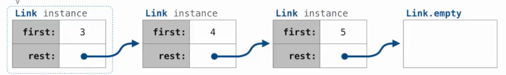
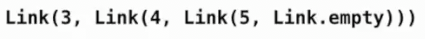
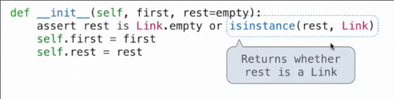
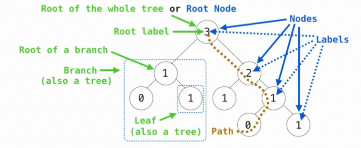

# 链表 树

## 链表

### 链表定义

链表对象有两个属性

* `first`是某个表示数据的对象
* `rest` 是另一个链表对象

最终的`rest`存储一个空链表



构造的方式如下





`isInstance`不仅能检查`rest`是否为`Link`的实例，而且如果`rest`是`Link`的子类的实例，也会返回`True`

```py
class Link:
    empty = ()
    def __init__(self, data, link=empty):
        assert link is Link.empty or isinstance(rest, Link)
        self.first = data
        self.rest = link
```

```py
>>> Link(3, Link(4, Link(5)))
<__main__.Link object at 0x77a6f8905f70>
>>> s = Link(3, Link(4, Link(5)))                                                                                
>>> s.first
3
>>> s.rest
<__main__.Link object at 0x77a6f8981460>
>>> s.rest.first
4
>>> s.rest.rest.first
5
>>> s.rest.rest.rest is Link.empty
True
```

### 链表操作

```py
class Link:
    empty = ()
    def __init__(self, data, link=empty):
        assert link is Link.empty or isinstance(link, Link)
        self.first = data
        self.rest = link

    def __repr__(self):
        if self.rest is Link.empty:
            return f'Link({self.first})'
        else:
            # 这里 {repr(self.rest)} 和 {self.rest| 结果不同
            return f'Link({self.first}, {repr(self.rest)})'

    def __str__(self):
        return f'{str(self.first)} -> {str(self.rest)}'

def range_link(start, end):
    """返回一个从 START 到 END 递增的链表

    >>> range_link(3, 6)
    Link(3, Link(4, Link(5)))
    """
    if start >= end:
        return Link.empty
    else:
        return Link(start, range_link(start + 1, end))

def map_link(f, s):
    """返回一个链表，其中每个单元的数据是原链表S中每个数据x, 在函数f作用后的f(x)

    >>> map_link(square, range_link(3, 6))
    Link(9, Link(16, Link(25)))
    """
    if s.rest is Link.empty:
        return Link(f(s.first))
    else:
        return Link(f(s.first), map_link(f, s.rest))

def filter_link(f, s):
    """返回一个链表, 这个链表是原链表s中各单元元素x满足f(x) == True的单元构成的新链表

    >>> filter_link(odd, range_link(3, 6))
    Link(3, Link(5))
    """
    if s.rest == Link.empty:
        if f(s.first):
            return s
        else:
            return Link.empty
    else:
        if f(s.first):
            return Link(s.first, filter_link(f, s.rest))
        else:
            return filter_link(f, s.rest)

square, odd = lambda x: x * x, lambda x: x % 2 == 1
```

```py
>>> r = range_link(1, 6)
>>> s = filter_link(odd, r)
>>> t = map_link(square, s)
>>> print(t)
1 -> 9 -> 25 -> ()
```

### 列表变异

#### 循环列表

```py
>>> t = s.rest
>>> t.rest = s
>>> s.first
5
>>> s.rest.first
2
>>> s.rest.rest.rest.rest.rest.first
2
```

### 添加到有序列表

```py
def add(s, v):
    """向有序无重复链表中添加元素v，返回的新链表中仍有序无重复元素"""
    if s == Link.empty:
        return Link(v, Link.empty)
    else:
        if v < s.first:
            return Link(v, s)
        elif v > s.first:
            s.rest = add(s.rest, v)
            return s
        else:
            return s
```

```py
>>> s = Link(1, Link(3, Link(6)))
>>> print(s)
1 -> 3 -> 6 -> ()
>>> s = add(s, 4)
>>> print(s)
1 -> 3 -> 4 -> 6 -> ()
>>> s = add(s, 4)
>>> print(s)
1 -> 3 -> 4 -> 6 -> ()
>>> s = add(s, 7)
>>> print(s)
1 -> 3 -> 4 -> 6 -> 7 -> ()
>>> s = add(s, 0)
>>> print(s)
0 -> 1 -> 3 -> 4 -> 6 -> 7 -> ()
>>> s = add(s, 0)
>>> print(s)
0 -> 1 -> 3 -> 4 -> 6 -> 7 -> ()
```

## 树

树和链表的差异在与树的分支有多个树，而链表的其余部分只有一个链表




