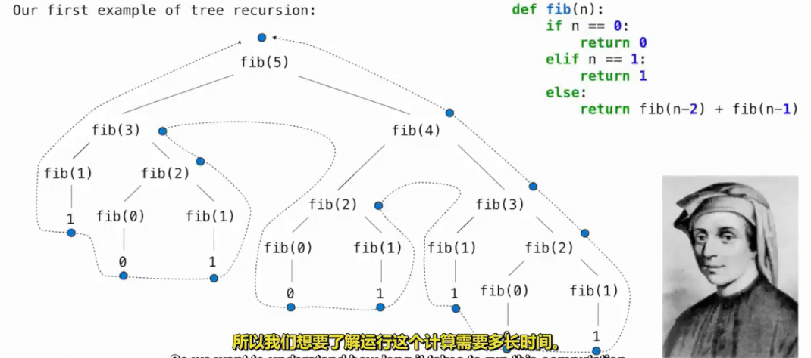

# 测量效率
 
* [程序的运行时间](#程序的运行时间)
* [记忆化](#记忆化)
* [不同的函数定义](#不同的函数定义)
* [与效率有关的符号](#与效率有关的符号)
* [空间](#空间)
  * [活动环境](#活动环境)

## 程序的运行时间



```py
def fib(n):
    if n == 0 or n == 1:
        return n
    else:
        return fib(n - 2) + fib(n - 1)

def count(f):
    def counted(n):
        counted.call_count += 1
        return f(n)
    counted.call_count = 0
    return counted
```

```py
>>> fib = count(fib)
>>> fib(5)
5
>>> fib.call_count
15
>>> fib(5)
5
>>> fib.call_count
30
>>> fib(30)
832040
>>> fib.call_count
2692567
```

## 记忆化

记住以前算过的结果，再次需要其值时，只需要把其保留下来

```py
def memo(f):
    def memoized(n):
        if n not in memoized.cache:
            memoized.cache[n] = f(n)
        return memoized.cache[n]
    memoized.cache = {}
    return memoized
```

如果是一个非纯函数，由于我们并不每次都调用原始的f,因此可能行为不同

## 不同的函数定义


## 与效率有关的符号

描述量级的符号有`Θ`以及`O`


* `Θ` 表示对上下限都有要求
* `O` 描述了函数运行所需的时间上限

需要对`n`有明确具体的描述

`O(2^n)`级别


## 空间

大量的值以及大量的帧都会导致空间的不足

例如非常大的列表和函数次数很多的递归调用

在评估值的过程中，有哪些环境帧我们需要保留？

在任何时刻，都有一组**活动环境** *active environments*

这些活动环境中的值和帧会消耗内存或空间

而在非活动环境中的值和帧所消耗的内存空间，都会被回收利用

python解释器会回收任何不需要知道的某些信息

### 活动环境

* 当前正在评估的任何函数调用，即调用了其，但是还没有返回
* 而这些函数的父环境也在活动环境
    * 闭包，父函数已返回但是子函数正在被调用

```py
def count_frames(f):
    def counted(n):
        counted.open_count += 1
        if counted.open_count > counted.max_count:
            counted.max_count = counted.open_count
        result = f(n)
        counted.open_count -= 1
        return result
    counted.open_count = 0
    counted.max_count= 0
    return counted
```

