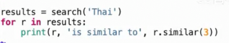
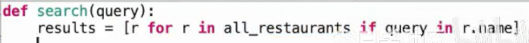
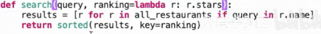

# 模块化设计
 
* [示例_餐厅搜索](#示例_餐厅搜索)
  * [实现思路](#实现思路)
  * [优化](#优化)

鼓励程序员将处理不同关注点的程序部分隔离开来，这样不必一次考虑程序的所有要求

模块化组件可以独立开发、测试，以确保其可以解决其所需解决的问题，而不必担心程序其余部分的行为

例如我们的`Hog`项目，分为三个模块


* 游戏模拟器 *关注游戏规则 游戏内事件的顺序 以及确定谁赢得比赛所需的状态跟踪*
* 游戏评论 *关注描述游戏中发生的不同事件 以及生成评论所需的任何状态跟踪*
* 玩家策略 *捕获关于策略的信息* 

这种分割不仅仅是长函数被分割为短函数，更是程序的不同方面、不同关注点被隔离到代码的不同部分

程序的某部分尽可能少地了解与其无关的其他关注点

* 比如更改`hog`的游戏规则部分代码，只影响`Simular`的代码，而无需更改`Game Commentary`的代码, 这种代码更具模块化

## 示例_餐厅搜索

### 实现思路

从餐厅名称中的关键词查找餐厅，并显示相关的餐厅


我们有一个包含上述餐厅信息和另一个包含上述用户评论信息的文件

我们需要构建一个程序，使得通过名称查找并显示相关餐厅

我们期望获得一些功能：

* 通过`search('关键字')`查询到一个餐厅列表
* 对于结果中的每一个餐厅，都能通过`r.similar(num)`得到`num`个相似的餐厅



之后是构建`search`的思路



我们需要实现这个`all_restaurants`

返回的结果需要按照一定顺序，这给我们可模块化的机会



* `sorted`会根据`key`从小到大排序

我们开始实现`Restaurant`，在这个过程中，思考`all_restaurants`如何实现，可以使其成为类属性


对于相似函数的实现，这实际上可以有很多种相似性，我们通过传入一个相似函数来完成模块化

```py
    def similar(self, k, similarity):
        """返回 K 个和 self 最相似的饭店

        similarity - 一个接受两个饭店作为参数的函数，返回二者的相似度
        """
        all_but_self = [r for r in Restaurant.all if r not is self]
        sorted_rts = sorted(all_but_self, key=lambda r: similar(self, r))
        return sorted_rts[:k]
```

之后我们实现返回相似度的函数，不妨以评论者都在其中做为标准

```py
def reviewed_both(r, s):
    return len([x for x in r.reviewers if x in s.reviewers ])
```

之后我们从文件读入


我们再来实现`reviewers_for_restaurant`


### 优化

这是一个二次时间的函数


但是我们可以改为线性时间，比如将第一个餐厅的所有评论者变为字典，之后，我们遍历第二个餐厅的评论者，在字典中查找是否有键，并计数

也可以先排序再依次比较，但是额外还要有排序的时间支出

```py
def fast_overlap(s, t):
    """返回 s 和 t 中的相同元素个数

    s, t - 排序后可迭代对象
    >>> fast_overlap([3, 4, 6, 7, 9, 10], [1, 3, 5, 7, 8])
    >>> 2
    """
    i, j, count = 0, 0, 0
    while i < len(s) and j < len(t):
        if s[i] == t[j]:
            count, i, j = count + 1, i + 1, j + 1
        elif s[i] < t[j]:
            i += 1
        else:
            j += 1
    return count
```
