# 列表变异以及环境图_对象_可迭代对象及迭代器_内置函数_内置表达式_链表
 
* [列表变异以及环境图](#列表变异以及环境图)
* [对象](#对象)
* [可迭代对象和迭代器以及内置函数和表达式](#可迭代对象和迭代器以及内置函数和表达式)
* [链表](#链表)

## 列表变异以及环境图

名称可以引用列表 并且可以通过赋值语句更改其绑定列表

此外，列表的内容可以改变，其长度可以增长或缩短，即使其绑定的名称不变

* append时的环境图

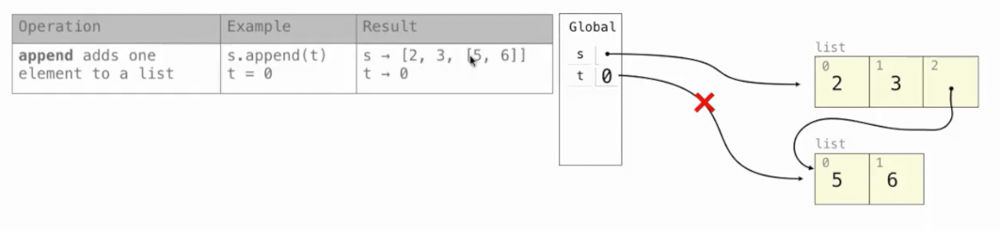

* extend时的环境图

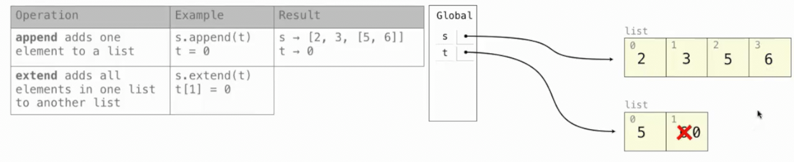

* 加法和切片时的环境图

加法和切片都会返回一个新列表，而不改变原列表

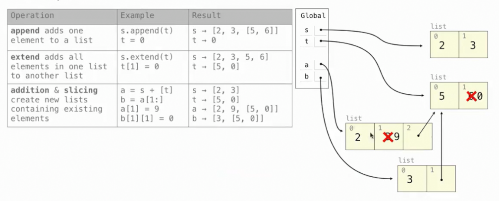

但是由于我们采取`[t]`这种方式创建新列表，故会指向原列表t，后续操作也修改了列表t

* `list`函数

其会创建一个包含现有元素的新列表

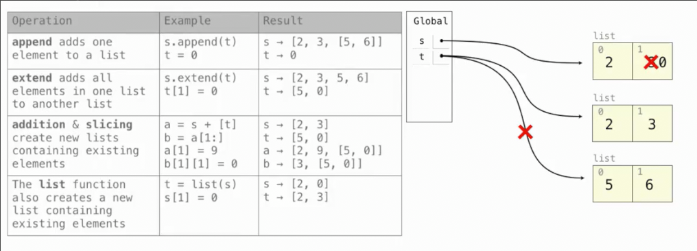

* 修改`切片`的值

会在原列表的基础上添加、替换、删除

类似extend，以复制的形式添加到自身

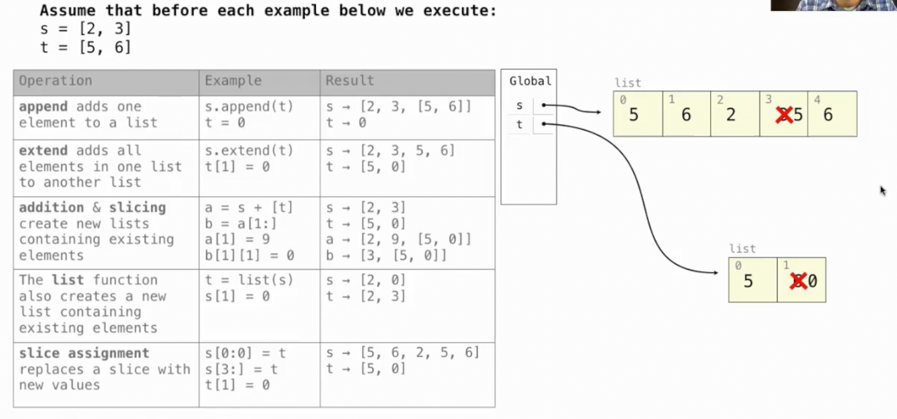

* 其它操作

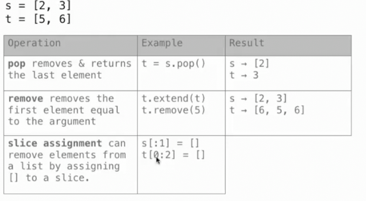

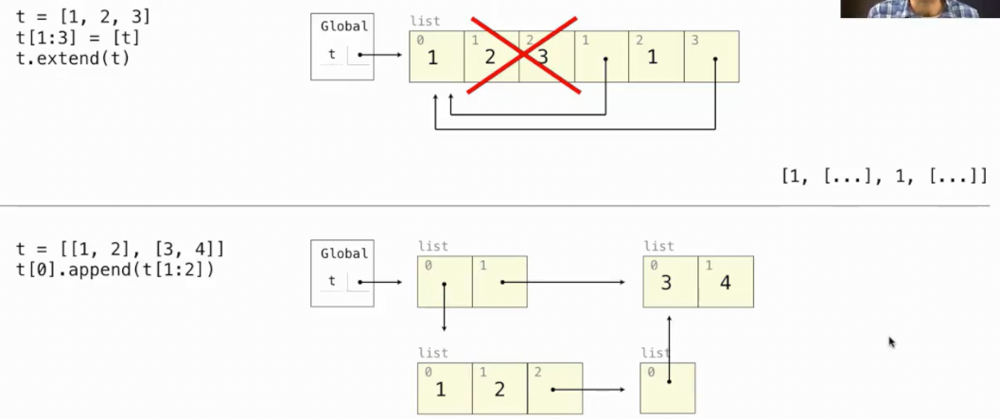

## 对象

对象总在查找类属性之前查找实例属性

```py
class Worker:
    greeting = 'Sir'
    def __init__(self):
        self.elf = Worker
    def work(self):
        return self.greeting + ', I work'
    def __repr__(self):
        return Boss.greeting

class Boss(Worker):
    greeting = 'Worker'
    def work(self):
        print(Worker.work(self))
        return 'I gather wealth'

jack = Worker()
john = Boss()
jack.greeting = 'Maam'
```

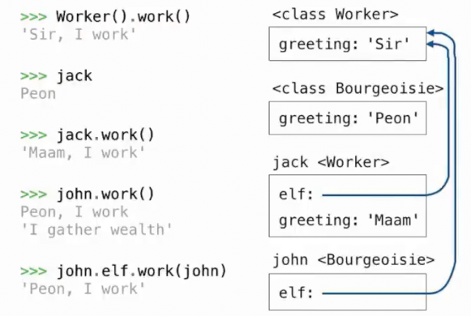

## 可迭代对象和迭代器以及内置函数和表达式

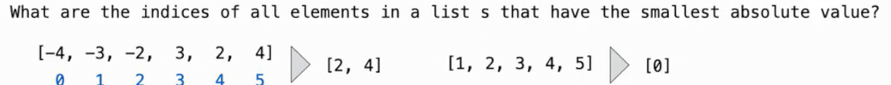

```py
>>> [i for i, _ in enumerate(s) if abs(s[i]) == min(map(abs, s))]
```

* `min`中同样可以使用`key`来指定排序的键

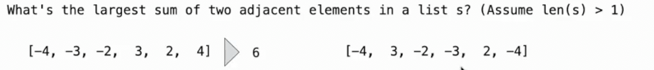

```py
>>> max([s[i] + s[i+1] for i in range(len(s)-1)])
```

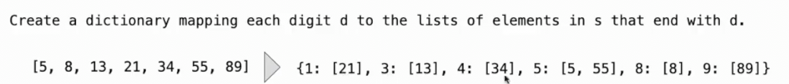

```py
>>> {i: [j for j in s if j%10 == i] for i in range(10) if i in map(lambda x: x%10, s)}
```

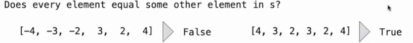

```py
>>> all([s[i] in s[0:i] + s[i+1:] for i in range(len(s))])
```

## 链表

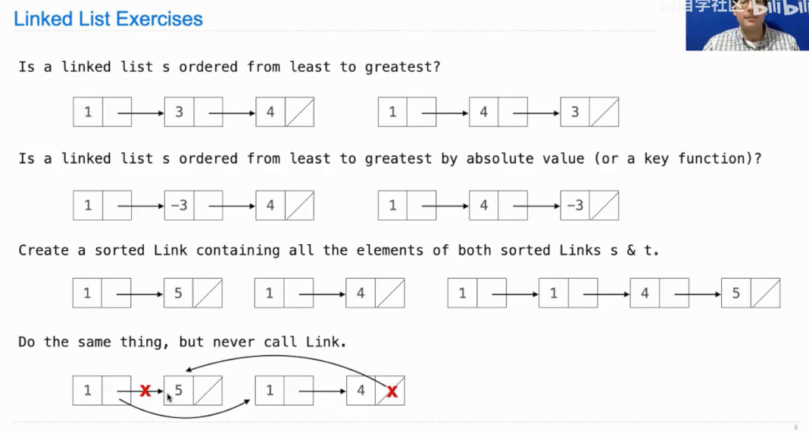

```py
def is_ordered(l, key=lambda x: x):
    if l.rest is Link.empty:
        return True
    else:
        return key(l.first) <= key(l.rest.first) and is_ordered(l.rest)
```

```py
def merge(s, t):
    """合并两个有序链表为一个有序链表"""
    if s.first <= t.first:
        merged = merging = s
        s = s.rest
    else:
        merged = merging = t
        t = t.rest
    while s is not Link.empty and t is not Link.empty:
        if s.first <= t.first:
            merging.rest = s
            merging = s
            s = s.rest
        else:
            merging.rest = t
            merging = t
            t = t.rest
    if t is Link.empty: 
        merging.rest = s
    else:
        merging.rest = t
    return merged
```

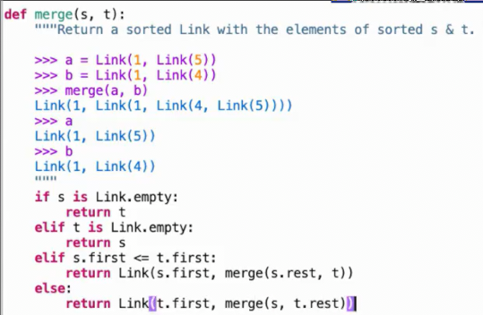

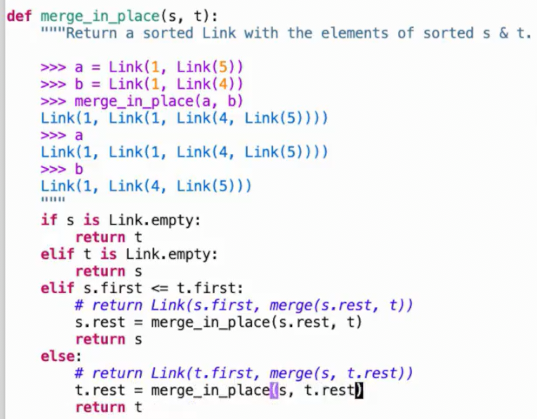
