# Scheme

一门较早的语言，对python诞生的影响较大

是一种Lisp语言的方言, Lisp是今天仍在使用的最古老的两种语言之一

Lisp的美在于其简单性 一天即可学会

## 基础知识

Scheme 程序由 **表达式** 组成

* 如`2` `3.3` `true` `+` `quotient`...
* 还可以进行**组合** `(quotient 10 2)` 10 和 2 的 商 `(not true)` False `()`中包含多个表达式

数字是自我评估的，而符号绑定到值

调用表达式看起来像组合 以运算符开头 后面跟 0 个 或 多个 操作数，也包含在括号中

```scheme
> (quotient 10 2)
5
```

`quotient`是内置的**操作**名称 *procedure* 对标 python 中的 函数

表达式允许嵌套

```scheme
> (quotient (+ 8 7) 5)
3
```

允许分行 不限制缩进

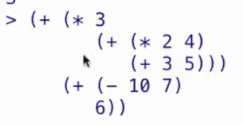

```scm
> 2
2
> (+ 1 2 3 4)
10
> (+)
0
> (* 1 2 3 4)
24
> (*)
1
```

```scm
1 ]=> (/ (+ (* (- (* 2 2 2 2 2 3 3 3) 1) 7) 1) 3)

;Value: 2014

1 ]=> +   

;Value: #[arity-dispatched-procedure 12]

1 ]=> (number? 3)

;Value: #t
```

```scm
scm> (/ (+ (* (- (* 2 2 2 2 2 3 3 3) 1) 7) 1) 3)
2014
scm> +   
#[arity-dispatched-procedure 12]
scm> (number? 3)
#t
scm> (number? +)
#f
scm> (zero? 2)      
#f
scm> (zero? 0)
#t
scm> (integer? 2.2)
#f
scm> (integer? 2)
#t
```

上述的`?`是操作名的一部分，方便我们理解操作的作用

## scheme 解释器

在项目4中，我们将构建一个实现`scheme`解释器的python程序

我们学习其的目的是理解如何为其构建解释器

## 特殊形式

除调用表达式外，还存在名为**特殊形式**的其他类型表达式

特殊形式是**不是调用表达式的任意组合**

* `if`表达式

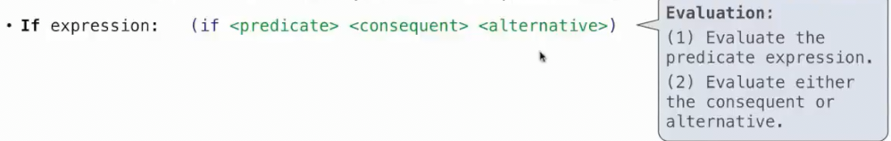

首先评估谓词，之后根据谓词的真假选择评估结果还是替代

* `and`和`or`

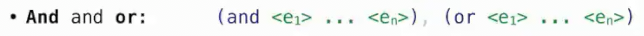

可能其中一些不会评估(在已经确定真假的情况下，即发生python中的短路)

* **绑定符号到值**

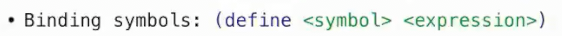

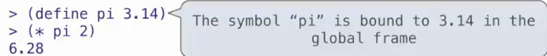

`scheme`使用和`python`相同的环境模型

* 定义新过程

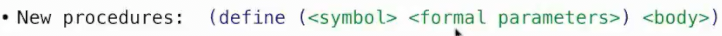

注意定义新过程时，`define`后紧跟`()`

`define`的`()`内依次是**过程名** **形参** 外部是 **过程体**

```py
1 ]=> (define (abs x)
        (if (< x 0)
            (- x)
            x))

;Value: abs

1 ]=> (abs -3)

;Value: 3
```

这样创建了一个过程，并自动在当前帧绑定了同名名称给这个操作

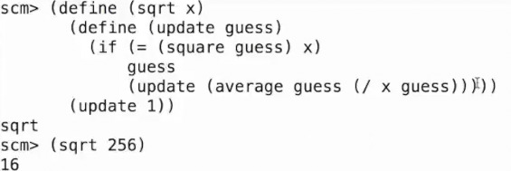

一个递归过程

相当于python的这个函数

```py
def sqrt(x):
    def update(guess):
        if x == square(guess):
            return guess
        else:
            return update(average(guess, x / guess))
    return update(1)
```

由此可见，闭包在`scheme`中也得到支持

## lamdba表达式

评估为一个匿名操作

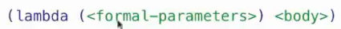

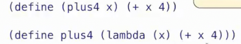

## 其他的特殊形式

* `cond` 

相当于python中的`if-elif-else`

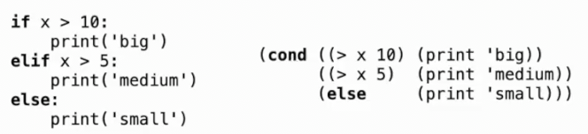

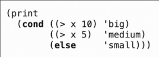

当在两个选项中选择使用`if`，如果多个使用`cond`

* `begin` 将多个表达式合并为一个表达式

可以在计算所需结果之前执行一些操作，比如返回前进行打印，或者将某些符号定义为特定值

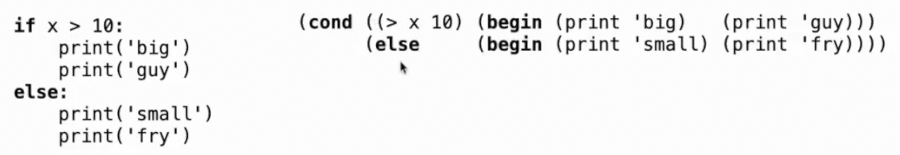

* `let` 临时地将符号绑定到某表达式的值

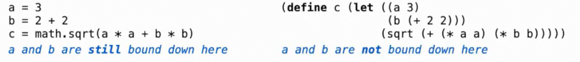

大多时候我们不进行临时定义，而是使用`let`

本课程的`scheme`提供了一些图形交互的api

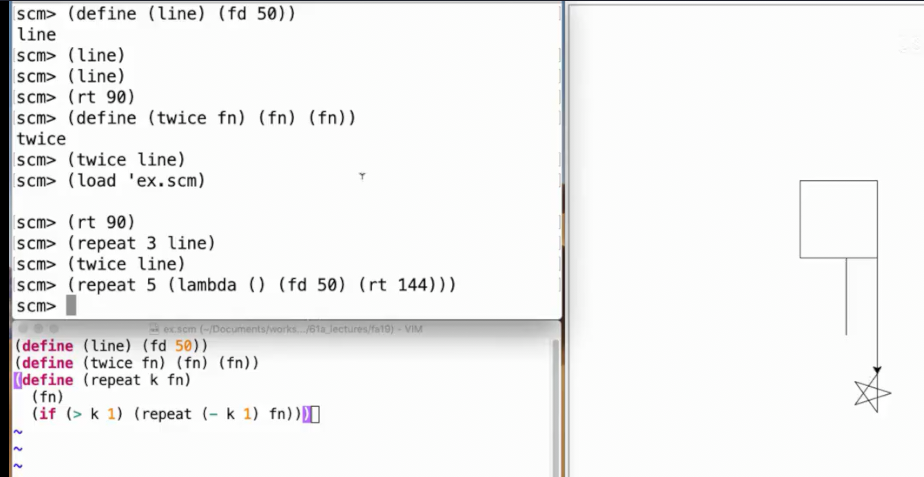

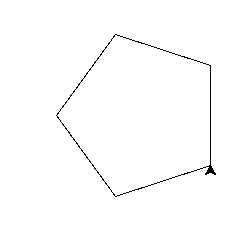

```scm
(define (for start end step do_someting)
  (if (< start end)
      (begin (do_someting start)
      (for (+ start step) end step do_someting))))

(define (draw_five_line i) (fd 100) (lt 72))
```

```scm
scm> (load 'for.scm)

scm> (for 0 5 1 draw_five_line)
```
