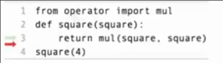

# 多环境_python特性_流程控制
 
* [多环境](#多环境)
* [python的一些特性](#python的一些特性)
  * [运算符](#运算符)
    * [除法](#除法)
  * [函数中返回多个值](#函数中返回多个值)
  * [python_文件以及交互性输出](#python_文件以及交互性输出)
  * [函数的文档字符串](#函数的文档字符串)
  * [形参默认值](#形参默认值)
* [条件语句](#条件语句)
  * [布尔值](#布尔值)
* [迭代](#迭代)

## 多环境

当我们开始调用函数时，会形成多环境

*这个程序执行过程中存在三个环境(如果不算函数mul)*


**沿着当前帧的父级帧（函数定义时所在的帧，导入的函数永远隶属于全局帧，但是其自动创建的同名名称却不是这样)，一直找到全局帧，即为当前帧内的环境**

同名变量可能在不同环境中具有不同意义



## python的一些特性

### 运算符

其真实原理有些复杂，后面会进行讲解，目前只需要将他们视为调用内置函数

```python
>>> 2 + 2
4
>>> 2 + 3 * 4 + 5
19
>>> from operator import add, mul
>>> add(add(2, mul(3, 4)), 5)
19
```

#### 除法

python提供真正除法和整除，其分别为`/` `//`

```python
>>> 2013 / 10
201.3
>>> 2013 // 10
201
```

对应的函数为`truediv` `floordiv`

```python
>>> from operator import truediv, floordiv
>>> truediv(2013, 10)
201.3
>>> floordiv(2013, 10)
201
```

同时还有取余运算 `%` `mod()`

### 函数中返回多个值

```python
>>> def divide_exact(n, d):
...     return n // d, n % d
... 
>>> quotient, remainder = divide_exact(2013, 10)
>>> quotient
201
>>> remainder
3
```

### python_文件以及交互性输出

我们可以编写`.py`文件，其在编辑过程只是一些文本，不会执行

保存后我们可以在命令行调用`python3 xxx.py`以执行，其通过打印语句输出到屏幕

我们还可以不使用打印语句查看变量，而是使用`python3 -i xxx.py`交互性输出

其会执行文件，但不会立即退出，而允许我们查看变量

```python
~/code/md/cs61a/tmp ❯❯❯ python -i try.py
>>> q
201
>>> r
3
>>> 
```

### 函数的文档字符串

写于函数的下一行

```python
def devide_exect(n, d):
    """返回 N 除以 D 的 商 和 余数

    >>> q, r = devide_exect(2013, 10)
    >>> q
    201
    >>> r
    3
    """
    return floordiv(n, d), mod(n, d)
```

* 以两个`"""`包裹
* 第一句是一个描述 一般使用全大写描述参数
* 后续是一些例子

使用`python -m doctest -v xxx.py`可以解析执行文档字符串提供的例子

```py
Trying:
    q, r = devide_exect(2013, 10)
Expecting nothing
ok
Trying:
    q
Expecting:
    201
ok
Trying:
    r
Expecting:
    2
**********************************************************************
File "/home/galaxy/code/md/cs61a/tmp/try.py", line 11, in try.devide_exect
Failed example:
    r
Expected:
    2
Got:
    3
1 items had no tests:
    try
**********************************************************************
1 items had failures:
   1 of   3 in try.devide_exect
3 tests in 2 items.
2 passed and 1 failed.
***Test Failed*** 1 failures.
```

出错处文档字符串提供的期望输出和实际输出不符

### 形参默认值

```py
def devide_exect(n, d=10):
```

当没有传入的实参不足以让名称`d`进行绑定时，将`d`绑定于10

## 条件语句

语句*statement*是解释器执行的一些操作，比如将一个名称绑定到一个值，或者定义一个新的函数


* `header`指定了语句的类别

```py
def absolute_value(x):
    """返回 X 的 绝对值"""
    if x < 0:
        return -x
    elif x == 0:
        return 0
    else:
        return x
```

必须有`if` 可以有0个或多个`elif` 可以有0个或1个`else`

### 布尔值

python中的假值

* `False` `0` `''` `None` ...
* 其它的任何

## 迭代

```py
>>> i, total = 0, 0
>>> while i < 3:
...     i = i + 1
...     total = total + i
... 
>>> i
3
>>> total
6
```


