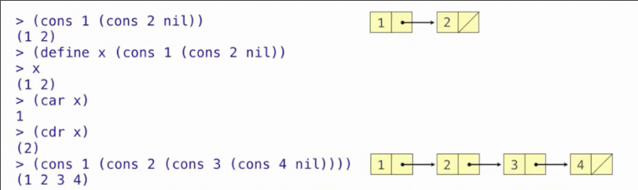
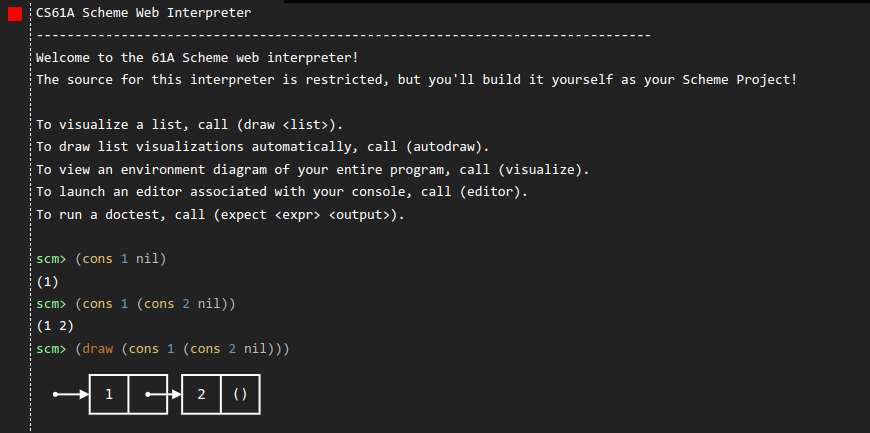
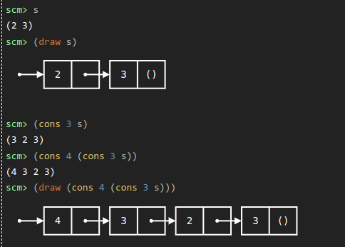
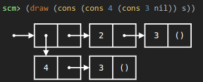

# 列表_符号编程
 
* [列表](#列表)
* [符号编程](#符号编程)
* [列表处理](#列表处理)

## 列表

在`Scheme`中列表就像我们在python中创建的链表类

每个`scheme`列表就是一个链表

* `cons` 是一个接受两个参数的过程 用于创建一个链表
* `car` 是返回列表的`first`的过程 
* `cdr` 返回列表`rest`
* `nil` 是一个内置符号，被评估为空列表

```scm
scm> (cons 2 (cons 3 nil))
(2 3)
scm> (define lst (cons 2 (cons 3 nil)))
lst
scm> (car lst)
2
scm> (cdr lst)
(3)
```



这是一个用于本课程的多种语言的[在线解释器](https://code.cs61a.org/)，其支持查看`scheme`的环境图 使用`(draw lst)`查看







```scm
scm> (define s (cons 1 (cons 2 nil)))
s
scm> s
(1 2)
scm> (list? s)
#t #t
scm> (list? 3)
#f #f
scm> (list? nil)
#t #t
scm> (null? nil)
#t #t
scm> (null? s)
#f #f
scm> (list 1 2 3 4)
(1 2 3 4)
```

## 符号编程

不仅仅可以计算数字，而且可以计算方程

符号通常指向数字，但是有时候可以指向符号本身

```scm
scm> (define a 1)
a
scm> (define b 2)
b
scm> (list a b)
(1 2)
```

当我们把符号绑定到值，在评估含有符号的表达式时，结果不含符号

允许使用`'符号`使得符号自身成为值

```scm
scm> (list 'a 'b)
(a b)
scm> (list 'a b)
(a 2)
```

`'`表示引用的表达式本身就是值，而不需要再去对其评估求值

```scm
scm> '(a b c)
(a b c)
scm> (car '(a b c))
a
```

也可以使用`(quote a`来获得引用符号 a

## 列表处理

* `(append s t)` 将两个不用列表的元素放入一个列表中

也可以传入多个列表

* `(map f s)` 对列表s 中的每个元素调用`f`并将结果收集到一个列表
* `(filter f s)` 对列表s中的每个元素调用`f`并将结果为`true`的元素收集到列表
* `(apply f s)` 将整个列表中的所有元素传入f，返回结果

```scm
scm> (append `(1 2) `(2 3) `(5 6))
(1 2 2 3 5 6)
scm> (map (lambda (x) (+ x 1)) `(1 2 3 7 6 5))
(2 3 4 8 7 6)
scm> (filter (lambda (x) (> x 3)) `(1 2 3 7 6 5))
(7 6 5)
scm> (+ `(1 2 3))
Traceback (most recent call last):
  0     (+ (quasiquote (1 2 3)))
Error: operand 0 ((1 2 3)) is not a number
scm> (apply + `(1 2 3))
6
```

返回一个二维列表，其中每个子列表为原列表的一个非空真子集，并且这个子集所有元素之和为偶数

```scm
(define (even-subsets s) 
  (filter (lambda (l) (and (not (= (apply + (map (lambda (x) 1) s))
                                   (apply + (map (lambda (x) 1) l))))
                           (not (null? l))
                           (even? (apply + l)))) 
          (begin(define (get-subs s) 
             (if (null? s) 
               `(())
               (append (get-subs (cdr s))
                       (map (lambda (lst) (append lst (list (car s))))
                            (get-subs (cdr s)))))) 
                (get-subs s))))
```

```scm
scm> (even-subsets `(1 2 3 4))
((4) (2) (4 2) (3 1) (4 3 1) (3 2 1))
```


