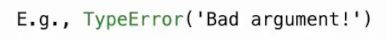
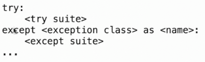
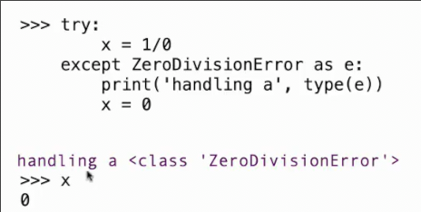

# 异常
 
* [触发异常](#触发异常)
* [捕获处理异常](#捕获处理异常)
* [reduce](#reduce)

编程语言通常有一些指示 错误或某种异常事件发生 的机制，并有处理这些错误并描述下一步操作的机制

在`python`和其他语言中这种机制被称作异常

## 触发异常

可以引发异常来指示发生了异常情况，比如错误

`raise 表达式` 表达式需要被评估为异常

具体来说，表达式需要被评估为**基本异常的某个子类**, 或者是**某种异常类的实例**

异常的构造方式和其他对象相同



传入的字符串描述发生了什么，异常的具体细节

**常见内置异常类型**

* `TypeError` 当某函数被传递了错误的参数数量或者参数个数
* `NameError` 某名称没有找到
* `KeyError` 某键没有在字典中找到
* `RecusionError` 太多的递归调用

```py
>>> abs('hello')
Traceback (most recent call last):
  File "<stdin>", line 1, in <module>
TypeError: bad operand type for abs(): 'str'
>>> raise TypeError
Traceback (most recent call last):
  File "<stdin>", line 1, in <module>
TypeError
>>> raise TypeError('very bad idea')
Traceback (most recent call last):
  File "<stdin>", line 1, in <module>
TypeError: very bad idea
```

```py
def double(x):
    if isinstance(x, str):
        raise TypeError('double 需要一个数字 作为参数')
    return 2 * x
```

## 捕获处理异常

异常具有多种类型的原因一方面是方面查看异常信息，更是为了在语言中创建处理异常并继续运行程序的能力

默认情况下，发生异常时，程序会停止，显示错误消息，回溯，由程序员决定接下来做什么，改变程序后重新运行

我们同样可以通过`try`语句 在错误发生后继续运行



* `try` 中是一些任意的代码块
* 与之匹配的`except`描述了这个`try`语句处理的特定类别的异常, 可以有多个`excepe`
* `except` 后是 **错误类型** 并且(可选的) `as`后是给这个错误类型实例起的别名
* 接下来是一些发生这种错误的处理代码

1. 首先执行`try`中的代码块，如果没有异常，则结束
2. 如果发生异常，那么发生的异常类别是我们`except`的**异常类别的子类**，则将其捕获，交由`except`的代码块处理 



```py
def invert(x):
    result = 1/x
    print('Never printed if x is 0')
    return result

def invert_safe(x):
    try:
        return invert(x)
    except ZeroDivisionError as e:
        return str(e)
```

```py
>>> invert_safe(2)
Never printed if x is 0
0.5
>>> b = invert_safe(0)
>>> b
'division by zero'
```

在处理来自网上或者用户输入的数据时非常有效

## reduce

作用是将整个值序列减少为一个单一的值

```py
def reduce(f, s, initial):
    """ 从起始值开始 遍历 s 内的元素 x 重复计算f(起始值, x) 并把每次计算的结果作为新的起始值进入下一次计算)

    >>> reduce(mul, [2, 4, 8], 1)
    64
    >>> reduce(add, [1, 2, 3, 4], 0)
    10
    """
    if not s:
        return initial
    else:
        return reduce(f, s[1:], f(initial, s[0]))
```

```py
def divide_all(n, ds):
    try:
        return reduce(truediv, ds, n)
    except ZeroDivisionError as e:
        return float('inf')
```

```py
>>> from functools import reduce
```
