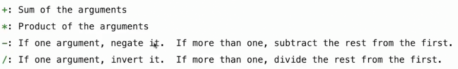

# 解释器_编程语言
 
* [编程语言](#编程语言)
* [解析](#解析)
* [scheme计算器](#scheme计算器)
* [评估](#评估)
* [解释器的用户界面](#解释器的用户界面)
* [异常](#异常)
* [特殊形式](#特殊形式)

解释器是一个接受以编程语言编写的代码作为输入的程序，然后执行该代码以创建程序描述的行为

解释器程序的一部分将描述解释的一般工作原理，另一部分将封装语言的各个部分实际执行的所有细节

## 编程语言

计算机通常执行用许多不同编程语言编写的程序

* **机器语言** 语句由硬件本身解释 *计算机的中央处理单元，可以执行一组固定的指令，并且具有有限的寄存器可以直接使用，一些访问远距离的更多内存的方法* 机器语言的拓展需要更改计算机的电路，因此不常发生
    * 这种语言难以编写，基于操作特定的硬件内存地址，很少有抽象机制，一般没有办法命名，函数或操作
* **高级语言** 具有由另一个程序进行解释的语句和表达式(或者被编译为另一种语言), 解释涉及到阅读程序并执行其行为，而编译则将其翻译为另一种语言如机器语言，以便后续执行
    * 很多现代语言在这两者之间混合 实时编译部分，以便像交互式解释那样执行
    * 提供抽象的手段 命名 函数 类...
    * 我们的计算机中没有专为`Scheme`或者`python`而设计的硬件部件, 而是最终转化为机器语言执行，解释器或编译器是两者之间的桥梁
    * 高级语言往往建立在其他高级语言之上 如 机器语言可能用来实现`C语言`的编译器，而`C语言`可以用来构建`Python`解释器

高级语言也提供了抽象的手段，以将编写解释器时，将某些系统细节忽略掉，以适配不同的机器语言

`Python`在运行前被编译为`Python` 3 字节码

之后由运行这种较低级字节码的解释器 也会抽象掉一些细节

编程语言具有

* **语法** 即语言中所有合法语句和表达式的描述 `syntax`
* **语义** 这些语句和表达式的执行或评估规则 `semantics`

一个新的编程语言需要有一个形式规范，将其写成文档，描述语言的精确语法和语义

或者构建一个其解释器或编译器的实现，作为语法和语义的参考描述

* Scheme 起始于规范 而后才有解释器的实现
* Python 起始于实现 而后开发了对其工作原理的正式描述

## 解析

要将文本解释为编程语言，首先需要将该文本解析成一些结构，以便对其轻松进行解释

`Scheme`代码基本上是树形结构的 `(表达式(表达式(表达式(..))))`

解析把这些文本表达式转化为表达式树，以便根据语言规则来评估代码

`Scheme`程序看起来像是一个带有括号、符号、数字等的列表，我们可以编写一个程序，读取`scheme`列表并将其转换为具有正确结构的列表显示

* `scheme_reader` 接受文本输入，返回一个表达式

* `str`为其在`scheme`的表示
* `repr`为其在python中的表示

`Parse`由两部分组成

* 词法分析 获取标记序列 tokens
* 语法分析 获取表达式 

**语法分析**

识别表达式的分层结构（嵌套）

基本的情况是符号和数字

递归地读取合并子表达式 

找到正确的括号才会返回

## scheme计算器

输入scheme表达式 以返回正确结果

仅包含基本表达式(数字)和调用表达式(以加减乘除开头) 

* 数字将被评估为自身
* 调用表达式遵循以下

## 评估

* 函数`eval`对表达式进行评估，会根据其类型自动分派

## 解释器的用户界面

通常解释器都有一个 `读取 >> 求值 >> 循环`的过程

* 打印提示符 提示用户计算机已准备好接受输入
* 从用户读取文本
* 解析文本 进行一系列传递 得出结果
* 报告结果或错误
* 循环

## 异常

## 特殊形式

当`p4`相应完成度时 予以补充

