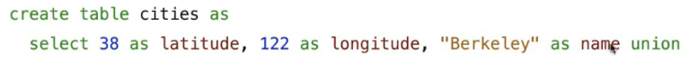

# 数据库
 
* [数据库组织形式和SQL](#数据库组织形式和SQL)
* [SQL_语法](#SQL_语法)
  * [从0开始建表](#从0开始建表)
  * [从已有表中获取表格](#从已有表中获取表格)
* [SQL](#SQL)
  * [select_语句](#select_语句)
    * [从头创建表](#从头创建表)
    * [投影表](#投影表)
    * [算术运算](#算术运算)

## 数据库组织形式和SQL

数据库以**结构化的表格形式**存储数据

数据库**组织数据的形式是表格**，这些表格是**记录的集合** 

**记录是表格中的行，对于表格中的每一列都有一个值**


* 每一列有一个**名称** `Name` `Longitude` ..
* 通常每一列都有某种类型 比如**字符串** **数字**


`SQL` *Structured Query Language* 或许是使用最广泛的编程语言之一

* 其用于从现有表中生成新表，操作其内容，添加删除行等
* `SQL`是一种声明式编程的语言 声明式语言还有`Prolog` 
    * 在这种声明式语言中，程序是**对期望结果的描述**，而解释器则负责**找出**如何生成这个**结果**
    * 而命令式语言是**对计算过程的描述**，解释器执行和**评估**该过程的**规则**

可能有多种方法达到`SQL`语句期望的效果，而数据库管理系统通常找到最快的

## SQL_语法

### 从0开始建表



* 第一句创建一个名为`cities`的表
* 第二句在创建这个表后，添加一条记录，其中指定了记录每一列的值和名称，`"Berkeley"`用引号的原因是其为一个值，而名称不需要(列的名字)


* 添加一条记录后的`union`是为了表示接下来接受另一个单行表的描述并将其组合成多行表


这种是一种不常见的建表方式，从0开始时才出现

### 从已有表中获取表格


* 第一行为使用`cities`表中`longitude`列>=115的记录构建新表，并设置新表每条记录的`region`列为`west region`, `name`列不动
* 由于第一行使用`union`第二行在第一行提取的新表上，过滤出`cities`中`longitude` < 115的记录，并设置 region属性设置为`other`，name不动,形成新表


## SQL

SQL是标准化的，基于一个规范，不同厂商有一些变体，以扩充其来竞争

我们专注于其普遍部分

* 一个`select`语句可以创建一个新的表，可以从头开始，也可以从已有表构建
* `create table` 创建表语句为表赋予全局名称
* 此外还有很多语句


* 但是最重要的操作在`select`中，我们专注于此

一个[在线的sqlite](http://kripken.github.io/sql.js/examples/GUI/index.html)

### select_语句

#### 从头创建表

`select`语句始终包括一个以`,`分隔的**列描述列表**

**列描述**是一个表达式，可选地跟随`as`和名称


所有`sql`语句以`;`结束

* 表达式使用字面量会创建一个单行表
* 使用`union`连接多个表可以创建更多行表
    * 只能`union`具有拥有**相同列数和每列中具有相同类型信息**的表
    * **列名称不需要相同** union会自动采用第一个表中的列名称


`SQL`常用作交互式语言，因为我们往往想看看数据库有什么内容

因此`select`得到的表通常不会储存，而是显示给用户

如果想要存储可以使用`create table`


#### 投影表

可以将现有的表投影到新表

`select`可以使用`from`子句来指定输入


也可以在`from`子句的基础上使用`where`来获取输入表记录的子集

并且`from`子句(或者from .. where .. )基础上还可以使用`order`子句指定输入的排序


* 这里的`select child` 先评估`child`，在`select`中，名字会被评估为输入对应列的值，之后由于没有`as`，因此创建了一个同名的`child`列 
  * `select 1, 'hello';`会创建一个列名称分别是`1`和`'hello'`名称相对于值原封不动的表


创建表

```sql
create table parent as
  select "abraham" as parent, "barack" as child union
  select "abraham"          , "clinton"         union
  select "delano"           , "herbart"         union
  select "fillmore"         , "abraham"         union
  select "fillmore"         , "delano"          union
  select "fillmore"         , "grover"          union
  select "elsenhower"       , "fillmore";
```

查询

```sql
select * from parent
```


#### 算术运算

在`select`表达式中，列名被计算为值

算术表达式可以将行**值或常数**组合在一起，创建新的**值**


