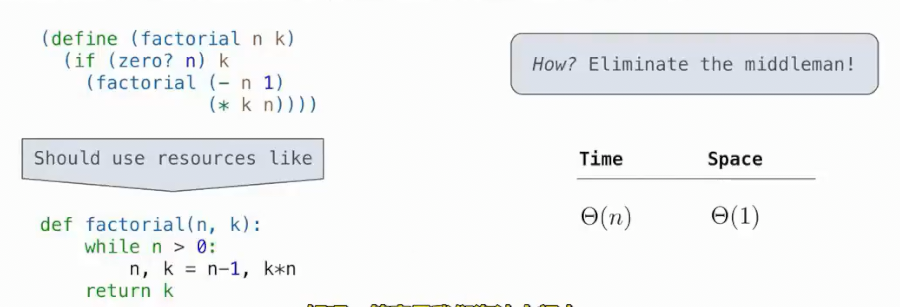

# 尾递归
 
* [scheme的迭代_尾递归](#scheme的迭代_尾递归)
* [尾递归的定义](#尾递归的定义)
* [尾递归的评估](#尾递归的评估)
* [reduce_map](#reduce_map)
  * [reduce](#reduce)
  * [map](#map)

## scheme的迭代_尾递归

函数式编程的理念是可以使用**纯函数**(没有副作用)来组织整个程序，这些函数的组织形式可以是模块化的

在纯函数程序中，**没有重新赋值，没有可变数据类型**

而**名称所绑定的值也是永久的**

这样做有一些好处

* 表达式的值与子表达式评估顺序无关 *这为一些并行处理提供了可能性*
* 使用子表达式的值替换掉子表达式，程序的行为不会改变 *可以进行记忆化操作*

但是我们不能重新绑定名称，那么是否可以**高效地进行基本迭代**？利用尾递归

在`python`中 递归调用总是会创建新的活动帧

这是python中，分别利用**迭代和递归**计算阶乘的时空复杂度


这种情况下，递归会使得空间复杂度为线性，我们希望**弥补递归与迭代关于空间复杂度的差异**

`Scheme`语言规范中，要求`Scheme`的实现必须是**正确的尾递归**，这允许在**常量空间中执行迭代计算内，即使这种迭代计算在语法中使用递归过程描述**


这是一个**尾递归**的`scheme`阶乘过程，规范中要求其空间复杂度为Θ1，与`python`中的迭代实现相同



而实现的关键就是**在进行递归调用时，淘汰不再需要的帧**

## 尾递归的定义

**当一个过程调用另一个过程时，如果当被调用的过程完成时还有更多工作要做，那就不是尾递归，反之，则是**

更规范地

尾递归是**尾上下文**中的调用表达式

尾上下文分为几种情况

* `Lambda`或过程定义表达式中`body`的最后一个表达式 *也就是确定返回值的那个*
* 如果`if`表达式是尾上下文，那么其内**结果表达式**和**替代表达式**也都是尾上下文 


* 如果`cond`是尾上下文，其中的所有非谓词子表达式是尾上下文
* 如果`and`或`or`是尾上下文，其中的最后一个子表达式也是尾上下文
* 如果`begin`是尾上下文，其最后一个子表达式也是尾上下文

**线性递归过程往往可以写成尾递归**

```scm
(define (len lst)
        (if (null? lst) 
            0
            (+ 1 
               (len (cdr lst)))))
```

尽管`if`和其中的子表达式都是尾上下文，但是`len`的再次调用并不在尾上下文，因此不是尾递归，仍需要线性空间

我们可以重写，使得其成为尾递归


```scm
(define (len lst base)
        (if (null? lst) 
            base
            (len (cdr lst) 
                 (+ base 1))))
```

## 尾递归的评估

尾递归的返回值尾当前过程调用的返回值，因此其也是最初开始“递”的帧的返回值

**最后一帧的返回值可以直接返回给原始调用**

```py
; 返回 n! * k
(define (fun n k)
        (define (funer n k base) 
                (if (= n 1)
                    (* k base)
                    (funer (- n 1) 
                           k 
                           (* base n))))
        (funer n k 1))
```


值得注意的是，对于相互递归调用的两个函数，二者必须都是尾递归，才能在常量空间内完成工作，如上面的函数中，尽管`fib-iter`在尾上下文，但是其子表达式中`fib`的调用不在尾上下文

计算出`fib`的值后，仍有更多工作

## reduce_map

### reduce

接受三个参数 一个过程、一个列表、一个基础值

首先将列表中的第一个元素和基础值传入过程，把结果作为新的基础值，再取出列表第二个元素...

```scm
(define (reduce f lst base)
        (if (null? lst)
            base
            (reduce f 
                    (cdr lst)
                    (f (car lst) base))))
```

对于`reduce 的递归调用是一个尾递归，但是对于`f`的调用我们并不清楚类型，因此不一定在常数空间内完成，取决于`f`是否使用常数空间

### map

将过程逐个应用于列表中每个元素，并构造包含所有结果的列表的函数

```scm
(define (map f lst)
        (define (mapper f lst base)
                (if (null? lst)
                    base
                    (mapper f 
                            (cdr lst)
                            (append base 
                                    (cons (f (car lst)) nil)))))
        (mapper f lst nil))
```
