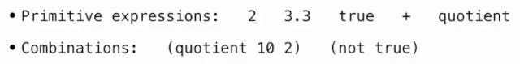
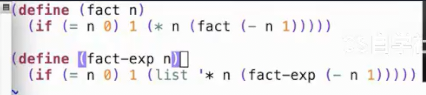
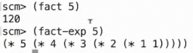
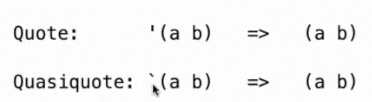
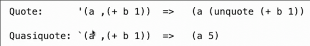
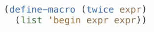
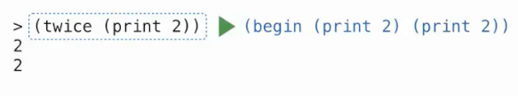

# 程序即数据
 
* [Scheme表达式就是列表](#Scheme表达式就是列表)
* [为什么使用scheme](#为什么使用scheme)
  * [准引用](#准引用)
  * [宏](#宏)

## Scheme表达式就是列表

这是我们熟悉的Scheme表达式



而Scheme列表是一个链表形式，采用`car`和`cdr`的形式表示，其可以表示Scheme中的组合

```scm
scm> (list 1 2 3)
(1 2 3)
scm> (list '+ 2 3)
(+ 2 3)
scm> (eval (list '+ 2 3))
5
```

* 内置过程`eval`接受任何表示为`Scheme`列表或原始的表达式，返回其值

因此如果我们需要写一个生成`scheme`代码的程序，只需要构建列表，当我们需要运行时，`eval`即可

`python`也有内置的`eval`函数，接受字符串，返回在`python`中其评估的值

但是`scheme`中，所有表达式都是列表形式的，因此编写一个编写程序的程序非常容易





## 为什么使用scheme

人们之所以被基于Lisp的这些编程语言吸引就是因为代码看起来就像是一堆符号和括号，实际上可以编写一个生成程序的程序

### 准引用

引用有两种方式



使用反引号进行**准引用**

通常二者的表现相同，但是准引用表达式的某些部分可以使用逗号来取消引用



### 宏

允许在scheme中能够定义**新的特殊形式**

*其运行良好的原因是，在`lisp`中程序即列表，即数据*

宏在源代码被评估之前会被执行的操作





其并没有评估参数，而是将调用时的表达式作为符号传入，并开始评估过程体，对结果整体`eval`

```scm
scm> (define (twice expr)
        (list 'begin expr expr))
twice
scm> (twice (print 2))
2
(begin undefined undefined)
scm> (twice '(print 2))
(begin (print 2) (print 2))
scm> (eval (twice '(print 2)))
2
2
scm> (define-macro (twice expr)
        (list 'begin expr expr))
twice
scm> (twice (print 2))
2
2
```

从宏观层面`twice`没有立即评估传入的表达式`(print 2)`，而我们可以选择何时评估，因此其成为了特殊形式
