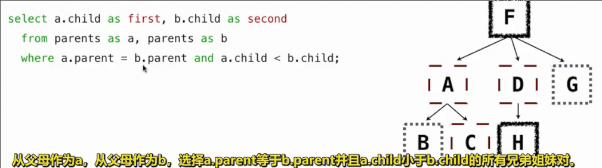
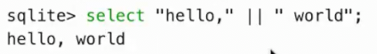

# 连接不同表_数字_字符串
 
* [逗号连接](#逗号连接)
* [处理重复名称](#处理重复名称)
* [数字表达式](#数字表达式)
* [字符串](#字符串)

## 逗号连接

* `A, B`可以得到表A和表B每一条记录的所有组合

## 处理重复名称

但是两个表具有相同的名称，而我想`select`调用合并后表中其中一个的值，怎么办呢

其中`table`是`t1, t2..`这种格式

我们可以通过`as`给表起别名，并能通过`名称或别名.列名`来准确地获取对应原表中的值

这是一个连接自身的`select`语句，目的是提取所有的兄弟对作为新表

## 数字表达式

和`python`中的数字表达式类似

可以出现在任意`expression`中

可以对其使用运算符以及内置过程

## 字符串

字符串表达式可以进行连接操作 **推荐 经常使用**

还有一些其他的字符串操作，但是*不是很好*

`substr(s, 4, 2)` 字符串`s`的字字符串，从位置4开始，长度为2

`instr(s, " ")` 返回数字，代表字符串`s`中第一个空格的位置

索引都是从1开始

*字符串的这些其他操作不应过多使用*

此外字符串也可以表示一些结构

*很不推荐*
