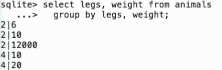

# 聚合函数
 
* [什么是聚合函数](#什么是聚合函数)
* [聚合函数和单个值混用](#聚合函数和单个值混用)
* [组](#组)

## 什么是聚合函数

我们目前的`select`都是逐行评估的

在`select`中的`expression`处通过**聚合函数**可以对一组行进行整体评估，比如可以获取所有行的和


我们只获得了一个输出行

`min` `max`就是一些聚合函数

* `sum` `avg` `count`

```sql
sqlite> select weight / legs from animals;
2
5
2
3
5
6000
sqlite> select max(weight / legs) from animals;
6000
```

也可以结合不同的聚合

```sql
sqlite> select max(weight / legs), min(weight) from anim
6000|6
```


对于`count`，其用于统计行数，通常`count(*)`

有一种传入列名的原因

* `count(distinct legs)` 计算不同独特legs的数量
* 聚合函数都可以传入`distinct ..`

## 聚合函数和单个值混用


会得到一行，其中`kind`属性为`weight`最大的行的`kind`属性

用`max`选中某值时也选中了这行

但是这种情况就不是有意义的


## 组

聚合函数获取来自**组**中所有行的某表达式的所有值，并操作

默认情况下，`where`过滤出的所有行都是一组，因此聚合时，只得到一行

我们可以在`select`中分组


`group by`后面跟一个表达式，其**唯一值**的数量就是分组的个数


结果是我们得到两行


也可以根据多个表达式来分组



当第一个表达式相同时，查看第二个表达式判断是否一组

`having`子句用于过滤特定的组别

其可以包含聚合函数


