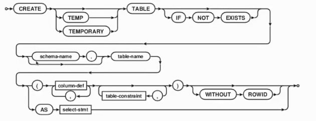
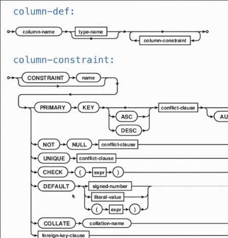
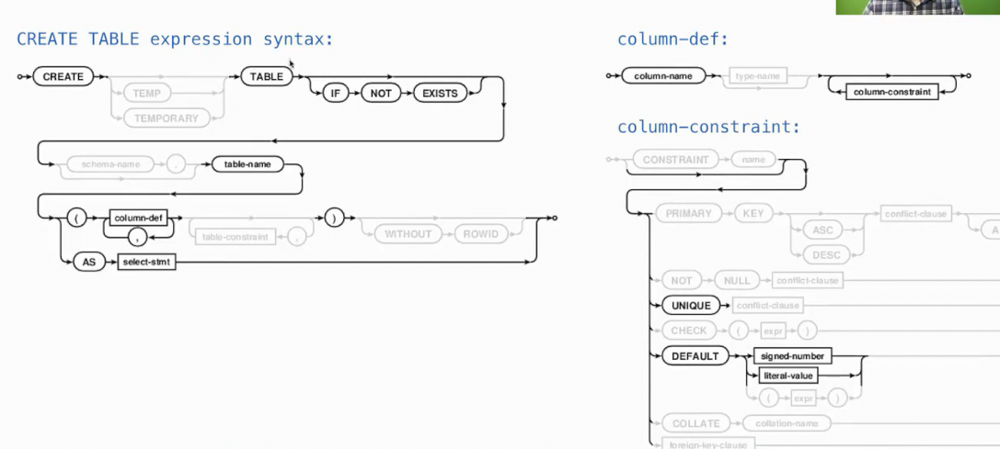
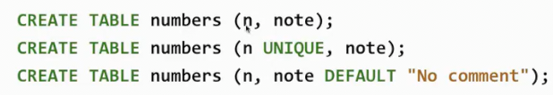
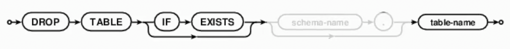
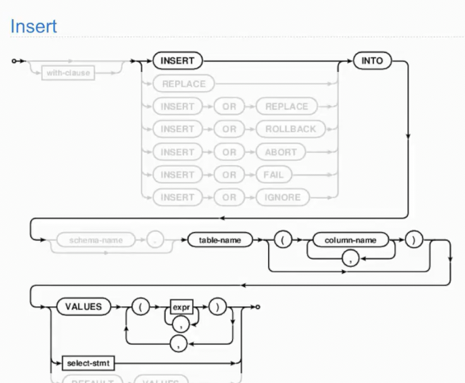

# 创建表 删除表

* `create table` 创建表
* `drop table` 删除表

## 创建表

`create table`的完整语法

我们关注已见过的版本

`create table [if not exit] table-name {as select-stmt | \(column-def[, colume-def ...]\)}` 

其中`column-def`为 **列定义**

`column-name [column-constraint ...]`

`column-constraint`为 **列约束**

`unique | default {signed-number | liter-value}`

* 第一句创建一个名为`numbers`的表，其有两个列`n`和`note`
* 第二句在此基础上，限制了不同记录`n`的值唯一
* 第三句在第一句基础上，给予`note`默认值 `"No comment"`

## 删除表

`drop table [if exists] table-name`

## 修改表

