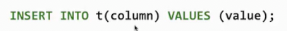
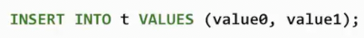
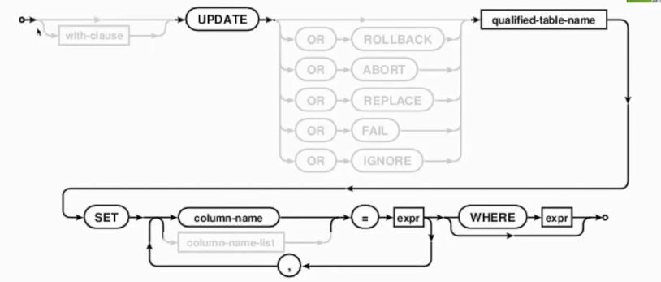
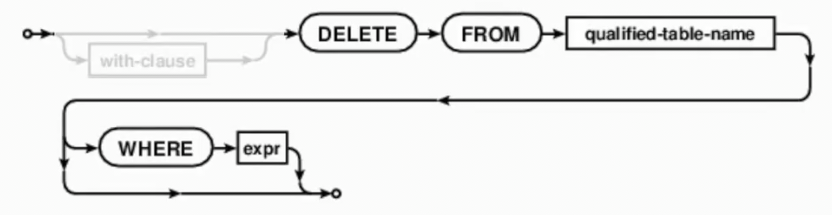

# 创建表_删除表
 
* [创建表](#创建表)
* [删除表](#删除表)
* [追加表](#追加表)
* [更新表](#更新表)
* [删除行](#删除行)

* `create table` 创建表
* `drop table` 删除表

## 创建表


`create table`的完整语法


我们关注已见过的版本


`create table [if not exit] table-name {as select-stmt | \(column-def[, colume-def ...]\)}` 

其中`column-def`为 **列定义**

`column-name [column-constraint ...]`

`column-constraint`为 **列约束**

`unique | default {signed-number | liter-value}`


* 第一句创建一个名为`numbers`的表，其有两个列`n`和`note`
* 第二句在此基础上，限制了不同记录`n`的值唯一
* 第三句在第一句基础上，给予`note`默认值 `"No comment"`

## 删除表


`drop table [if exists] table-name`

```sql
sqlite> create table primes(n, prime);
sqlite> drop table primes;
sqlite> select * from primes;
Parse error: no such table: primes
```

## 追加表




这是向表t的末尾插入新行，指定的插入对应列的对应值



没有给出列名，指所有列依次插入各值

```sql
sqlite> create table primes(n UNIQUE, prime DEFAULT 1);
sqlite> select * from primes;
sqlite> INSERT INTO primes VALUES (2, 1), (3, 1);
sqlite> select * from primes; -- values后多个括号表示插入多行 
2|1
3|1
```

由于我们设置prime列默认值，我们只需要向列n插入

```sql
sqlite> INSERT INTO primes(n) VALUES (4), (5), (6), (7);
sqlite> select * from primes;
2|1
3|1
4|1
5|1
6|1
7|1
```

select语句可以从表中取出一些行的某些列，这些列和insert后的列数对应

```sql
sqlite> INSERT INTO primes(n) SELECT n+6 from primes;
```

## 更新表



我们目前有一个列n递增，列prime全1的表

```sql
sqlite> select * from primes;
2|1
3|1
4|1
5|1
6|1
7|1
...
sqlite> select count(*) from primes;
24
```

我们更新2的倍数为非素数

```sql
sqlite> update primes set prime=0 where n>2 and n%2=0;
sqlite> select * from primes;
2|1
3|1
4|0
5|1
6|0
7|1
8|0
```

同样的逻辑，更新3和5的倍数为非素数

## 删除行



没有`where`会删除所有行，但是表仍存在

```sql
sqlite> DELETE FROM primes WHERE prime=0;
sqlite> select * from primes;
2|1
3|1
5|1
7|1
11|1
13|1
17|1
19|1
23|1
```
