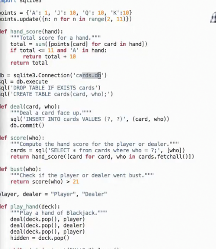
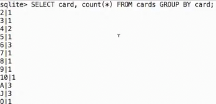

# Python执行SQL_不同程序和数据库的连接
 
* [Python_执行_SQL](#Python_执行_SQL)
* [数据库连接](#数据库连接)

## Python_执行_SQL

python程序可以创建并执行sql

```py
import sqlite3

db = sqlite3.Connection("n.bd") # 加载或创建n.db并返回数据库对象
db.execute("CREATE TABLE nums AS SELECT 2 UNION SELECT 3") # 创建两行一列的表 列名是 2
db.execute("INSERT INTO nums VALUES (?), (?), (?)", range(4, 7)) # 向表中添加三行
# 等同于_db_execute("INSERT_INTO_nums_VALUES_(4)__(5)__(6)")
print(db.execute("SELECT * FROM nums").fetchall()) # 查询数据 返回 游标对象 cursor 具有 fetchall() 方法 转换为元组
```

> [(2,), (3,), (4,), (5,), (6,)]

```py
# 保存数据库文件的更改
db.commit()
```

```sql
SQLite version 3.46.1 2024-08-13 09:16:08
Enter ".help" for usage hints.
sqlite> SELECT * FROM nums;
2
3
4
5
6
```

## 数据库连接

多个程序可以连接同一数据库，从同一表插入值或读取值

数据库管理系统的一个任务是要处理不同的连接到同一数据库，以及多个不同客户端试图更改同一个表的情况

这是21点的游戏规则

2-10 算对应点数 A可算1可算11 JQK算10

1. 玩家和庄家轮流抽两张牌
2. 庄家把第二张牌压下
3. 玩家的目标是超过庄家的牌 因此可以选择继续抽牌，但是一旦超过21,则输掉
4. 玩家结束后，庄家翻开牌，并继续抽牌直到点数在17-21,和玩家比点数 如果抽牌中超过21,则庄家负



在python程序中，循环抽牌，更新数据库，检验是否结束

```txt
发牌中...
再抽一张？y
再抽一张？y
再抽一张？y
Player 的牌爆掉了！

发牌中...
再抽一张？y
Player 的牌爆掉了！

发牌中...
再抽一张？y
再抽一张？y
再抽一张？y
再抽一张？n
Player 20 而 Dealer 19

发牌中...
再抽一张？y
再抽一张？y
再抽一张？n
Dealer 的牌爆掉了！

发牌中...
再抽一张？n
Dealer 的牌爆掉了！
```

而我们通过sqlite来查看现在公开的牌来做决策

```sql
sqlite> select * from cards where who != 'DISCARD' order by who;
J|Dealer
6|Player
3|Player
5|Player
A|Player
5|Player
sqlite> select * from cards where who != 'DISCARD' order by who;
4|Dealer
7|Player
5|Player
sqlite> select * from cards where who != 'DISCARD' order by who;
4|Dealer
7|Player
5|Player
3|Player
sqlite> select * from cards where who != 'DISCARD' order by who;
4|Dealer
7|Player
5|Player
3|Player
2|Player
sqlite> select * from cards where who != 'DISCARD' order by who;
6|Dealer
A|Player
9|Player
```

甚至我们可以整理弃牌堆来更好地决策



在这个事例，两个程序`python`和`sqlite`同时连接数据库`cards.db`实现对应功能

完整的python文件在[这里](21.py)
