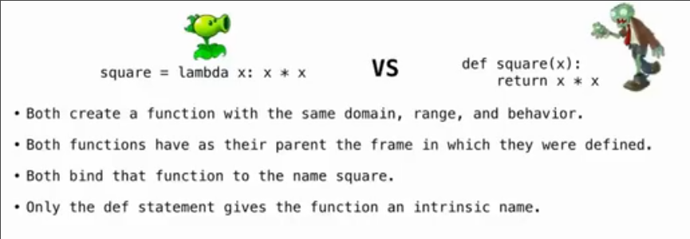

# 迭代_高阶函数_作用域_函数组合_lambda表达式
 
* [迭代](#迭代)
* [控制语句](#控制语句)
  * [逻辑运算的短路行为](#逻辑运算的短路行为)
* [高阶函数](#高阶函数)
  * [断言](#断言)
* [泛化](#泛化)
  * [返回函数的函数_闭包](#返回函数的函数_闭包)
  * [函数传递时的环境相关_作为参数_作为返回值](#函数传递时的环境相关_作为参数_作为返回值)
    * [函数作为参数](#函数作为参数)
    * [函数作为返回值](#函数作为返回值)
    * [手画环境示意图的小tip](#手画环境示意图的小tip)
* [局部名称的作用域](#局部名称的作用域)
* [函数组合_](#函数组合_)
* [Lambda表达式](#Lambda表达式)
* [函数柯里化](#函数柯里化)
  * [为什么使用柯里化](#为什么使用柯里化)

## 迭代

*计算斐波那契数列*


## 控制语句

这个函数可行吗

```py
def if_(c, t, f):
    """当条件 C 为真时，返回 T，否则返回 F"""
    if c:
        return t
    else:
        return f
```

和`if`语句不同，在调用函数前，首先会评估其内所有参数，从而无论条件真假，t和f都会被评估一遍，当在如下所示的函数中调用就会出错

```py
def real_sqrt(x):
    """当 X 大于 0 时返回 sqrt(x)，否则返回 0"""
    return if_(x > 0, sqrt(x), 0)
```

### 逻辑运算的短路行为

`<left> and <right>`

* 如果通过`left`可以得知结果（对于`and`来说，即为假），那么就不会再评估`right`，而是直接返回结果

`or`也相似


## 高阶函数

### 断言

`assert 布尔值, '错误信息'`

当布尔值为`False`时，会抛出`'错误信息'`


## 泛化

*一种推荐的思想*

提取多个相似函数中相同的部分为一个原始函数，并将相异的部分（可以是某个系数，甚至是某个函数），作为参数传递入原始函数，达到差异化的目的


### 返回函数的函数_闭包

```py
"""返回函数的函数"""

def make_adder(n):
    """返回一个函数，返回函数接受参数 K，返回 K + N
    
    >>> add_three = make_adder(3)
    >>> add_three(4)
    7
    """
    def adder(k):
        return k + n
    return adder
```

* 函数可以传递为参数，也可以被返回

### 函数传递时的环境相关_作为参数_作为返回值

#### 函数作为参数

```py
def apply_twice(f, x):
    return f(f(x))

def square(x):
    return x * x
```

```py
>>> square(10)
100
>>> apply_twice(square, 3)
81
>>> square
<function square at 0x7b5ba9124b80>
>>> 3
3
```


当调用`apply_twice(square, 3)`时

* 首先创建新的帧，然后将传入`square指向的函数`和`3`绑定到形参`f`, `x`
* 如此 f 同样指向 函数`func square(x)`
* 接着执行 `return f(f(x))`，在当前环境中查找`f`的指向，即`func square(x)`
* ...

#### 函数作为返回值

```py
def make_adder(n):
    def adder(k):
        return k + n
    return adder
```

```py
>>> add_three = make_adder(3)
>>> add_three(4)
7
>>> add_three(5)
8
```


* 当`make_adder`被调用时，其定义一个函数，这个函数的父栈帧即为`func make_adder`被调用时所创建帧 *因为在哪里创建其父帧就是谁*
* 而当`make_adder`返回后，调用这个返回的函数时，这个**函数内部仍然可以在当初创建他的`make_adder`的环境中寻找变量** *因为环境为其沿父帧链依次寻找直到全局帧*

#### 手画环境示意图的小tip

1. 当函数被定义时，总是创建这样一个函数`func <name>(<formal parameters>) [parant=<parant>]`
    * 其父帧为定义时所在的当前帧
2. 同时为当前帧创建一个同名名称绑定到这个函数
3. 当函数调用时，创建一个新帧，以被调用函数的名称作为标题
4. 在新帧中创建形参名称并绑定到实参
5. 在新帧作为起始的环境中执行函数体

## 局部名称的作用域

```py
>>> def f(x, y):
...     return g(x)
... 
>>> def g(a):
...     return a + y
... 
>>> f(1, 2)
Traceback (most recent call last):
  File "<stdin>", line 1, in <module>
  File "<stdin>", line 2, in f
  File "<stdin>", line 2, in g
NameError: name 'y' is not defined
```

* 当调用`f(1, 2)`时
* 创建帧，其父帧为全局
* 新帧名称 x y 绑定到实参
* 执行函数体 `return g(x)`，寻找名称`g`
* 在父帧全局帧中找到，创建帧，传递形参
* 在`g`调用所在帧中执行 `return a + y`
* 寻找`y`，但是当前帧的父帧为全局帧，环境中并没有`y`

## 函数组合_

```py
def make_adder(n):
    def adder(k):
        return k + n
    return adder

def square(x):
    return x * x

def triple(x):
    return 3 * x

def composel(f, g):
    def h(x):
        return f(g(x))
    return h
```

```py
>>> square(5)
25
>>> triple(5)
15
>>> squiple = composel(square, triple)
>>> squiple(5)
225
>>> tripare = composel(triple, square)
>>> tripare(5)
75
>>> squadder = composel(square, make_adder(2))
>>> squadder(5)
49
```

## Lambda表达式

我们希望有一种方式使得名称可以通过赋值的方法绑定一个从未写过的函数 `square = ...`

```py
# :_前为形参
# :_后为返回值
square = lambda x: x * x
```

```py
>>> square = lambda x: x * x
>>> square
>>> square(4)
16
>>> square(10)
100
```

我们也可以直接将其作为匿名函数直接调用

```py
>>> (lambda x: x * x)(3)
9
```

其返回值必须是一个单个的表达式

并且其没有语句



区别在于`def`自动给了一个同名名称，并且生成一个内在名称，而`lambda`需要手动赋值，并且函数自身是匿名的


## 函数柯里化


将多参数函数转换为一个单参数高阶函数的一般途径

### 为什么使用柯里化

*wav文件的原理*


对于声波采样，存储，但不压缩，因此空间占用相对大

可以用真实声音采样，同样可以使用数学函数生成声音

`wave`是个用来处理`.wav`文件的模块，而`struct`模块用来以`.wav`要求的格式编码整数

```py
from wave import open
from struct import Struct
from math import floor
```

采样率，来控制获取每秒有多少次来获取采样值，以控制音频

```py
frame_rate = 11025
```

`.wav`文件的编码

```py
def encode(x):
    """按.wav 文件要求的编码格式 编码值 x
    """
    i = int(16384 * x)
    return Struct('h').pack(i)
```

`play`函数是一个用于将波形写入`.wav`的函数, 其参数之一是一个描述波形的函数

```py
def play(sampler, name='song.wav', seconds=2):
    """将波形写入 name
    sampler 描述波形的函数 当输入时间时，输出对应时间的波形值(-1 - 1之间)
    name 输出的.wav文件
    seconds 声音的时长
    """
    out = open(name, 'wb')
    out.setnchannels(1)
    out.setsampwidth(2)
    out.setframerate(frame_rate)
    t = 0
    while t < seconds * frame_rate:
        sample = sampler(t)
        out.writeframes(encode(sample))
        t = t + 1
    out.close()
```

`trl`函数是一个生成一个周期内的三角波波形的函数

```py
def trl(frequency, amplitude=0.3):
    """根据 频率 FREQUENCY 振幅 AMPLITUDE 返回描述三角波形的函数"""
    period = frame_rate // frequency # 一个周期内的采样数(时间，单位是时间帧)
    def sampler(t):
        saw_wave = t / period - floor(t / period + 0.5)
        trl_wave = 2 * abs(2 * saw_wave) - 1
        return amplitude * tri_wave
    return sampler
```

而c音符的频率是`261.63`

```py
c_freq = 261.63
```

查看波形

```py
>>> c = trl(c_freq)
>>> t = 0
>>> while t < 100:
...     print(c(t))
...     t += 1
...
-0.3
-0.2714285714285715
-0.24285714285714305
...
0.10000000000000017
0.12857142857142864
0.3
0.2714285714285715
0.014285714285714235
...
-0.014285714285714235
-0.04285714285714297
-0.24285714285714277
-0.2714285714285715
-0.3
-0.2714285714285715
-0.24285714285714305
...
```

写入音乐文件
```
>>> play(c)
```

听上去是一个2s的单个音符

我们可以结合其他音符来生成和弦音

这是`c`和`e`音符的和弦，通过`both`函数，将两个表示波形的函数叠加成一个新函数

```py
c_freq, e_freq, g_freq = 261.63, 329.63, 392.00

def both(f, g):
    return lambda t: f(t) + g(t)

play(both(trl(c_freq), trl(e_freq)))
```

我们还可以控制音符的起止时间

```py
def note(f, start, end):
    """根据波形函数F 返回一个只在START到END区间有波形的函数
    start 起始时间 秒
    """
    def sampler(t):
        seconds = t / frame_rate
        if seconds < start:
            return 0
        elif seconds > end:
            return 0
        else:
            return f(t)
    return sampler

c, e = trl(c_freq), trl(e_freq)

play(note(c, 0, 1/4))
```

结合我们之间`both`叠加波形，我们可以依次播放两个音符

```py
play(both(note(c, 0, 1/4), note(e, 2/4, 3/4)))
```

加上一点音符前后的淡入淡出，避免太过突兀

```py
def note(f, start, end, fade=0.01):
    """根据波形函数F 返回一个只在START到END区间有波形的函数
    start 起始时间 秒
    fade 淡入淡出
    """
    def sampler(t):
        seconds = t / frame_rate
        if seconds < start:
            return 0
        elif seconds > end:
            return 0
        elif seconds < start + fade:
            return (seconds - start) / fade * f(t)
        elif seconds > end - fade:
            return (end - seconds) / fade * f(t)
        else:
            return f(t)
    return sampler
```

让我们演奏歌曲

```py
c, e = trl(c_freq), trl(e_freq)
g, low_g = trl(g_freq), trl(g_freq / 2)

z = 0
song = note(e, z, z + 1/8)
z += 1/8
song = both(song, note(e, z, z + 1/8))
z += 1/4
song = both(song, note(e, z, z + 1/8))
z += 1/4
song = both(song, note(c, z, z + 1/8))
z += 1/8
song = both(song, note(e, z, z + 1/8))
z += 1/4
song = both(song, note(g, z, z + 1/4))
z += 1/2
song = both(song, note(low_g, z, z + 1/4))
z += 1/2

play(song)
```

我们可以再次封装，演奏不同八度下的马里奥

```py
def mario_at(octave):
    c, e = trl(octave * c_freq), trl(octave * e_freq)
    g, low_g = trl(octave * g_freq), trl(octave * g_freq / 2)
    return mario(c, e, g, low_g)

def mario(c, e, g, low_g):
    z = 0
    song = note(e, z, z + 1/8)
    z += 1/8
    song = both(song, note(e, z, z + 1/8))
    z += 1/4
    song = both(song, note(e, z, z + 1/8))
    z += 1/4
    song = both(song, note(c, z, z + 1/8))
    z += 1/8
    song = both(song, note(e, z, z + 1/8))
    z += 1/4
    song = both(song, note(g, z, z + 1/4))
    z += 1/2
    song = both(song, note(low_g, z, z + 1/4))
    z += 1/2
    return song
    
# play(mario_at(1/2))
play(both(mario_at(1), mario_at(1/2)))
```

这里是[完整的文件](wav.py)
