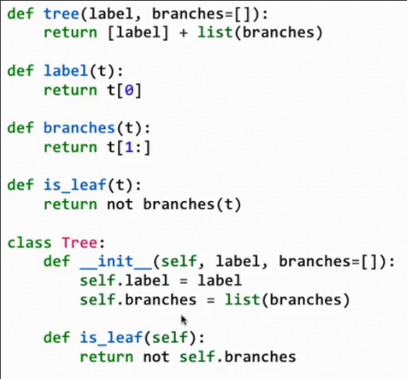
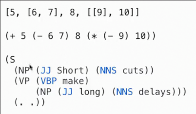
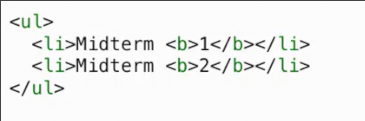
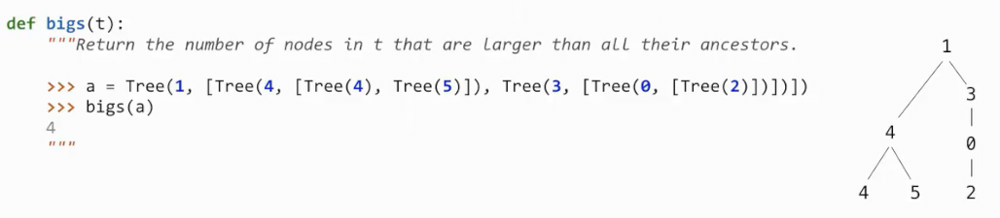
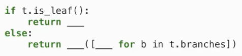
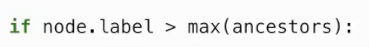
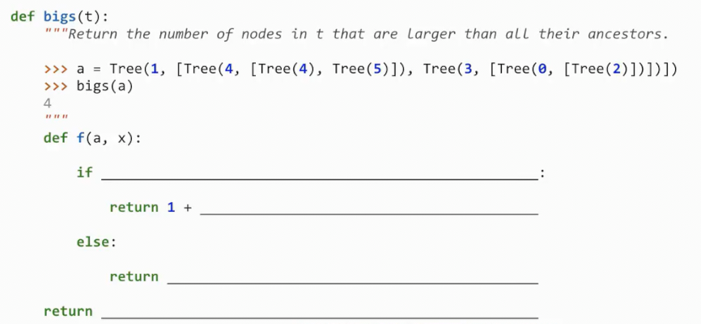
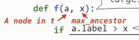
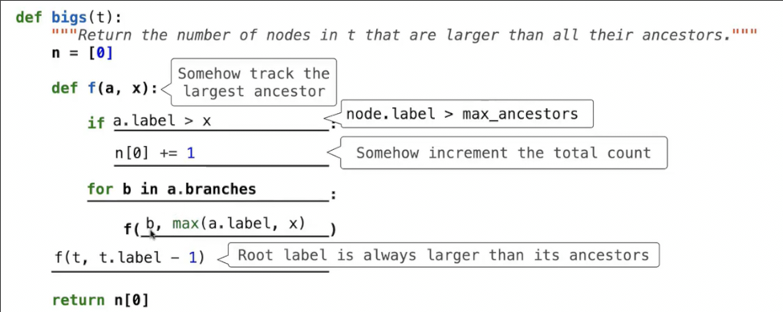
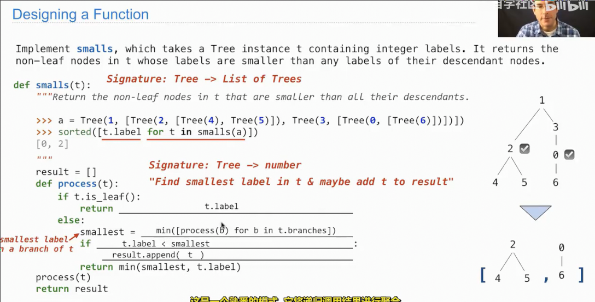

# 树_解决问题的思路_通用过程_函数的实现过程
 
* [树的介绍](#树的介绍)
* [解决问题的思路](#解决问题的思路)
* [通用过程](#通用过程)
* [函数的设计](#函数的设计)

## 树的介绍

树结构可以用数据抽象配合列表表示，也可以用类表示



树是一个抽象概念，泛化了所有具有树形组成部分的事物 *这也是python没有内置树类型的部分原因*

树可以包括其它树，下面是一些直观的树状程序结构





树的处理通常需要对子树的递归操作

## 解决问题的思路

当我们阅读问题时经历的过程



* 返回树中比其所有祖先节点大的节点数量

1. 不要立即写代码，甚至不要考虑已经存在的代码，而是思考要解决的问题到底要干什么？看不懂就从示例入手
    * 做一些笔记比如 t是树 bigs返回一个数字
    * 画向右侧的示例图表
    * **逐步**分析图表，模拟得出最终结果 *这里的逐步指的是，每一步尽量是计算机可以直接做到的，比如我们可以直接比较2和0，但是比较2和3需要额外记下一些东西，我们不能直接比较*

2. 我们考虑具体的代码思路，首先考虑这种递归



但是我们找不到方法使得叶节点能像2一样和其祖先节点比较

我们分析代码缺少什么，期望找到这样的代码



于是想到这样的结构



或许有时我们被强制使用一些名称，我们可以做一些笔记来提醒名称实际代表什么



```py
def bigs(t):
    """返回树中所有label大于其祖先节点标签的节点数量"""
    def bigs_num(t, ancestor_max):
        """返回树中所有label大于所有祖先label的节点个数"""
        if t.label > ancestor_max:
            now_node = 1
        else:
            now_node = 0
        if t.is_leaf():
            return now_node
        return now_node + sum([bigs_num(b, max(ancestor_max, t.label)) for b in t.branches])
    return bigs_num(t, -10000)
```

接下来可以手动模拟代码执行的过程，来查看是否和我们之前的模拟**完全吻合**

## 通用过程

对于一些泛性的问题，通常有通用的思路和方法

比如在树递归中积累结果

* 通过返回值，归之后将结果累积组合，完成累积
* 另一种方式是初始化一个值或者空列表，在递归中更新这个值或者列表 可以通过传参或者父帧或者祖先帧的变量



## 函数的设计

这门课侧重于编程范式和编程语言，更强调解决问题的能力

1. 设置数据定义 **必须表示的信息以及如何表示** *比如对餐厅的描述？ 如何表示？ 数据抽象底层使用字典或列表等？*

2. 编写将要定义的函数文档 **签名 目的 头部**
  * 定义 `def ...` 文档字符串：目的，参数的作用和形式

3. 编写函数示例 
  * 文档字符串中的范例

4. 函数模板
  * 函数的更改 结构 
  * 是否为`if - else`结构？如果是，条件是什么？
  * 函数内要调用哪些其他函数？即便不知道他们放在哪里

5. 函数定义
  * 填补模板中的空白

6. 函数测试
  * 确保函数通过示例


