# lambda_返回_抽象_错误
 
* [lambda表达式的环境](#lambda表达式的环境)
* [返回语句_](#返回语句_)
* [抽象](#抽象)
  * [选择名称](#选择名称)
* [错误_Tracebacks回溯](#错误_Tracebacks回溯)
  * [语法错误](#语法错误)
  * [runtime_error](#runtime_error)
  * [逻辑或行为错误](#逻辑或行为错误)

## lambda表达式的环境

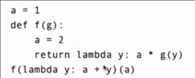

lambda表达式和普通环境一样，在哪里定义就以谁为父帧

在`lambda`表达式定义的同时就会进行评估

* 当调用`f(lambda y: a + y)`时，首先在全局帧中找到`f`，之后评估`lambda`表达式，其父帧为全局帧，假想其名称`l1`
* 之后进入帧`f`，将形参`g`指向`l1`函数，f帧内`a = 1`, 返回时，定义并评估`lambda`表达式，其父帧为`f`，假想名称`l2`
* 因此回到全局帧，现在即调用`l2(a)` - `l2(1)`
* 进入帧`l2`，将1赋予其形参y,返回时，使用到`a`，其帧内没有，向父帧`f`寻找，得到`a = 2`
* 之后评估`g(y)` - `g(1)`，帧内无`g`，向父帧`f`寻找，找到`g -> l1`，以此调用函数`l1`
* 进入帧`l1`, 将1赋予形参y，返回时使用a，其内没有而向父帧`global`寻找，找到`a = 1`，返回 `1 + 1  = 2`
* 因此回到帧2, 帧2返回 `2 * 2 = 4`
* 最后回到全局帧，结果为4

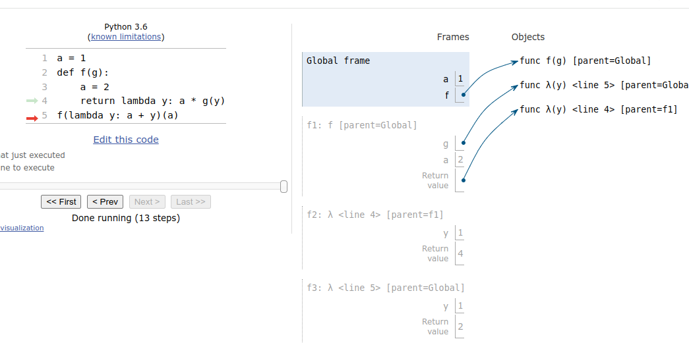

## 返回语句_

返回意味着得到了上一帧表达式的值，本帧结束，回到上帧（而不是父帧）

```py
>>> def end(n, d):
...     while n > 0:
...         if n % 10 == 4:
...             return
...         print(n % 10)
...         n = n // 10
... 
>>> end(34567, 5)
7
6
5
```

## 抽象

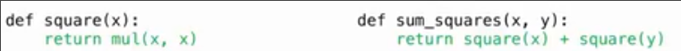

`sum_squares`需要知道关于函数`square`的一些内容

* `square`需要有一个参数
* 不需要知道`square`的变量名称 因为在不同环境中`square`函数的变量名称不同
* 需要知道`square`的计算过程
* 不需要知道`square`一定调用`mul` 

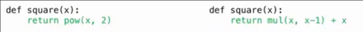

### 选择名称

名称对程序的正确性不重要，但是对于其他人的可阅读性来说很重要

* 尽量传达与其绑定的值的含义或目的，以得出我们为什么创建这个值和接下来对它会做什么
* 绑定到名称的值类型，最好在函数`stockString`中进行文档记录，而不是在名称中记录
* 函数的名称通常传达其表达效果，比如打印，三倍化，或返回的值如绝对值`print` `triple` `abs`

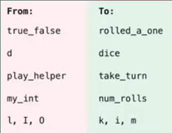

一些不重复的中间过程不需要命名，简单地复合即可，而一些重复性高的过程最好命名, 以便更改

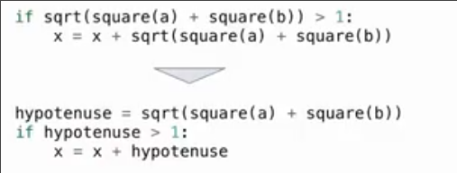

也不要把复合过程弄得太长，不便阅读

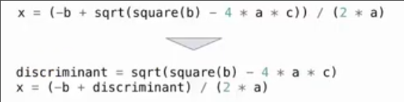

名称可以很长，如果这么做便于记录我们在做什么

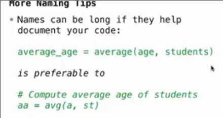

有些通用名称，计算函数的命名也可以很短，方便随时使用

还有一些约定俗称的单名称命名

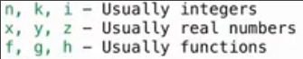

## 错误_Tracebacks回溯

### 语法错误

在python开始执行程序前就能检测到，这被称为语法错误

由表达式形式不正确引起 

*开括号没有对应的闭括号*

*加号要在两个表达式中间出现* ...

### runtime_error

运行时错误

在程序执行时，由python解释器检测到的错误

可以看到一个`tracebacks`，它是一个报告，描述错误发生时程序在做什么，以及要查看哪一行以修复错误

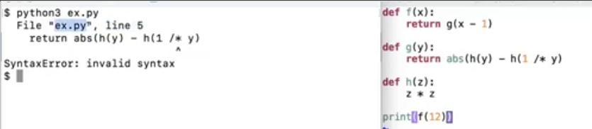

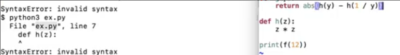

这里是由于开闭括号不匹配，python认为没有闭合括号的一行没有执行完，因此第七行不允许定义

所以python指示的错误可能不在本行，而是附近

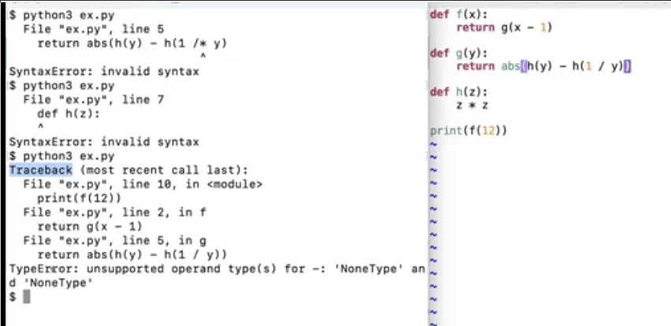

出现了`TypeError`, 这种通常是计算了无法算术运算的事物

我们没有`return`

因此并不一定是当前行出现问题，可能问题早就发生，只是现在才被发现

### 逻辑或行为错误

不会在python中被检测到，只是做了错误的事情

debug的方式是编写测试，并检查这些测试是否正确描述了程序的行为


