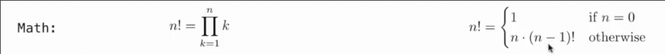

# 装饰器_函数内部访问自身_递归
 
* [装饰器](#装饰器)
* [函数中访问自身](#函数中访问自身)
  * [直接或间接返回自身](#直接或间接返回自身)
  * [函数的递归](#函数的递归)
  * [递归的环境图](#递归的环境图)
  * [验证递归函数的正确性](#验证递归函数的正确性)
  * [相互递归](#相互递归)
  * [递归和迭代的关系](#递归和迭代的关系)
  * [递归调用的顺序](#递归调用的顺序)
  * [树形递归](#树形递归)
    * [例子_计算分区](#例子_计算分区)

## 装饰器

```py
def trace1(fn):
    """返回 fn 的另一个版本，在其调用开始阶段先打印一些东西

    fn - 带有一个参数的函数
    """
    def traced(x):
        print('Calling', fn, 'on argument', x)
        return fn(x)
    return traced

@trace1
def square(x):
    return x * x
@trace1
def sum_squares_up_to(n):
    k = 1
    total = 0
    while k <= n:
        total, k = total + square(k), k + 1
    return total
```

```py
>>> square(12)
Calling <function square at 0x79c931040c20> on argument 12
144
>>> sum_squares_up_to(5)
Calling <function sum_squares_up_to at 0x7ec9014ccd60> on argument 5
Calling <function square at 0x7ec9014ccc20> on argument 1
Calling <function square at 0x7ec9014ccc20> on argument 2
Calling <function square at 0x7ec9014ccc20> on argument 3
Calling <function square at 0x7ec9014ccc20> on argument 4
Calling <function square at 0x7ec9014ccc20> on argument 5
55
```

在`def square`上修饰`@trace1`等同于在函数定义后重新赋值`square = trace1(square)`

将一个函数转化为另一个函数


## 函数中访问自身

### 直接或间接返回自身

在函数中如果不把自身的名称绑定到其他值，那么可以通过名称在其父帧中获取到自身

```py
def print_all(x):
    print(x)
    return print_all
```

```py
>>> print_all(1)(2)(3)(6)
1
2
3
6
<function print_all at 0x75e38d7da2a0>
```

下面这个例子会依次从左至右加和并输出


```py
1
4
9
```

通过一个返回一个调用自身的子函数，完成了状态的保存

### 函数的递归

递归意味着在函数内部直接或**间接**调用自身

递归函数通常是以检查**最基本情况(回归条件)** 开始

之后就是更复杂的一般情况，在我们的例子里就是n不为0的情况，或者更标准的写法下，是n为一位数的情况，返回n

```py
def split(n):
    """把 n 分割成个位和剩余两部分"""
    return n // 10, n % 10

def sum(x):
    """对x的所有位求和"""
    if x == 0:
        return 0
    all_but_last, last = split(x)
    return last + sum(all_but_last)
```

```py
>>> sum(12)
3
```

### 递归的环境图


这是一个使用递归计算阶乘的函数


每次调用`fact`都在解决比上一次更简单的问题，直到我们到达最简单情况

**迭代和递归的对比**




事实上，递归是更容易理解的

### 验证递归函数的正确性

如何验证递归函数是否正确工作呢？


1. 检查基本情况，即事例中`n == 0`的情况
2. 接下来把`fact`当作一个功能来看待 *不考虑其如何实现，而是考虑其应该做什么*
    * 在这里中显然`fact(n-1)`其功能是求`(n-1)`的阶乘
    * 假设其确实会返回`(n-1)`的阶乘
3. 考虑具有功能的`fact`以及其它数据是否把本帧的`fact`实现成功
    * 在这里`n`乘`fact(n-1)`也就是`(n-1)!`是否为`fact(n)`
    * `3 * 假设正确的fact(2)`是否为`fact(3)`

### 相互递归

两个不同的函数互相调用

在校验信用卡的校验位时，我们使用`luhn`算法：

1. **从最右侧(校验位)起，将每第二个数(所有偶数)的值加倍**
2. **如果加倍后的数大于9,那么将加倍后的数所有位相加来替代**
3. **取所有位之和**


有效信用卡的`luhn`和永远是10的倍数

```py
def luhn_sum(n):
    if n < 10:
        return n
    else:
        all_but_last, last = split(n)
        return luhn_sum_double(all_but_last) + last

def luhn_sum_double(n):
    all_but_last, last = split(n)
    luhn_digit = sum(2 * last)
    if n < 10:
        return luhn_digit
    else:
        return luhn_sum(all_but_last) + luhn_digit
```

### 递归和迭代的关系

想把递归转换为迭代如何处理？

迭代是递归的一个特殊情况

关键是弄清迭代函数每次通过`while`要维护的状态


我们可以观察递归函数，**注意在每次递归中传递什么，返回什么，这些可能是我们要维护的信息**


在这里我们为下一个递归传递剩余要加和的内容

返回的是一个部分加和

```py
def sum_iter(n):
    now_sum = 0 # 部分加和
    last_digits = n # 剩余位
    while last_digits > 0:
        all_but_last, last = split(last_digits)
        now_sum += last
        last_digits = all_but_last
    return now_sum
```

而将`while`迭代转化为递归就容易许多，原因在与迭代是递归的一种特殊情况

**关键在与寻找不同迭代中保持的状态，将其作为参数传递**


### 递归调用的顺序

```py
def cascade(n):
    if n < 10:
        print(n)
    else:
        print(n)
        cascade(n//10)
        print(n)
```

```py
>>> cascade(5)
5
>>> cascade(12345)
12345
1234
123
12
1
12
123
1234
```

调用之后的任何语句，都要在返回后才执行，在递归中，就是归的过程中执行


这两种写法中，第一个将基本过程和一般过程分开，因此更清晰

### 树形递归

发生在一个函数帧内发生多次递归调用

如斐波那契数列

```py
def fib(n):
    if n == 0:
        return 0
    elif n == 1:
        return 1
    else:
        return fib(n - 1) + fib(n - 2)
```


```py
from gtr import trace
@trace
def fib(n):
```

```py
>>> fib(3)
fib(3):
    fib(2):
        fib(1):
        fib(1) -> 1
        fib(0):
        fib(0) -> 0
    fib(2) -> 1
    fib(1):
    fib(1) -> 1
fib(3) -> 2
2
```

由此可以看出，这种算法有许多值被重复评估，因此在`n=35`时，耗时已经相当长

但是树状递归不一定很慢

#### 例子_计算分区

正整数 n 使用大小不超过 m 的部分进行分区的方式有多少种


即加数不能超过4

我们用较简单问题的组合来解释复杂的问题

* 不用4的部分 `count_partitions(6, 3)`
* 用4的部分 `count_partitions(2, 4)`


