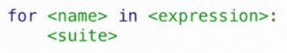
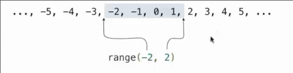
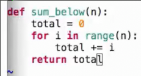
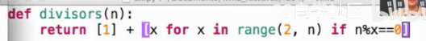
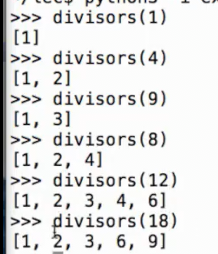

# 列表
 
* [列表的定义](#列表的定义)
* [列表的元素_in运算符](#列表的元素_in运算符)
* [列表的for语句](#列表的for语句)
  * [for_的执行过程_](#for_的执行过程_)
  * [for语句进行头部解包](#for语句进行头部解包)
* [range](#range)
* [列表推导](#列表推导)

## 列表的定义

```py
>>> [41, 43, 47, 49]
[41, 43, 47, 49]
>>> odds = [41, 43, 47, 49]
>>> odds[0]
41
>>> odds[1]
43
>>> len(odds)
4
```

索引最好理解为从起始位置的偏移量

```py
# 列表的定义
>>> digits = [1, 8, 2, 8]
>>> digits = [2//2, 2+2+2+2, 2, 2*2*2]
```

```py
# 获取列表元素
>>> digits[3]
8
>>> from operator import getitem
>>> getitem(digits, 3)
8
```

 并列表或者形成重复列表，可以使用加法或乘法运算

```py
# 遵循优先级
>>> [2, 7] + digits * 2
[2, 7, 1, 8, 2, 8, 1, 8, 2, 8]
# 也可以使用运算符函数
>>> from operator import add, mul
>>> add([2, 7], mul(digits, 2))
[2, 7, 1, 8, 2, 8, 1, 8, 2, 8]
```

列表的元素可以是其他元素，也可以嵌套其他列表

```py
>>> pairs = [[10, 20], [30, 40]]
>>> pairs[1]
[30, 40]
>>> pairs[1][0]
30
```

## 列表的元素_in运算符

in运算符只能判断left是否为right中一个单独的元素

```py
>>> digits = [1, 8, 2, 8]
>>> 1 in digits
True
>>> 5 in digits
False
>>> '1' == 1
False
>>> '1' in digits
False
>>> [1, 8] in digits
False
>>> [1, 2] in [3, [1, 2], 4]
True
>>> [1, 2] in [3, [[1, 2]], 4]
False
```

## 列表的for语句

while遍历列表的写法

```py
def count(s, value):
    """统计值在序列s中出现的次数"""
    total, index = 0, 0
    while index < len(s):
        element = s[index]
        if element == value:
            total += 1
        index += 1
    return total
```

```py
>>> count([1, 2, 1, 2, 1], 1)
3
```

for允许我们完全忽略掉索引

```py
def count(s, value):
    """统计值在序列s中出现的次数"""
    total = 0
    for element in s:
        if element == value:
            total += 1
    return total
```

### for_的执行过程_

对于环境`for`的影响是

每当循环到`for element in s`时，名称`element`绑定到新的元素，继续执行循环体（不会创建新帧）



整个过程如下

1. 首先评估`expression`的值，其必须产生一个**可迭代值**
2. 对于这个可迭代值的每一个元素
   1. 将`name`绑定与这个元素
   2. 执行`suite`

### for语句进行头部解包

```py
>>> pairs = [[1, 2], [2, 2], [3, 2], [4, 4]]
>>> same_count = 0
>>> for x, y in pairs:
...     if x == y:
...         same_count += 1
... 
>>> same_count
2
```

x和y绑定到每一个`pair`中的每一个元素

## range

range是另一种可迭代值，但不是列表

 

不会包含结尾值(所画线都在两个参数之前）

长度为两个参数之差

可以通过`list()`进行转换

```py
>>> list(range(-2, 2))
[-2, -1, 0, 1]
>>> range(-2, 2)
range(-2, 2)
```

如果只有一个参数，则隐含的起始值为0

```py
>>> range(4)
range(0, 4)
```



当我们不关心这个`i`的时候可以使用

```py
for _ in range(3):
```

## 列表推导

```py
>>> letter = ['a', 'b', 'c', 'd', 'e', 'f', 'm', 'n', 'o', 'p']
>>> [letter[i] for i in [3, 4, 6, 8]]
['d', 'e', 'm', 'o']
```

列表推导根据一个现有的列表，根据某个表达式，计算出一个新的列表

```py
>>> odds = [1, 3, 5, 7, 9]
>>> [x+1 for x in odds]
[2, 4, 6, 8, 10]
```

通过反复将`x`绑定到可迭代的`odds`的元素，来评估`x+1`

```py
>>> [x for x in odds if 25 % x == 0]
[1, 5]
```

这是一种更复杂的形式，后面跟着对新绑定的`x`的条件限制




