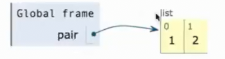
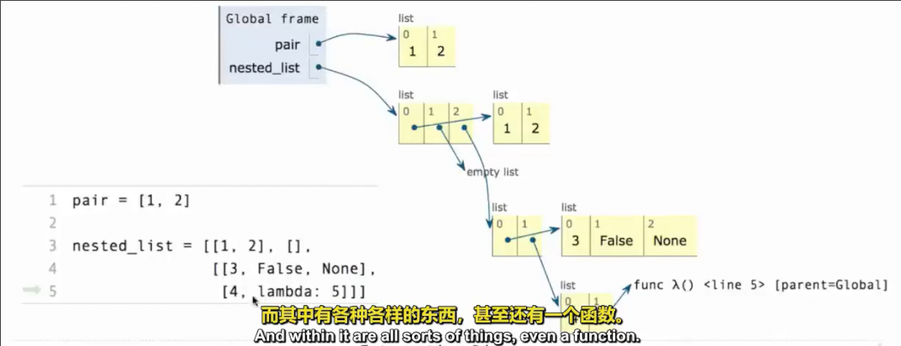
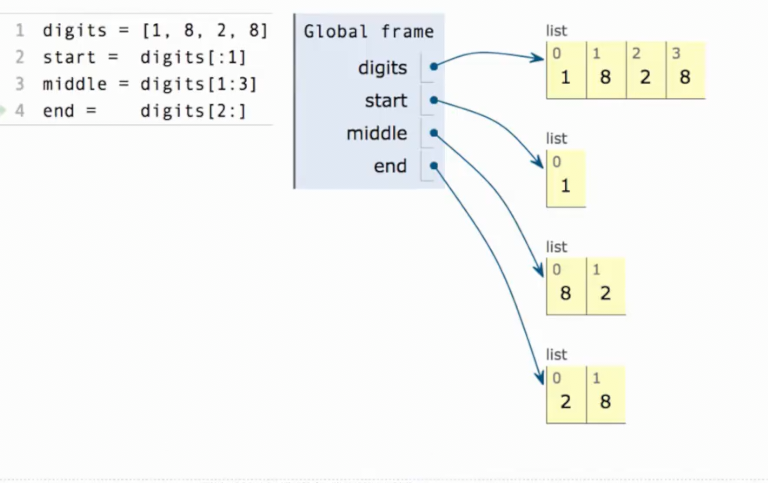
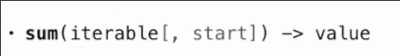
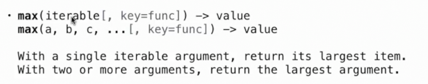
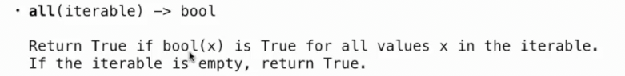
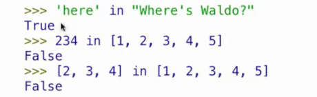
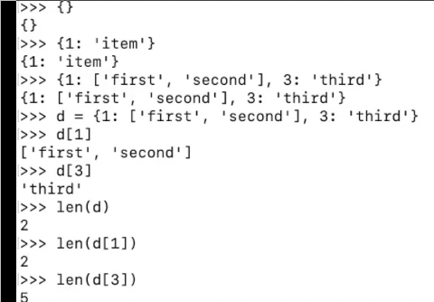
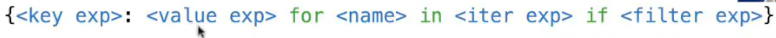
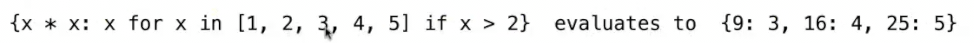

# 方框指针表示列表环境_指针_序列求值_字符串_字典
 
* [列表环境的方框指针](#列表环境的方框指针)
* [切片](#切片)
* [序列求值](#序列求值)
  * [sum](#sum)
  * [max](#max)
  * [all](#all)
* [字符串](#字符串)
* [字典](#字典)
  * [字典的规则和操作](#字典的规则和操作)
  * [字典推导式](#字典推导式)

## 列表环境的方框指针

在环境图中列表被表示为一行带有索引标签的相邻方框，每一个方框对应一个元素

每个方框可以包含一个原始值或者指向一个符合值





## 切片

```py
>>> odds = [3, 5, 7, 9, 11]
>>> list(range(1, 3))
[1, 2]
>>> [odds[i] for i in range(1, 3)]
[5, 7]
```

切片是一种更简明的方式来表达这个从列表内获取子列表的方式

```py
>>> odds[1:3]
[5, 7]
```

同样:右边的数不包含上限，也可以省略

```py
>>> odds[:3]
[3, 5, 7]
>>> odds[1:]
[5, 7, 9, 11]
>>> odds[:]
[3, 5, 7, 9, 11]
```

省略某一个意味从头开始或者一直到结尾

其总是创建新值，而不改变原有的列表



## 序列求值

### sum



求出**可迭代值**的所有元素之和，并加到`start`(默认为0), 如何序列为空，返回`start`

```py
>>> sum([2, 3, 4])
9
>>> sum([2, 3, 4], 5)
14
>>> sum([[2, 3], [4]], [])
[2, 3, 4]
```

注意当列表中的元素不为数字，则一定要提供`start`

### max



* 可以传递一个**可迭代值**和一个可选的函数`key`
    * 这个函数的意义在于对于其中的每一个元素传入到函数中，以计算出实际的最大值
* 也可以传递多个元素和一个可选的函数`key`

```py
>>> max([1, 6], [2, 5], [3, 4], [4, 3], key=lambda lst: lst[1])
[1, 6]
```

同样存在`min`

### all



接受一个可迭代对象，如果可迭代对象的每一个元素在调用`bool()`时都返回`True`则返回`True`，否则返回`False`

如果这个可迭代对象为空，也返回`True`

```py
>>> all(range(5))
False
>>> all(range(1, 5))
True
```

同样存在`any()`

## 字符串

python中通过`exec("...")`可以执行字符串的内容

```py
>>> exec('curry = lambda f: lambda x: lambda y: f(x, y)')
>>> curry
<function <lambda> at 0x7bd4385c8cc0>
```

有两种方式可以表示字符串字面量 `''` `""`，其中`""`中可以加入`'`

此外由三个`'`或`"`组成的三引号可以跨越多行, 常用于文档字符串

字符串是一种序列，可以对其获取长度以及进行列表相同的元素选择

```py
>>> city = 'Berkeley'
>>> len(city)
8
>>> city[3]
'k'
```

但是获取到字符串的元素都是字符串，而列表不同

此外`in`在字符串中的工作也与其他可迭代值不同，可以查找单词，或者子集



## 字典

### 字典的规则和操作

用于存储键值对

键和值的类型不固定，但是键必须为固定对象

```py
>>> numerals = {'I': 1, 'V': 5, 'X': 10}
>>> numerals['I']
1
>>> numerals[0]
Traceback (most recent call last):
  File "<stdin>", line 1, in <module>
KeyError: 0
```

只可以通过键名来查找，并不能通过索引或者是值来查找键

但是字典是一个键的序列

```py
>>> numerals
{'I': 1, 'V': 5, 'X': 10} 
>>> list(numerals)
['I', 'V', 'X']
>>> numerals[0] # 尽管其是序列，但是这样无法访问到键或值
Traceback (most recent call last):
  File "<stdin>", line 1, in <module>
KeyError: 0
>>> list(numerals)[0]
'I'
```

如果想遍历值，可以使用`numerals.values()`, 其也是一个可迭代值，但是不能通过索引访问到元素，但是能执行`sum`之类的求值操作

```py
>>> numerals.values()[0]
Traceback (most recent call last):
  File "<stdin>", line 1, in <module>
>>> [x for x in numerals.values()]
[1, 5, 10]
>>> sum(numerals.values())
16
>>> max(numerals.values())
10
```



注意 键不能重复，否则会覆盖

### 字典推导式





```py
def index(keys, values, match):
    """返回一个字典，这个字典的key为keys中的元素，每个k对应的值是一个列表，其中每个值v是使得`match(k, v)`为真的值, 同时v在可迭代对象values中
    >>> index([7, 9, 11], range(30, 50), lambda k, v: v % k == 0)
    {7: [35, 42, 49], 9: [36, 45], 11: [33, 44]}
    """
    return {k: [v for v in values if match(k, v)] for k in keys}
# 可以注意到的是_由于列表位于字典的内部_所以在其中可以访问到k
```
