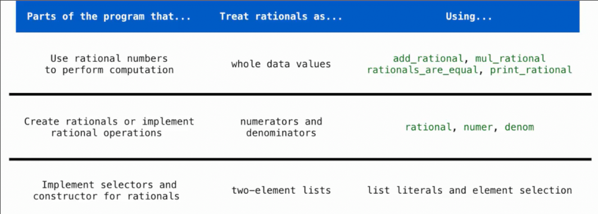
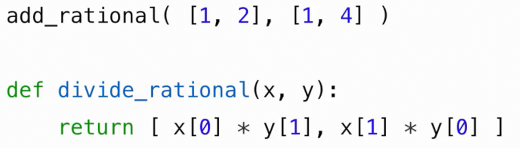

# 数据抽象
 
* [抽象屏障_程序分层](#抽象屏障_程序分层)
* [pairs_具有两个值的抽象类型](#pairs_具有两个值的抽象类型)
  * [列表实现的pair](#列表实现的pair)
  * [闭包表示pair](#闭包表示pair)

大多数值在某种意义上都是一些复合，比如日期将年月日组合在一起形成整体, 地理位置是经纬度的组合

抽象数据类型允许将复合值视为整体

隔离了两部分

* 数据的表示方式
* 数据的操作方式

比如有理数

其有分子和分母两个可以确切表示的整数组成


其中的`rational`我们称之为**构造器**，其返回给我们一个有理数的抽象

而`number`和`denom`称为**选择器**，通过传入这个有理数，其返回给我们有理数的两个部分

据此我们还可以进行有理数的计算


这些函数都是基于上述我们的三个最基本函数：构造器，选择器

## 抽象屏障_程序分层

抽象屏障将程序的不同层分开，使得每个层不需要完全了解剩余其下层或上层

这样做有利于当我们更改其中的一部分时，而不对剩余产生很大影响



更底层的是列表的实现

当我们实现创建有理数和执行有理数操作时，我们无需知道其构造器和选择器内部由列表实现

我们也不应跨越屏障，直接使用列表和列表的元素选择



例如这种对列表操作的实现就是不好的，没有很好的分层，假定了有理数是一个列表

正确的做法是调用构造器

## pairs_具有两个值的抽象类型

由两个值组成，以某种方式捆绑在一起，这样可以视其为一个整体

### 列表实现的pair

我们可以将其实现为列表`>>> pair = [1, 2]`

```py
>>> pair
[1, 2]
>>> x, y = pair # 列表支持这种解包操作
>>> x
1
>>> y
2
>>> pair[0]
1
>>> pair[1]
2
```

这种`pair`很适合我们的有理数

```py
def rational(n, d):
    """构造一个有理数 代表 N/D"""
    return [n, d]
```

对应地，两个选择器用于从列表形式的有理数中获取分母分子

```py
def numer(x):
    """返回一个有理数的分子"""
    return x[0]

def denom(x):
    """返回一个有理数的分母"""
    return x[1]
```

我们还需要对构造好的有理数约分

```py
from fractions import gcd

def rational(n, d):
    """构造一个有理数 代表 N/D"""
    g = gcd(n, d)
    return [n // g, d // g]
```

### 闭包表示pair

这是一个有理数的抽象表示


我们通过闭包，在一个函数内定义一个函数，因此可以引用封闭作用域中的n和d 


