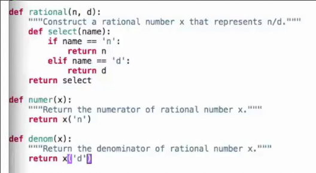
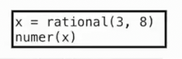
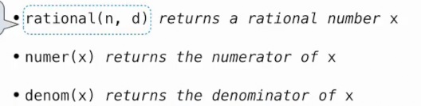
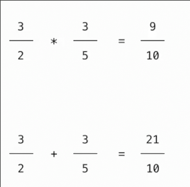
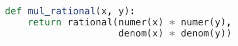
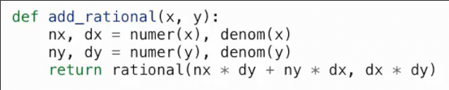
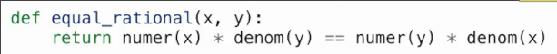

# 数据抽象 抽象屏障

## 闭包

这是一个有理数的抽象表示

我们通过闭包，在一个函数内定义一个函数，因此可以引用封闭作用域中的n和d 

## 数据抽象

大多数值在某种意义上都是一些复合，比如日期将年月日组合在一起形成整体, 地理位置是经纬度的组合

抽象数据类型允许将复合值视为整体

隔离了两部分

* 数据的表示方式
* 数据的操作方式

比如有理数

其有分子和分母两个可以确切表示的整数组成

其中的`rational`我们称之为**构造器**，其返回给我们一个有理数的抽象

而`number`和`denom`称为**选择器**，通过传入这个有理数，其返回给我们有理数的两个部分

据此我们还可以进行有理数的计算

这些函数都是基于上述我们的三个最基本函数：构造器，选择器

## 抽象屏障

抽象屏障将程序的不同部分分开，使得每个部分不需要完全了解剩余部分

这样做有利于当我们更改其中的一部分时，而不对剩余产生很大影响
