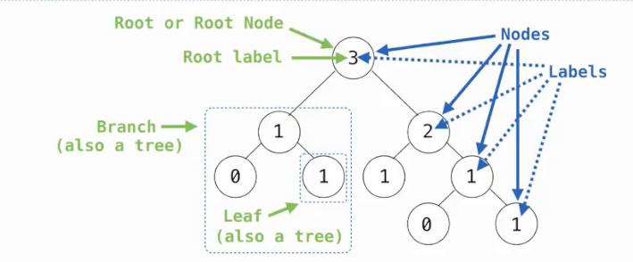
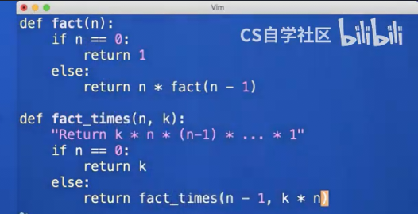
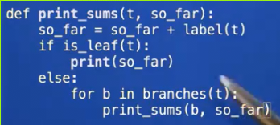

# 数据抽象实例_树
 
* [树的定义](#树的定义)
* [树的抽象](#树的抽象)
* [树的操作](#树的操作)

## 树的定义

* 由**一个根标签和一系列分支**组成，其中每一个分支都是一棵树，有也有自己的根标签和分支
* 没有分支的分支称为**叶子**



* 其中每个位置成为**节点**，每个节点都有对应的表示值的标签，数据就存储其中
* 多数节点都有其**父节点和子节点**, 也可以描述其祖先，后代，兄弟姐妹

## 树的抽象

* 构造器 *一个树有一个根标签和一个分支列表，构造器将接受这两个值*
* 选择器 分别返回树的`label`以及分支列表

```py
>>> tree(3, [tree(1),
...          tree(2, [tree(1),
...                   tree(1)])])
```

```py
def tree(label, branchs=[]):
    """返回一个树 其中 root 是树的根节点 branchs是树的各个分支"""
    for branch in branchs:
        assert is_tree(branch)
    return [label] + list(branchs)

def label(tree):
    """返回树的根节点数值"""
    return tree[0]

def branchs(tree):
    """返回树的所有分支"""
    return tree[1:]

def is_tree(tree):
    """判断传入的内容是否符合树的定义"""
    if type(tree) != list or len(tree) < 1:
        return False
    for branch in branchs(tree):
        if not is_tree(branch):
            return False
    return True

def is_leaf(tree):
    """判断一个树是否为叶子"""
    return not branchs(tree)
```

```py
>>> tree(1, [5])
Traceback (most recent call last):
  File "<stdin>", line 1, in <module>
  File "/home/galaxy/code/md/cs61a/tmp/tree.py", line 4, in tree
    assert is_tree(branch)
           ^^^^^^^^^^^^^^^
AssertionError
>>> tree(1, [tree(5)])
[1, [5]]
>>> t = tree(1, [tree(5, [tree(7)]), tree(6)])
>>> label(t)
1
>>> branchs(t)
[[5, [7]], [6]]
>>> branchs(t)[0]
[5, [7]]
>>> is_tree(branchs(t)[0]) # 这里使用[]访问分支列表没有违反抽象屏障，列表本身就是树抽象的一部分
True
>>> label(branchs(t)[0])
5
```

## 树的操作

返回树的叶节点数量

```py
def fib_tree(n):
    """构造 根节点为第 N 个斐波那契数的斐波那契树"""
    if n <= 1:
        return tree(n)
    else:
        left = fib_tree(n - 1)
        right = fib_tree(n - 2)
        l = label(left) + label(right)
        return tree(l, [left, right])

def count_leaves(t):
    """返回树的叶节点树"""
    if is_leaf(t):
        return 1
    else:
        return sum([count_leaves(b) for b in branchs(t)])
```

```py
>>> f = fib_tree(4)
>>> f
[3, [2, [1, [1], [0]], [1]], [1, [1], [0]]]
>>> count_leaves(f)
5
```

返回树的全部叶节点

```py
def leaves(t):
    """返回树T的叶节点列表"""
    if is_leaf(t):
        return label(t)
    else:
        l = [leaves(b) for b in branchs(t)]
        return sum(l, [])
```

```py
>>> f = fib_tree(4)
>>> f
[3, [2, [1, [1], [0]], [1]], [1, [1], [0]]]
>>> leaves(f)
[1, 0, 1, 1, 0]
```

从一个树中返回一个结构完全相同的新树，只是叶节点标签自增

```py
def increment_leaces(t):
    """返回一个结构完全相同, 但是叶节点标签递增的新树"""
    if is_leaf(t):
        return tree(label(t) + 1)
    else:
        new_branchs = [increment_leaces(b) for b in branchs(t)]
        return tree(label(t), new_branchs)
```

```py
>>> f = fib_tree(4)
>>> leaves(f)
[1, 0, 1, 1, 0]
>>> f = increment_leaces(f)
>>> leaves(f)
[2, 1, 2, 2, 1]
```

所有标签都增加

```py
def increment(t):
    """返回一个自增所有标签的树"""
    if is_leaf(t):
        return tree(label(t) + 1)
    else:
        new_branchs = [increment_leaces(b) for b in branchs(t)]
        return tree(label(t) + 1, new_branchs)
```

```py
>>> f = fib_tree(4)
>>> f
[3, [2, [1, [1], [0]], [1]], [1, [1], [0]]]
>>> f = increment(f)
>>> f
[4, [2, [1, [2], [1]], [2]], [1, [2], [1]]]
```

打印树

```py
def print_tree(t, tabs=0):
    print(f"{tabs * ' '}{label(t)}")
    for b in branchs(t):
        print_tree(b, tabs+2)
```

```py
>>> print_tree(fib_tree(4))
3
  2
    1
      1
      0
    1
  1
    1
```

我们分析这两种递归



上面的递归中，在"递"的过程中，完全没有乘法运算，而是在"归"的过程中才一步一步完成最后的结果

而下面的递归，在"递"的过程就实时运算，直到达到基本情况，计算完成，"归"的过程只传递而不运算

打印从根到叶节点的标签和



查找根到各节点路径标签总和为某值的节点个数

```py
def count_paths(t, n):
    """返回一个节点数，使得树T的根到这些节点的路径标签总和为N"""
    if label(t) == n:
        found = 1
    else:
        found = 0
    return found + sum([count_paths(b, n-label(t)) for b in branchs(t)])
```
