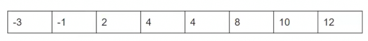

# 衡量程序运行的时间

## 观察

这是一个有序的数组，目标是找出是否有重复的数字



* 一种算法是找出数组中所有对，查看两元素是否相同
* 另一种则基于这个数组已经是有序的了，我们每次只需要查看相邻的元素是否相同

显然第二种算法好些 那么具体好多少？

```java
    public static boolean dup1(int[] A) {
        for (int i = 0; i < A.length; i++) {
            for (int j = i + 1; j < A.length; j++) {
                if (A[i] == A[j]) {
                    return true;
                }
            }
        }
        return false;
    }

    public static boolean dup2(int[] A) {
        for (int i = 0, j = 1; j < A.length; i++, j++) {
            if (A[i] == A[j]) {
                return true;
            }
        }
        return false;
    }
```

我们可以利用ucb提供的库进行时间测试

```java
    public static void main(String[] args) {
        int testsize = 1000;
        double lasttestruntime = 0.0;
        while(lasttestruntime < 10) {
            int[] arr = new int[testsize];
            for (int j = 0; j < testsize; j++) {
                arr[j] = j;
            }
            Stopwatch s = new Stopwatch();
            s.start();
            boolean b = dup1(arr);
            double newtime = s.getElapsed() / 1000.0;
            s.stop();
            System.out.println("Test of size " + testsize + " compeleted. Time elapsed: " + newtime + " seconds.");
            testsize *= 2;
            lasttestruntime = newtime;
        }
    }
```

对于dup1

```java
Test of size 1000 compeleted. Time elapsed: 0.006 seconds.
Test of size 2000 compeleted. Time elapsed: 0.002 seconds.
Test of size 4000 compeleted. Time elapsed: 0.009 seconds.
Test of size 8000 compeleted. Time elapsed: 0.015 seconds.
Test of size 16000 compeleted. Time elapsed: 0.074 seconds.
Test of size 32000 compeleted. Time elapsed: 0.178 seconds.
Test of size 64000 compeleted. Time elapsed: 0.591 seconds.
Test of size 128000 compeleted. Time elapsed: 2.234 seconds.
Test of size 256000 compeleted. Time elapsed: 8.836 seconds.
Test of size 512000 compeleted. Time elapsed: 35.568 seconds.
```

对于dup2

```java
Test of size 1000 compeleted. Time elapsed: 0.0 seconds.
Test of size 2000 compeleted. Time elapsed: 0.0 seconds.
Test of size 4000 compeleted. Time elapsed: 0.0 seconds.
Test of size 8000 compeleted. Time elapsed: 0.0 seconds.
Test of size 16000 compeleted. Time elapsed: 0.0 seconds.
Test of size 32000 compeleted. Time elapsed: 0.0 seconds.
Test of size 64000 compeleted. Time elapsed: 0.001 seconds.
Test of size 128000 compeleted. Time elapsed: 0.002 seconds.
Test of size 256000 compeleted. Time elapsed: 0.001 seconds.
Test of size 512000 compeleted. Time elapsed: 0.001 seconds.
Test of size 1024000 compeleted. Time elapsed: 0.0 seconds.
Test of size 2048000 compeleted. Time elapsed: 0.001 seconds.
Test of size 4096000 compeleted. Time elapsed: 0.002 seconds.
Test of size 8192000 compeleted. Time elapsed: 0.004 seconds.
Test of size 16384000 compeleted. Time elapsed: 0.008 seconds.
Test of size 32768000 compeleted. Time elapsed: 0.015 seconds.
Test of size 65536000 compeleted. Time elapsed: 0.032 seconds.
Test of size 131072000 compeleted. Time elapsed: 0.066 seconds.
Test of size 262144000 compeleted. Time elapsed: 0.116 seconds.
Test of size 524288000 compeleted. Time elapsed: 0.23 seconds.
```

我们做一些观察，dup1随着规模的增倍，运行时间大概变为4倍

而dup2规模加倍后，运行时间会变为大概两倍

## 数学原因


