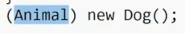
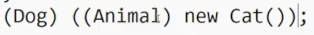
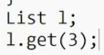
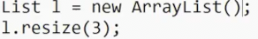
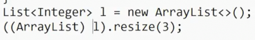

# 答疑

## 静态动态类型 类型转换

当我们点击idea的运行时 两个独立的步骤

1. **编译** 查看我们的代码是否有意义
    * 语法错误 
    * 列出每个类的所有方法和属性（包括继承的） 复制父类没有被重写的方法到子类
    * 检查继承的接口的方法是否被正确覆盖
    * 为了`Override`，需要**签名相同**（名字，返回值，参数都相同）
    * **浏览代码 为每个变量分配一个静态类型** 通常依据声明和返回值
    * 当作**类型转换**时，会将静态类型转换

这个表达式原本的静态类型是返回值类型`Dog`，而强制转换为`Animal`

类型转换时会检查一下是否可能，也就是Dog确实是一种Animal(其实都是)，而Animal转换为Dog在编译阶段也是可行的 也就是是否有**父子、祖先关系**

甚至这种双重转换也会通过编译 其满足刚刚的条件

* &nbsp;
  * 之后会逐行检查以查看是否可以运行 查看每个表达式的静态类型，保证该行可以运行

检查`List`是否有一个函数`get`，接受整数

* ArrayList 有 resize 方法，但是List没有
* 也不会通过编译，因为仅仅依据静态类型得出l是List

不过我们可以仍然利用强制转换通过编译

2. 在完成所有检查之后，汇编为机器语言供计算机执行
  * 在运行时，依赖于对象的**动态类型**
  * 可以看到对象的真实类型，类型转换是否有问题 比如我们骗过编译器 cat 转 object 转 任何东西
  * 调用函数时，使用动态类型中相同名称的方法 比如ArrayList强制转换为List，执行的依然是ArrayList的中方法
  * 选择和签名相同的方法以执行
  * 访问数组越界 内存溢出等等运行时错误

## 列表

我们有两种列表 `Linked List` `Array List`

对于Linked List，我们有一些选择

* `Naked Linked List` 裸递归实现，不是很好用
* 单向链表 将裸链表包装为节点 添加更多功能
  * 相比双向链表，不能很好处理尾部移除，但是内存更少，有一定用途
  * 哨兵用于规避复杂边缘情况
* 双向链表 
  * 和单链表相似，允许向后

另一种是ArrayList

与数组对比

* Java原生支持，不是一个类
* 区别是使用之前要指定长度
* 长度不能更改

而ArrayList

* 以数组作为底层
* 定期resize
* 每个操作都在常数时间访问

## public和private

Java的理念是尽可能限制自己能做的事

一个类做的事情越多，代码就越复杂
