# 渐近分析以及几种算法 二叉搜索树

## 递归
 
* [递归](#递归)
* [二分查找](#二分查找)
* [归并排序](#归并排序)
* [二叉搜索树](#二叉搜索树)
  * [定义](#定义)
  * [算法](#算法)
    * [查找](#查找)

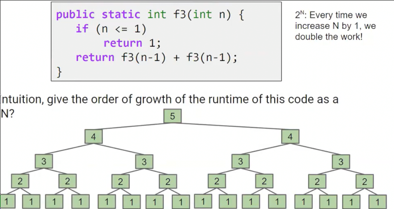

这个树状递归算法的时间复杂度是θ(2^n)

那么这个算法呢

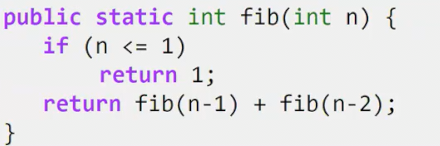

也是一个指数级别的 但是会比刚刚的算法快，因为这个树不完整，相当于剪掉一部分分支 O(2^n)

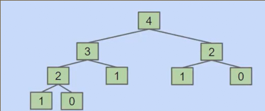

## 二分查找

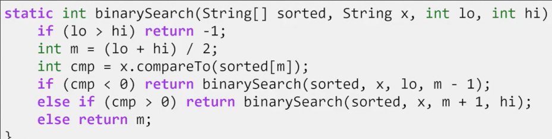

每次列表都变为原来的一半，操作增加一

反方向来看，从1开始，每次列表变为两倍，每次操作增加一

因此是O(log n)

## 归并排序

对于一个无序的列表，一分为2，按照相同的方法排好两边，之后合并

时间复杂度 θ(NlogN) 每层N次合并 logN层

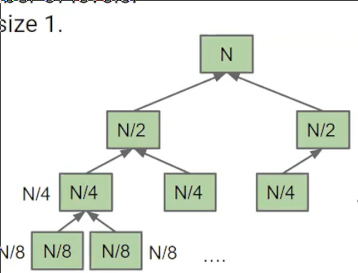

这样，我们回顾之前的两个算法

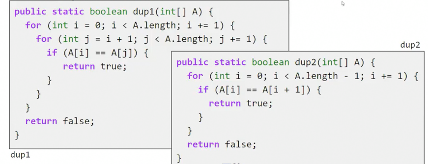

当数组未排序，我们不能使用O(N)的dup2，但是可以使用O(N^2)的dup1，但是更好的做法应该是O(NlogN)的归并排序再用dup2

这是非常好的转变，N^2转变NlogN的成果巨大，而NlogN转N的成果就相对较少

## 二叉搜索树 BST

### 定义

抽象数据类型 ADTs 指的是**接口** 不包括实现，告诉人们其能做什么

Java可以很好区分抽象数据类型和实际实现

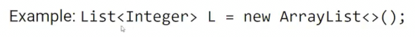

这种语法告诉我们左侧是列表，右侧是我们具体如何实现的列表

我们回到之前的LinkedList 同时，我们希望所有的元素是有序的，一个OrderedLinkedList

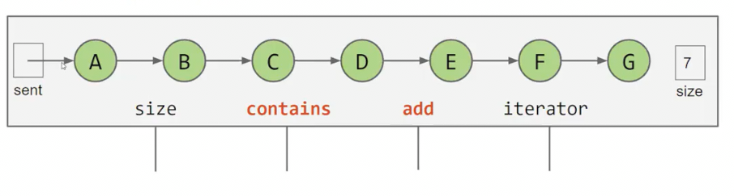

其中contains、add的时间复杂度都是 θ(n) 从头扫描到尾以放在合适位置或查找元素在哪

但是这个链表已经排好序了，可不可以加以利用

将哨兵放在中间？比较目标元素和哨兵处元素的大小？这样时间缩短一半

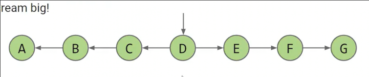

如果我们将哨兵所指元素，其指向是B和F呢

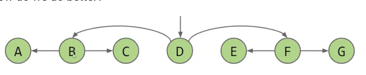

这样时间又缩短一半！以此类推，时间复杂度变为 O(logn)

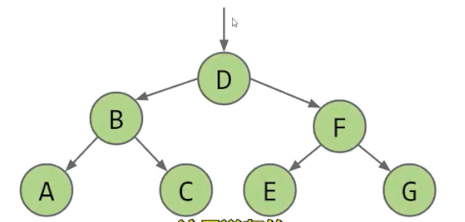

在**树**中，从一个节点到另一个有且只有一条路径

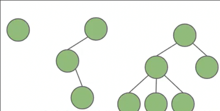

这些都是树

**有根树**就是在树的基础上，**任意选定一个节点**作为根节点

* 在此基础上，节点通往根节点时遇到的第一个节点就是**父节点** 而相对的，后者就是前者的**子节点** **父节点有且只有一个**，因为通往根节点的路径有且只有一条
* **二叉树**每个节点都有0、1、2个子节点

**二叉搜索树**是有根的二叉树,并且具有`BST`属性

* BST表面，树中所有左子树中的所有元素都小于其根节点 右子树..
* 二叉搜索树的元素必须可以比较，同时比较具有**传递性**
* 二叉搜索树的**元素不允许相同**

### 算法

#### 查找

从根元素开始，如果目标和根元素相同则返回，否则如果目标比根元素小，将左子节点作为新的根节点进行上述，大，则...

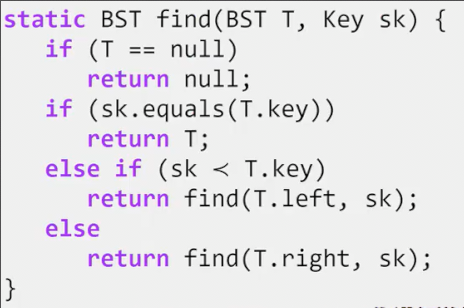

如果二分搜索树是一个茂密的树，则是一个θ(log n)的算法，因为元素每翻一倍，树大概增加一层，我们寻找的过程是在爬下树，因此时间增加1

#### 插入

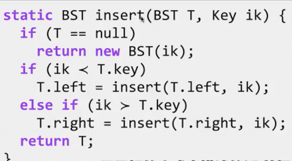

返回插入后的树

当比根节点的label小时，插入到子树，将结果（插入后新的树）作为新的左子树

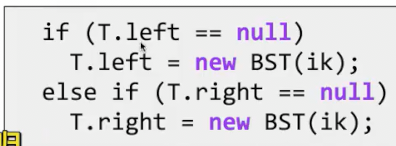

这种写法看上去好想一点，但是并没有真正递归到基本情况，因此**并不规范** *远程递归*

#### 删除

