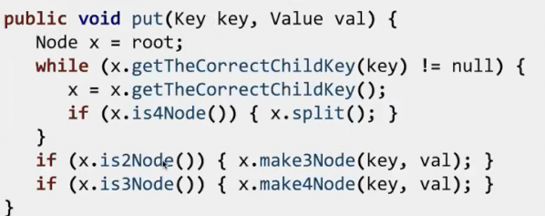
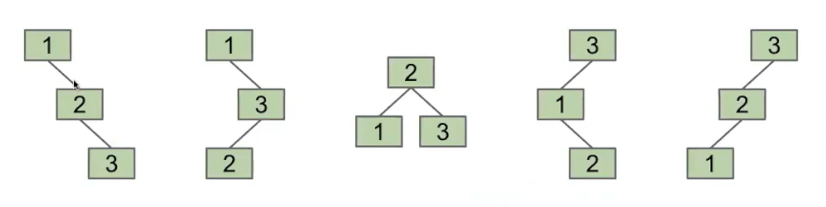
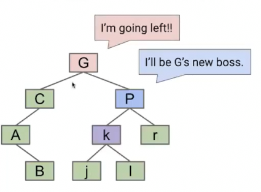
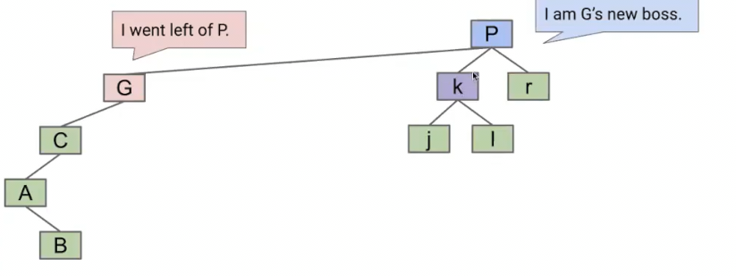
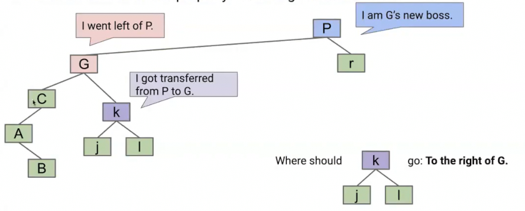
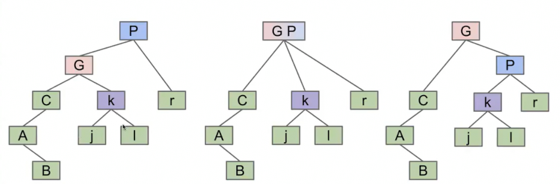
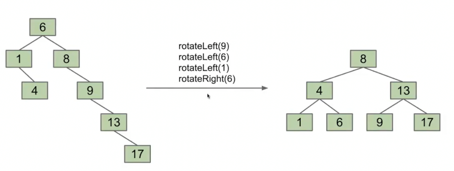
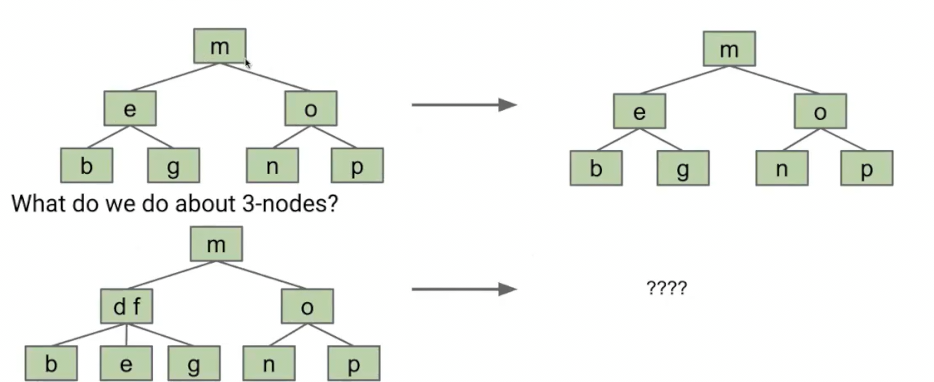

# 树旋转和左偏红黑树

B树可以通过对节点的过度填充并分割节点，保持树的完美平衡

但是B树的实现比较麻烦 

需要处理不同类型节点的情况（有些是两项，有些是三项）

## 树的旋转

这是几种不同添加元素顺序的全部合法的二叉搜索树

本质上这些是同一棵树，只是结构不同，是否有方式从一种转为另一种？

通过旋转可以做到

### 旋转的定义

比如**向左旋转**G节点

被旋转的节点的右儿子替代了被旋转节点的位置，但是！其原右儿子现在很可能有三个儿子，根据搜索二叉树的性质，我们知道现在将k移动到G的右儿子是不改变树的

完成旋转

总结来说，节点n发生左旋时，n的右子节点替代n的位置，而n成为原右子节点的左儿子。

之后将原右子节点的原左儿子挂到n的右（理解为原右子节点多了左，节点n少了右）

这是理解旋转的另一种方案

### 平衡

研究证明可以在O(N)的步骤内对任意的树进行旋转，使其成为茂密的树 N为节点数
 

## 左偏红黑树

我们有比构建出不平衡树后，耗费O(n)的时间旋转整理使其茂盛，更好的算法

我们回顾之前的2-3树，这是一个每个节点最多容纳2个元素的B树。其永远是平衡繁茂的

能不能不构建2-3树，但是构建一个结构上和2-3完全相同的**二叉搜索树**呢

