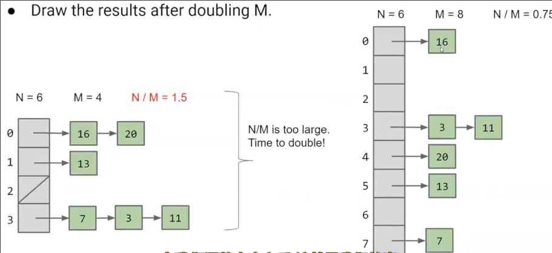
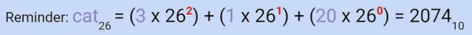
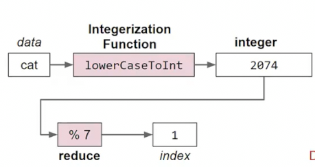
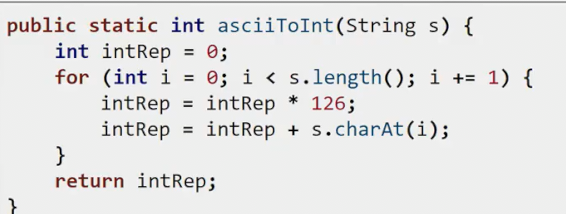
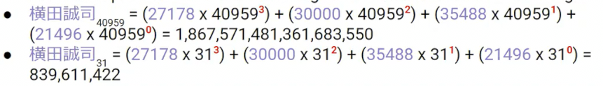
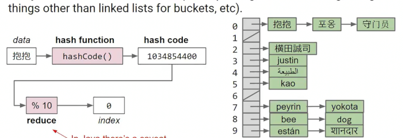
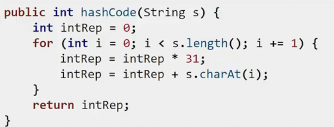
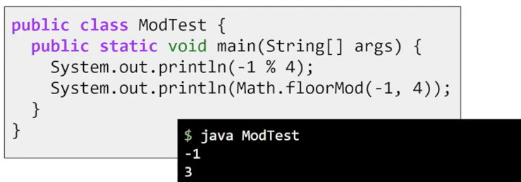

# 哈希表
 
* [构建集合和映射更快的数据结构](#构建集合和映射更快的数据结构)
* [数字在箱子集合中](#数字在箱子集合中)
* [非数字元素在箱子集合中](#非数字元素在箱子集合中)
* [对象转换为数字](#对象转换为数字)
* [哈希码](#哈希码)

## 构建集合和映射更快的数据结构

这是当前集合和列表的底层实现方式和时间复杂度

我们可以做的更好吗

* 我们有时无法判断两个事物的大小关系，因此搜索树相关的算法不太可行 用户层面，似乎集合或者映射不太需要必须存储可比较大小的事物
* 并且我们希望在复杂度上做出改进 比log n更好

我们考虑一个集合，并存在两个操作

* 添加操作，并假设我们永远不会尝试添加已经在集合中的东西
* 包含操作，检查给定项是否在集合中

有时候，把自己投射到数据结构的视角上有助于我们构建数据结构

* 假设现有有一堵墙和一支铅笔
* 当我们要检查一个数字`1`，我们查看墙上是否有1？没有的话，我们返回False，

* 当我们添加一个数字`5`时，在墙上空白处添加5

但是这足够快吗？如果墙上有很多数字怎么办？

添加似乎足够快，但是查找呢？

我们需要查看每个数字

如果这样呢？

查找的效率很差，最坏需要完整遍历整个集合

改进或许我们可以选择排序（树算法等），这样插入查找都是O(log n)，然而需要考虑有些事物无法排序

## 数字在箱子集合中

一种优化方案，我们想一下麦当劳的取餐架。

我们的食物被**分配一个数字**，并且被放置在数字最后一位对应的位置上，我们只需要去查找这个位置所有数字，得到数字对应的食物

同样插入时也是这样，效率很高

* 但是仅仅通过各位分类只是将原来的时间变为1/10，而随着数据的不断增多，依据面临之前的问题
* 这种算法也会浪费一些空间，我们不得不留出一些空间给每个箱子，以便未来插入
* 如果每个箱子装满怎么办

**空间上** 我们不给每个箱子赋予一定的空间，而是动态空间，如**链表**

**时间上** 如果有M个箱子，共计N个元素，那么查找和插入的时间复杂度大概是θ(N/M) 因此，我们需要使得M不是一个常数，而是一个和N正相关的东西 来降低θ(N)的复杂度

* 我们可以在最大箱子的大小超过k时增加m，但是事实证明箱子的平均大小超过k时增加m更有效，具体增加多少呢？
* 指数增加（加倍）会得到常数的摊销时间复杂度 这和我们实现列表时的数组扩容相近

假设现在当n/m大于1.5时，我们调整m为两倍，并且分组的依据是`i%m`

* `N/M`永远几乎是一个常数

## 非数字元素在箱子集合中

对于元素非数字的集合来说，比如说单词`cat`，我们把它放在什么箱子中？

* 首先将单词的首字母作为分组依据，可以将其编号`A-0 B-1 C-2 ...` 放入26个不同的桶
* 当`n/m`达到一定时，我们需要扩增桶，按照前两个字母划分26*26个桶

这种方法的缺点是

* 每个字母的出现概率并不相同,以s开头的单词最多
* 比当前桶划分更短的单词比如`a`不能放入`aa`这种两字母长桶中
* 集合每次resize不是加倍而是特定的26倍，这与字母的属性密切相关，我们希望不需要知道对象的属性（这不是集合必须要进行的工作），就可以将其放入集合 

因此这种方法只能**完美适用于整数**

但是可否能将对象转换为整数？？

## 对象转换为数字

字符串？

* *使用ASCII/Unicode？* 
* *相加所有字母的ASCII？*
* *26进制？*
* *字母的个数？*

我们需要使得数字分布尽可能均匀 上面一些方法可能在此点上不好

26进制是这样 不过其中没有0 

根据进制转换的一一对应性，每个单词有唯一的二十六进制，因此有唯一的十进制数字

因此接下来可以利用箱子集合，整个流程如下

其中函数的作用就是字符串转数字

为了更广泛的字符串，不仅仅表示26个字母，我们可以使用ASCII(此时就是126进制）或者Unicode

但是对于Unicode，一个字符串的对应进制数字就是一个天文数字了。java中存在溢出 

## 哈希码

从一个无限或有限的集合中取值，并最终降至有限多项的集合中。我们的目标集合是Java中的整数集合`4,294,967,296`项

注意由于初始范围可能比目标范围大，因此无法为每一个字符串获取**唯一**的值 但是碰撞并不常见

Java中使用31作为转换进制

在Java中，所有对象都从Object上继承了一个hashCode()方法，默认返回其当前所在的内存地址 有些随机，但是在同一台机器上重复运行时会保持一致

而字符串重写了这个方法基本如下

**一个特殊情况**

* 如果一个东西的hashCode是-1，我们应当将其放在最后一个箱子，应当使用Math.floorMod取余数

最终集合和映射的复杂度为θ(1)，只要是均匀分布（否则都装在一个箱子中，而我们扩增箱子又是通过箱子的平均决定。退化为θ(n)
