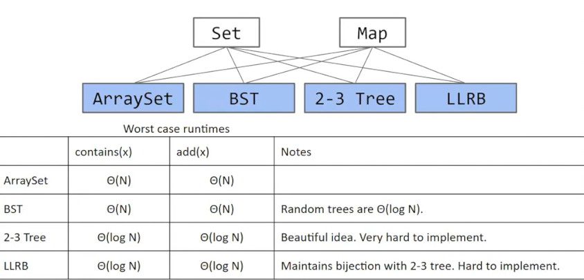
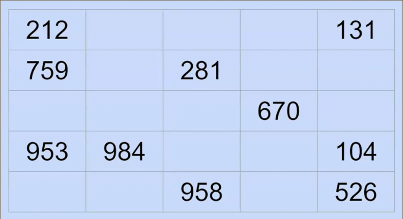
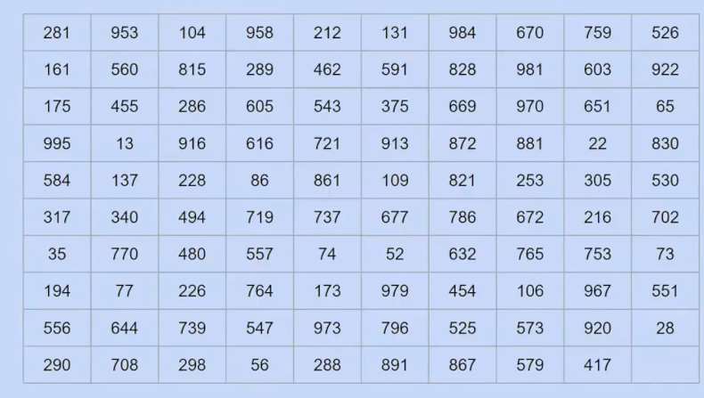
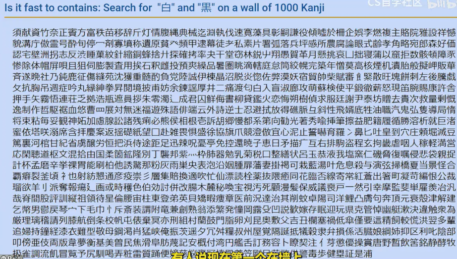
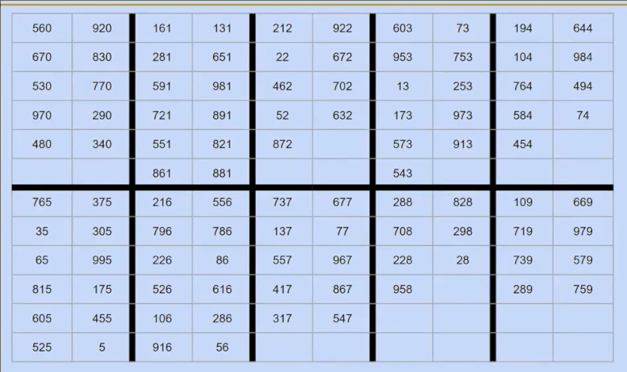

# 哈希表

## 构建集合和映射更快的数据结构

这是当前集合和列表的底层实现方式和时间复杂度

我们可以做的更好吗

* 我们有时无法判断两个事物的大小关系，因此搜索树相关的算法不太可行 用户层面，似乎集合或者映射不太需要必须存储可比较大小的事物
* 并且我们希望在复杂度上做出改进 比log n更好

我们考虑一个集合，并存在两个操作

* 添加操作，并假设我们永远不会尝试添加已经在集合中的东西
* 包含操作，检查给定项是否在集合中

有时候，把自己投射到数据结构的视角上有助于我们构建数据结构

* 假设现有有一堵墙和一支铅笔
* 当我们要检查一个数字`1`，我们查看墙上是否有1？没有的话，我们返回False，

* 当我们添加一个数字`5`时，在墙上空白处添加5

但是这足够快吗？如果墙上有很多数字怎么办？

添加似乎足够快，但是查找呢？

我们需要查看每个数字

如果这样呢？

查找的效率很差，最坏需要完整遍历整个集合

改进或许我们可以选择排序（树算法等），这样插入查找都是O(log n)，然而需要考虑有些事物无法排序

一种优化方案，我们想一下麦当劳的取餐架。

我们的食物被**分配一个数字**，并且被放置在数字最后一位对应的位置上，我们只需要去查找这个位置所有数字，得到数字对应的食物

同样插入时也是这样，效率很高

* 但是仅仅通过各位分类只是将原来的时间变为1/10，而随着数据的不断增多，依据面临之前的问题
* 这种算法也会浪费一些空间，我们不得不留出一些空间给每个箱子，以便未来插入
* 如果每个箱子装满怎么办

**空间上** 我们不给每个箱子赋予一定的空间，而是动态空间，如**链表**

**时间上** 如果有M个箱子，共计N个元素，那么查找和插入的时间复杂度大概是θ(N/M) 因此，我们需要使得M不是一个常数，而是一个和N正相关的东西 来降低θ(N)的复杂度

* 我们可以在最大箱子的大小超过k时增加m，但是事实证明箱子的平均大小超过k时增加m更有效，具体增加多少呢？
* 指数增加（加倍）会得到常数的摊销时间复杂度
