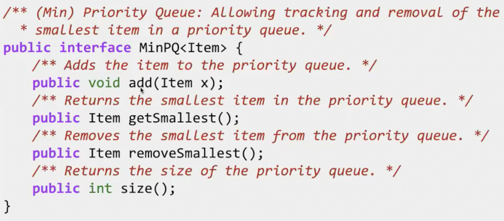
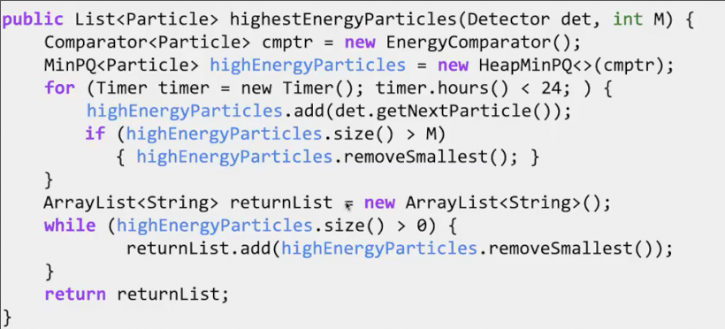
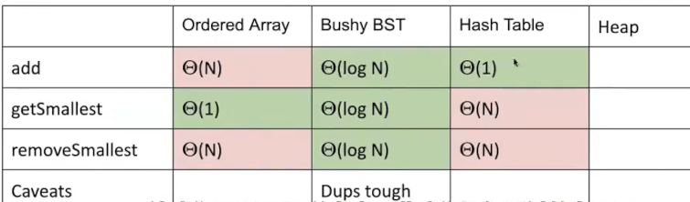
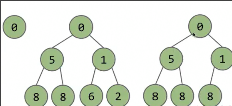
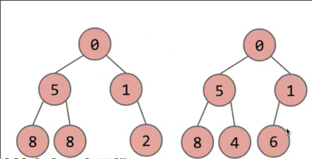

# 优先队列和堆

先前我们讨论了两种抽象数据类型（集合、映射）的一些数据结构实现

本次我们将学习新的同样非常重要的抽象数据类型**优先队列** *PQ*

## 优先队列的表现

用户期望看到的是**一堆项目**

期望通过这些方式和数据集交互

* 添加到项目集
* 用户**只会查询或删除最小的一个**
* 获取项目集大小

一个应用场景 我们想从每天不断新增的一堆粒子中获取到能量最高的10个

* 一种想法是，粒子新增时，加入一个列表。而当我们统计时，排序列表
  * 首先这在空间上低效，我们最终关注的是10个项目，但不得不跟踪百万个
* 使用优先队列 粒子新增，放入优先队列。但是，当size超过10,我们从优先队列中删除最小的，因此，总是跟踪最大的10个

## 不好的实现

我们尝试之前的数据结构进行实现

### 有序数组

我们需要扫描整个数组以插入保证有序性

插入时也要将后续项目依次挪到下一位

所以插入是O(n)

找到最小的只要a[0]，所以O(1)

移除最小的，需要后面的项依次向前移动

### 茂盛的BST

可以是红黑树或者2-3树

各种都是log n，都是只需要爬树

但是在二叉树中不会有两个项重复，或许我们的两个粒子能量相同，那么数据集中就应该同时存在二者

### 哈希表

加入时间O(1)，但是查找和删除都需要遍历其中所有元素 原因在于我们知道如何以O(1)的时间通过项目寻找到是否存在，但是不能直接找到最小的项目,除非遍历

## 堆

**二叉最小堆** 

* 二叉意味这是一棵**二叉树**
* 并且这个二叉树是**完整**的 **完整的定义是，只能在最下层缺少节点，并且剩余节点都在左侧**
* 其中**每个根节点的值都小于等于两个子树中任意节点**

这两棵树就不是合法的二叉最小堆

