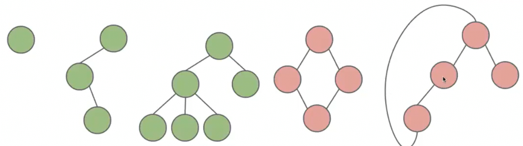
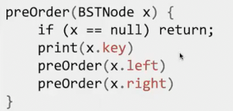
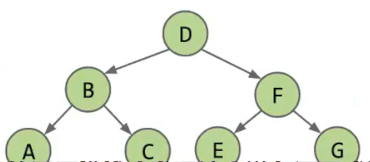
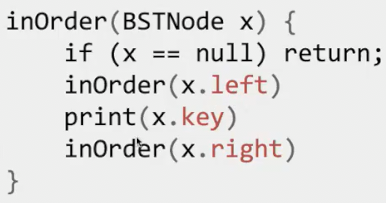
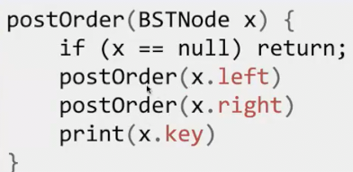
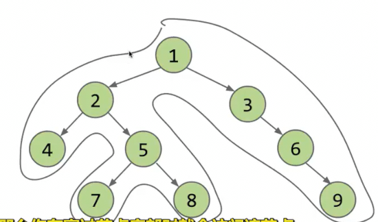

# 树的遍历 图

## 树的总结

我们回顾树

* 是一系列节点的集合
* 从一个节点到另一个节点有且只有一条路径

特别地**有根树**只是选择了一个节点作为根

* 此时父节点是通往根节点路径的第一个节点

### 遍历树

有很多自然的顺序来遍历所有节点

* 层序遍历 从上到下，从左到右
* 先序遍历 在遍历到一个节点时，尽可能向左侧继续遍历 *打印目录结构*

如果两个儿子都遍历过，则向父亲返回 

顺序是 DBACFEG

* 中序遍历 我们递归到某一节点时，先不做事情（此时假装为未遍历到）前继续遍历左儿子

只有左树的事情做完后，才会做根节点的事情，再做右树的，之后返回父亲

顺序是 ABCDEFG

* 后序遍历 *查看目录大小 因为要知道父的大小要先知道所有子项的大小*

先做左树，再做右树的时期，之后做自己的，然后返回

顺序是 ACBEGFD

一种方便了解先序 中序 后序的方式是 **逆时针方向**包裹住树

* 先序遍历会在我们绘制包裹时，**路过节点的左侧**遍历节点
* 中序遍历会在路过**节点底部**遍历
* 后序遍历会长路过**节点右侧**遍历

## 图
