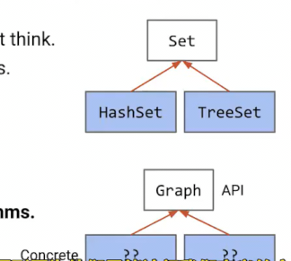
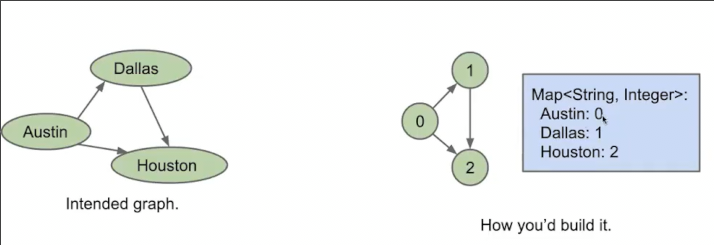
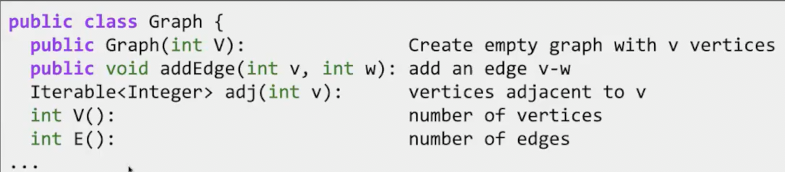
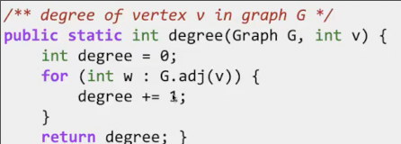
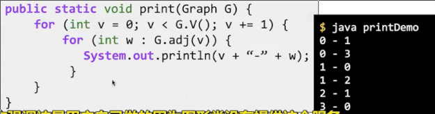
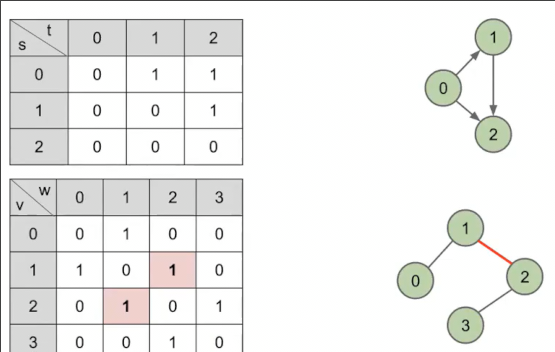
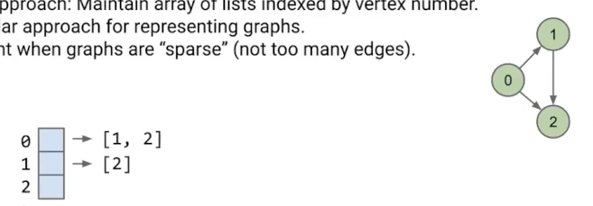
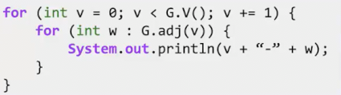
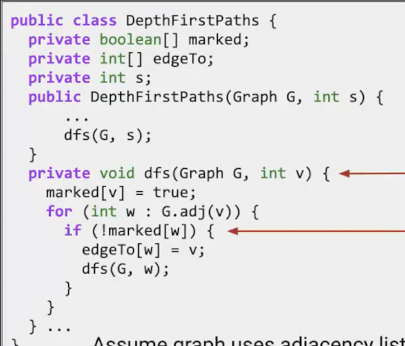

## 图的接口和API

图作为**抽象类型**要为用户提供什么服务或方法

在决定抽象类型接口的阶段，我们的决策会影响**具体实现数据结构所能达到的时间复杂度** **内存使用** **实现图类的代码复杂度**

1. 首先我们决定节点的值只可以是数字，对于其他类型，我们可以额外引入映射到图上

2. 功能如下

* 在创建图时就要告知图中有多少节点 并且不可增减节点
* 允许任意**添加边**
* `adj`询问图中和v相邻的所有节点
* 总共有多少节点
* 总共有多少边

对于一些其它功能需要自己动手实现

打印可以利用其特供的接口

## 图的实现

### 图的算法的实现

在此之前我们想一下**如何表示深度优先路径算法**

可以构建一个类来表示

我们向这个**路径器**提问，来获得答案

也可以集成到图类中

### 表示图的数据结构

在内存中如何组织，我们用什么数据结构来实现

#### 邻接矩阵

创建一个二维表，其中每一项表示，两个节点间是否存在边

#### 邻接数组表示

邻接矩阵的缺点是**浪费了很多空间**尤其对于稀疏图（有很多节点，但是边却相对较少）

矩阵的大部分都是0

邻接数组是一个**列表的数组**

每个列表告诉**对应的节点与哪些节点相连**

### 复杂度分析

使用邻接列表表示，这个打印操作的复杂度要分情况考虑

因为最坏情况下，每个节点都与其余节点相邻 θ(V^2)

最好情况则是θ(V) 每个节点都不与其他节点相邻 只需要从数组头走到尾 

但是当我们引入另一个变量E时，情况就发生变化，每个节点的列表内，其之和只能有E条边 因此复杂度θ(V+E)

并且这个复杂度可以看错由**其相对较大的项主导** 对于很稀疏的图，近似于θ(V) 对于边非常密集的图 近似 θ(E)

深度优先搜索、深度优先路径的复杂度也是θ(V+E) 分析方法和上述一致

## 广度优先搜索

在树中等价于**层序遍历**
