# 最短路问题
 
* [广度优先_深度优先_对比和弊端](#广度优先_深度优先_对比和弊端)
* [处理加权最短路的算法特征](#处理加权最短路的算法特征)
* [一些糟糕的算法实现](#一些糟糕的算法实现)
  * [BFS](#BFS)
  * [虚拟节点](#虚拟节点)
* [Dijkstra](#Dijkstra)

## 广度优先_深度优先_对比和弊端

目前两种路径算法的对比**深度优先路径**和**广度优先路径**

* 对于所有图都适用，给出某顶点到所有顶点的路径
* **广度优先路径**给出的路径是图中**经过边最少的** 
* 二者时间复杂度相同O(V+E)
* 空间复杂度
  * 如果图是细长的，那么DFS空间复杂度偏高，调用堆栈会根深
  * 如果图很浓密，那么BFS空间复杂度偏高，每次会入队很多

但是BFS可以处理如实际地图中的最短路问题吗？

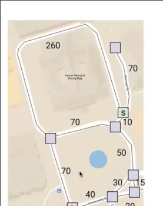

其不能很好地处理加权边 **找到的是边最少的路径** 而我们需要权重和最小的路径

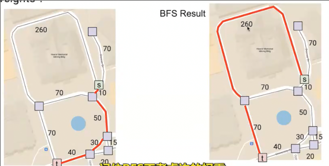

## 处理加权最短路的算法特征

我们需要处理的问题是在这个**非负加权**有向图中找到A和**其余节点**之间的**最短路**

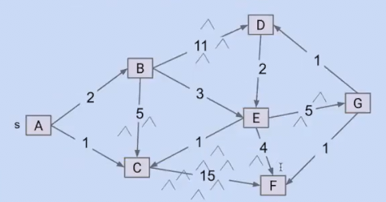

1. 首先，无论什么情况，最短路永远不应该形成一个圈

2. 而我们需要给出到所有节点的最短路，因此最终形成的数据结构和我们的**深度优先路径** **广度优先路径** 相同

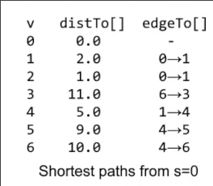

每个顶点有两个对应的值 **到给顶点的权重** **到前一个顶点的边（前一个顶点）**

事实上，这个表对应一课以**给定点**作为根的**最短路径树** *因为从根到每个节点有且只有一条最短路径*

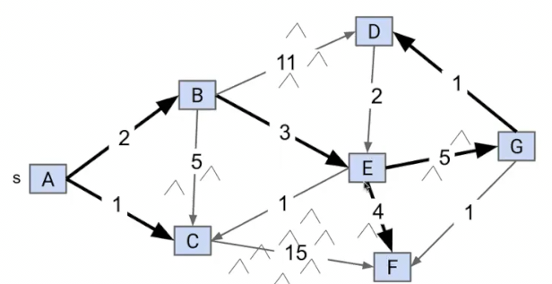

而我们知道树中每个节点都对应一条入边（根节点除外），所以有`V-1`条

## 一些糟糕的算法实现

### BFS

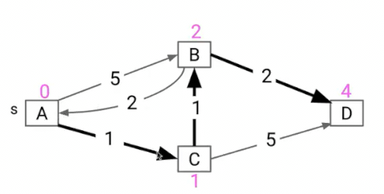

一种想法是类似BFS, 从给顶点开始，每当看到一个邻顶点就将其作为最短路计入（和BFS完全一样）

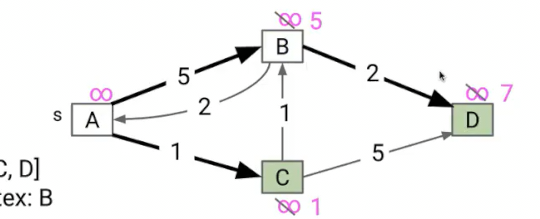

错误的原因在于只要我们看到从没见过的节点，就通往其的边扔到答案树中，无论其是不是最短路

### 虚拟节点

对于长度为K的边，引入中间k-1个虚拟节点，使得现在所有节点之间的边权重都为1，也就是等同于无权图，自然可以使用BFS正确求解

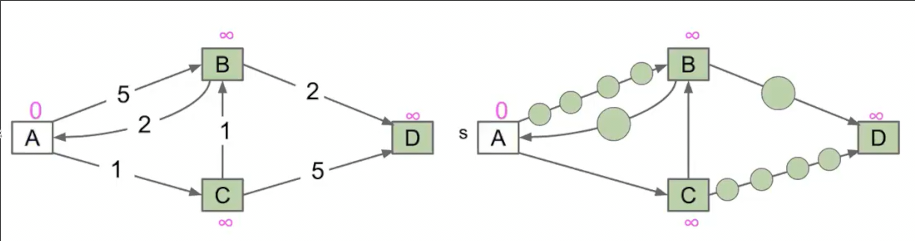

但是如果是一个这样的图呢

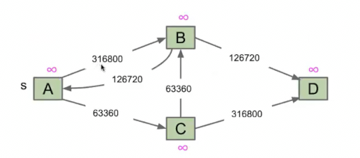

我们不得不引入庞大的节点，使得其变成庞大的图

## Dijkstra

1. 我们跟踪给定点到其余点的距离

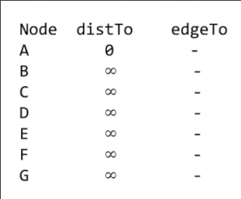

2. 每次**从未探索的成本最小**的节点节点出发，考虑其邻近的所有边，将**出发节点成本和边的成本加和与要到达的节点现有成本比较** 
  * 如果成本小于目标现有成本，则代表路径更好，添加到结果
  * 否则舍去这条路径

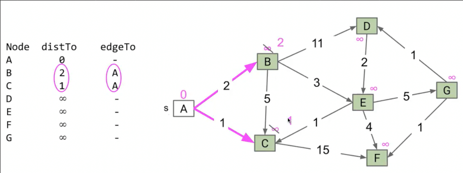

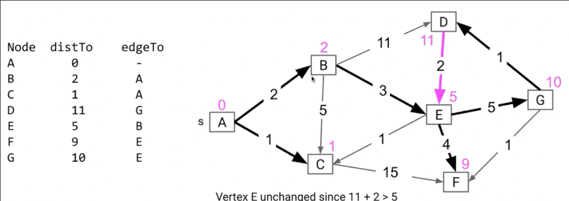

选择下一个要出发的节点可以不遍历所有节点以查看最小节点，而是使用**优先队列**，每次将最小节点出队

在每次节点成本发生变化时，更新优先队列(log n)

之后选择节点时 出队(log n)

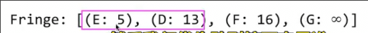

**一些不变量**

* `edgeTo[v]`是目前为止到达这个顶点的最短路径
* `distTo[v]`是目前位置到达这个顶点的最短路径长度
* 优先队列包含了我们仍要访问的所有节点

**一些性质**

* 如果正在出发的节点，指向之前已经出发过的节点，那么这条边肯定会被放弃

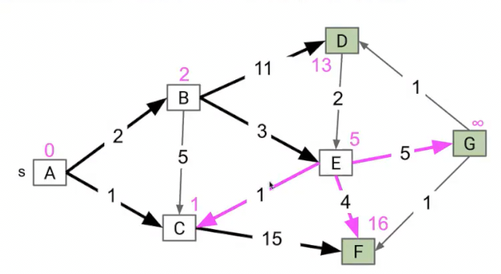

比如这里的E->C 原因在于E作为后出发的节点，其成本一定比先出发的C高

因此之所以需要每次选择最小元素是因为，最小元素在后续的路径一定不会被更新，其是最终的最短路径，只有这样，试图更新的周边节点路径才是**当前的最短路径**

