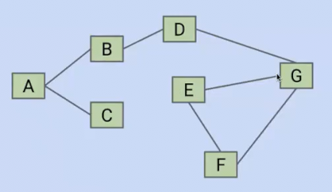
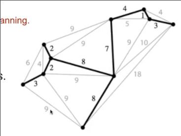
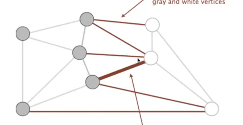
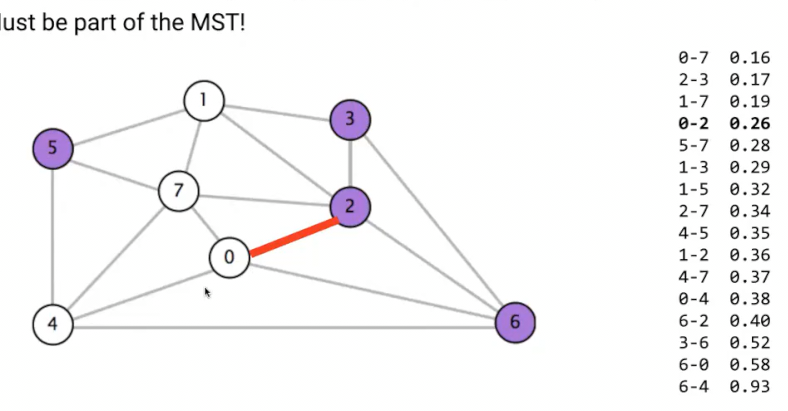
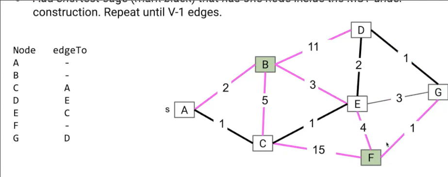
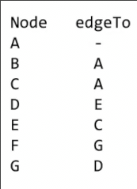

# 最小生成树
 
* [切割属性](#切割属性)
* [最小生成树算法](#最小生成树算法)
  * [Prim_算法](#Prim_算法)

**MST**

我们想判断图中是否存在环

* 可以采用深度优先搜索，寻找是否会遇到被标记过的顶点
* 另一种想法采用并查集，遍历所有的边，如果边的两个顶点不在同一集合，则合并，如果在一集合说明二者间之前存在路径，那么意味着循环

另一个问题是，对于一个连通加权无向图，我们希望找到一种的一系列边，这些边是**无环但是又在同一连通图中**

也就是找到这样一组边

* 连通
* 无环 前两点表明这是一棵树
* 触及所有顶点 *生成*

这样的树称为**生成树**

此外，希望所有边的权重和最小 **最小生成树**

最小生成树是图的属性 但是可能一个图可能会有一个或多个最小生成树

## 切割属性

1. 随机将节点分为两组 灰 白
2. 找出图中一端连接灰一端连接白的全部边
3. 其中**权值最小的边一定是最小生成树的组成部分**

也就是边按照权重排序后，第一个连接灰白的边一定是最小生成树的组成部分

反证法可以证明

## 最小生成树算法

为了生成完整的最小生成树，我们应用切合属性

### Prim_算法

1. 从任意节点开始 标记其作为1队，其余的作为2队，应用切割属性得到最小生成树连接其的一条边
2. 将这条边连接的2队节点添加到1队，再次应用切割属性，得到另一条边
3. ... 直到全部节点成为1队

