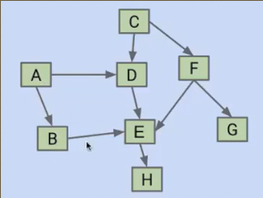
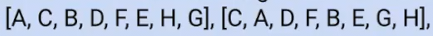
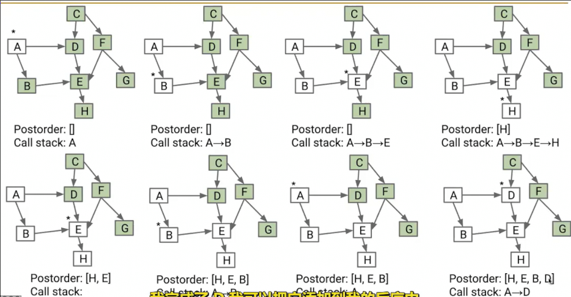
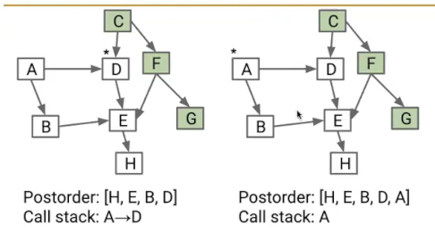
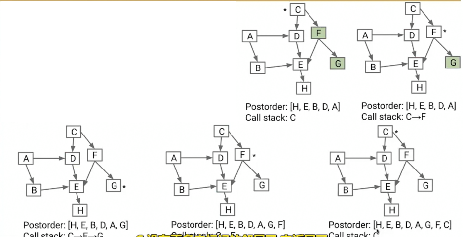
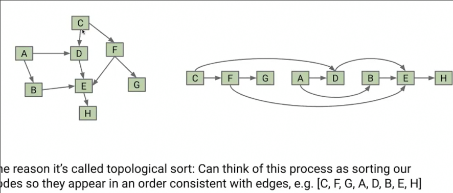

# 有向无环图
 
* [全部事务的合法顺序_拓扑排序](#全部事务的合法顺序_拓扑排序)
* [算法](#算法)

**DAG**

## 全部事务的合法顺序_拓扑排序

假设每个节点是一项任务

我们必须在进行H之前先进行E，进行E之前先进行D，在此之前先执行A

我们希望找到一个合法顺序

在最终的顺序中，所有指向节点的顶点，必须出现在前面

## 算法

首先对于图采用DFS，得到**返回顺序**，之后反转这个排序

得到一个排序，但是还有节点没有被包含，在未包含的节点上重复 仍然在返回时向之前的**返回顺序**列表中继续添加

...

直到所有节点被遍历过

最终反转列表得到做全部事情合法的顺序

**选择节点时需要选择一个没有入边的**

这种顺序称为**拓扑排序**

当我们按照顺序重新排列图中节点的顺序，会得到一个相同的图，其中箭头总是指向右侧

顺便，对于有向无环图dijkstra可以处理负权重
