# 前缀树_Trie
 
* [结构](#结构)
* [改进空间效率](#改进空间效率)
* [字符串操作](#字符串操作)

对于一些特殊的元素，或许我们有更高效、更简单的实现

比如我们的目标是插入26个字符，的其中一些，并且在这个过程中查询、删除等操作

与其使用哈希表，为什么不直接建立26个长度的数组，然后将索引设置`true`或`false`呢

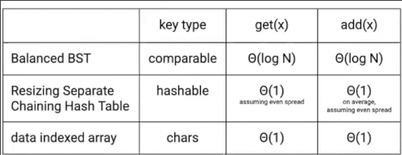

如果有`!`呢？我们可以利用ascii，建立127长度的数组也似乎不是什么难事

如果元素是字符串呢？

## 结构

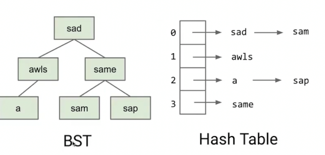

这是处理这个问题的之前的一些解决方案

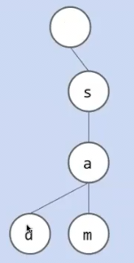

这就是插入了两个元素的**前缀树** `sad` `sam`

可以插入更多

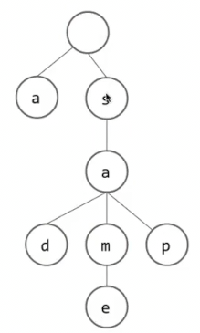

我们可以直接连接已经存在的a，但是似乎很丑，可以重新创建一个（保持离哨兵距离为1是第一个字母，距离2是第二个字母..)

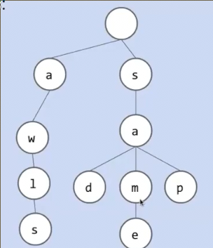

加入awls

但是集合中现在有什么？ sad、sam...或许aw也在集合中？？但是我们从未添加过

标记每次插入结束的元素

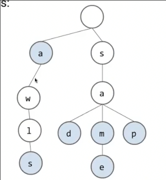

当需要`contains("contains")`时，首先查看第一层是否有c、c的儿子是否有`o`...直到`s`查看是否被标记为结尾

非常简单和巧妙的结构

整个过程在O(词长)时间完成（每层可以通过索引直接访问）可以视为常数时间O(1)

同样可以作为Map

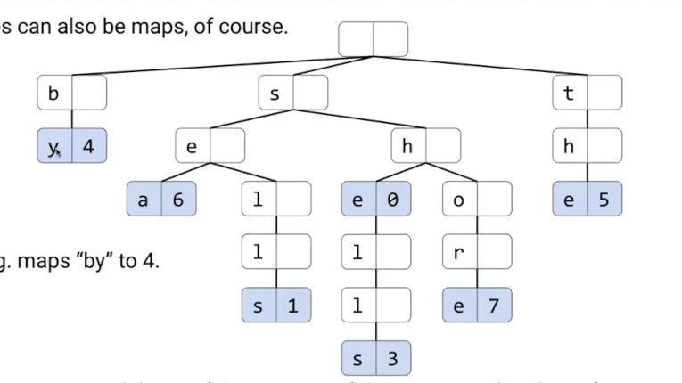

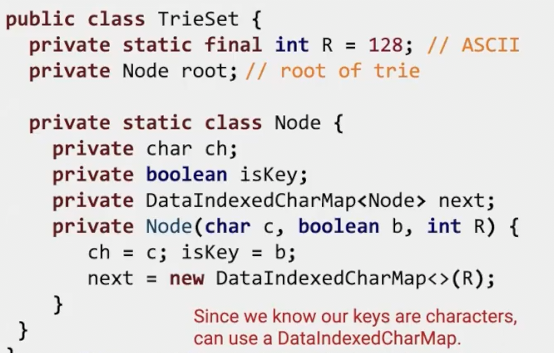

其中`next`是一个数字和Node之前的映射 用于常数时间内判断节点是否存在和访问

但是这个映射用数组的化可能出现这种大多数为null的情况

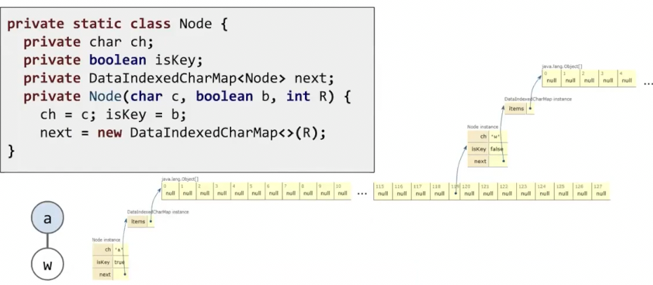

有一些空间浪费

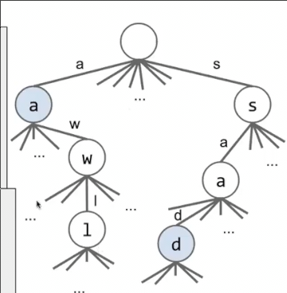

但是null的下一层就没有了因此不会指数级浪费

此外的一个改进是不必存储字母，我们通过索引直接查看那个位置有没有Node就可以，字母是完全多余的

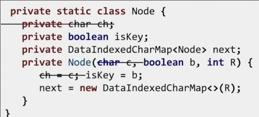

## 改进空间效率

数组的意义是将字母映射到对应的节点，我们可以使用BST或者哈希表等map来替代

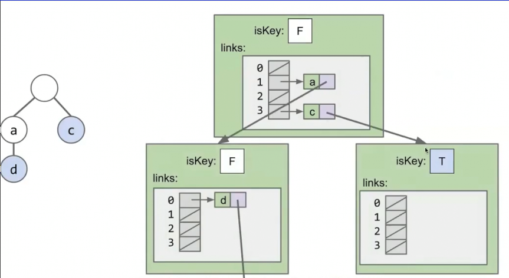

这是底层，但是我们不必思考如此详细，要信任抽象。无论用什么，总是把字母映射到节点

几种map的对比

* 字符映射数组 非常快 但是内存上耗费多
* 哈希表 几乎非常快（均摊） 但是使用更少内存
* 平衡二叉树 稍微慢一些，内存使用和哈希表差不多

log n和 O(1)的差异往往是不可察觉的 况且在这里字母表是恒定的，最多只有26个元素

## 字符串操作

trie使用的原因是不仅仅是稍微改进的时间复杂度，更是其**非常擅长字符串操作**

* 找到`sample`的最长前缀

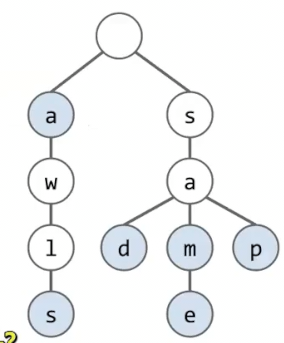

显然相比其它结构，前缀树非常擅长

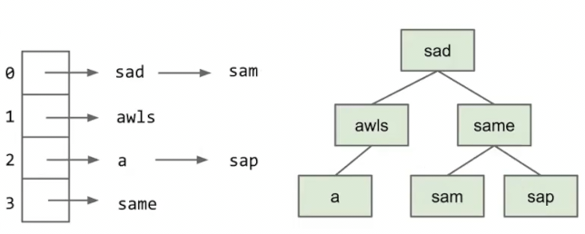

O(1)的时间

