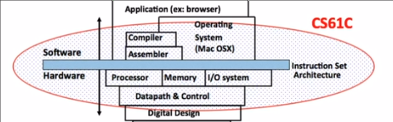

# CS61C

## 目录

| 名称 | 描述 |
| - | - |
| [数字表示](Unit1.md) | |
| [C语言](Unit2.md) | |
| [指针](Unit3.md) | |
| [C语言内存管理](Unit4.md) | |
| [浮点数](Unit5.md) | |
| [RISC-V](Unit6.md) | |
| [RISC-V 的内存存储 分支](Unit7.md) | |
| [RISC-V 的按位逻辑指令 汇编过程 伪指令](Unit8.md) | |
| [RISC-V 的函数调用](Unit9.md) | |
| [RISC-V 的指令表示](Unit10.md) | 二进制 六种指令类型 |
| [编译 汇编 链接 加载](Unit11.md) | |
| [晶体管 信号 两种电路 寄存器](Unit12.md) | P型N型寄存器 组合逻辑电路 状态电路 |
| [状态元素](Unit13.md) | 寄存器 建立时间 保持时间 延时 流水线 周期内最大延时 有限状态机 | 
| [组合逻辑电路](Unit14.md) | 真值表 逻辑门 布尔逻辑 规范 |
| [组合逻辑块](Unit15.md) | 多路复用器 算术逻辑单元 加法器 有符号数的溢出 减法器 |
| [处理器设计](Unit16.md) | 指令执行的五个步骤 处理器的状态元素 R指令I指令的数据通路 |
| [其余指令的数据通路](Unit17.md) | S B J U |
| [额外的指令 指令时序 控制单元设计](Unit18.md) | CRS ecall ebreak |
| [性能衡量 流水线](Unit19.md) | 流水线的数据通路 三种危险和其改善 超标量处理器 |
| [二进制前缀 内存层次 缓存设计原则](Unit20.md) | |
| [直接映射缓存](Unit21.md) | 缓存和内存相互映射方式 地址对于缓存的三个部分 专业术语 |
| [写入缓存和一些细节](Unit22.md) | 块大小的权衡 未命中的分类 |
| [组相联缓存 平均内存访问时间](Unit23.md) | 多层缓存 真实CPU |
| [操作系统工作和基本概念](Unit24.md) | 启动顺序 |
| [虚拟内存 内存管理器 内存分页](Unit25.md) | 物理上的内存和存储器 |
| [分级页表 TLB 虚拟内存性能评估](Unit26.md) | |
| [三种和IO设备数据交互方式 网络](Unit27.md) | 轮询 中断 DMA |
| [并行性 四种架构 SIMD架构](Unit28.md) | |
| [线程 多核 多线程](Unit29.md) | 软件线程 硬件线程 逻辑核心 物理核心 |

## 涵盖内容

软件部分 涵盖**编译器** **汇编器** 

硬件部分 涵盖**处理器**（以及其数据路径和控制）**内存**

## 课程的意义

理解顶层抽象背后的底层原理

* 了解计算机工作的原理
* 对性能的优化有更深刻的认识
* 不同语言之间的区别
* 了解和避免内存泄漏

## 本课程的方法和原理

* 抽象
* 摩尔定律和缩放原理
    * 发展在指数级变化（目前在放缓）
* 局部性原理和存储器层次结构
    * 随着内存的距离核心变远，其存储量越大，价格更便宜，但是显著变慢
* 并行性
    * 计算系统的很多事情同时发生
    * 多个线程
* 性能测量以及根据测量结果改进的可靠性和冗余的反馈
    * 冗余：多数投票来决定答案 降低了错误的风险

其他课程

* CS70
* CS61B
