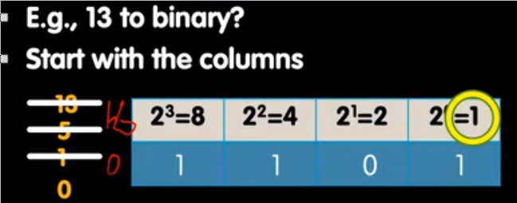
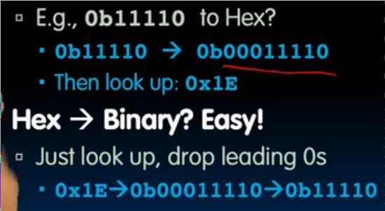
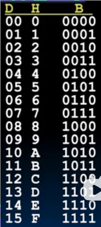
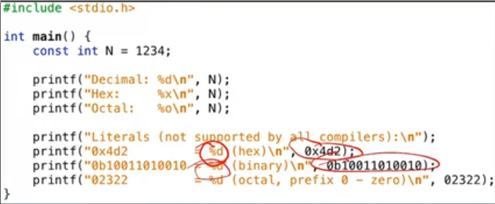
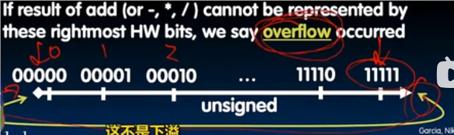
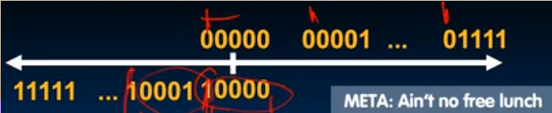
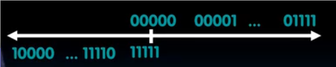
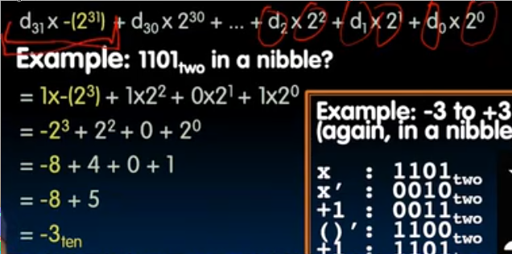
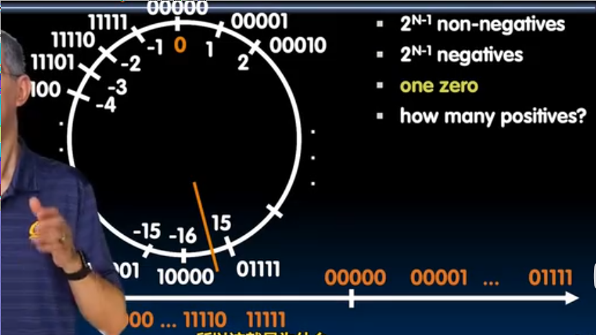
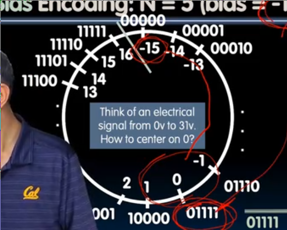

# 数字表示
 
* [Bits可以表示任何事物！](#Bits可以表示任何事物！)
* [二进制_十六进制_十进制](#二进制_十六进制_十进制)
  * [进制之间的转换](#进制之间的转换)
    * [任意进制转换为十进制](#任意进制转换为十进制)
    * [十进制转换为任意进制](#十进制转换为任意进制)
    * [十六进制和二进制的转换](#十六进制和二进制的转换)
    * [C语言中的进制转换](#C语言中的进制转换)
* [数字表示法](#数字表示法)
  * [溢出_overflow](#溢出_overflow)
  * [有符号数的表示](#有符号数的表示)
    * [有符号数的表示方法一](#有符号数的表示方法一)
    * [有符号数的表示方法二](#有符号数的表示方法二)
    * [补码表示法](#补码表示法)
      * [负数的补码表示_转换为十进制](#负数的补码表示_转换为十进制)
      * [补码表示的溢出](#补码表示的溢出)
    * [偏编码_bias_encodeing](#偏编码_bias_encodeing)

数据通常开始于**模拟**区域，我们需要将其转换为**数字**形式, 这需要两个步骤：

1. 取样 *在定期间隔的每个时间点上，询问数据的值是多少*
2. 将其转化在**特定标尺上的某个振幅** *对于一些标尺上没有的数据，取最接近的*

但是并不是所有的数字数据都是通过模拟数据转化而来, 也可以来自纯数字世界，比如音频，视频

## Bits可以表示任何事物！

ASCII 使用**7位**来表示所有字符

Unicode 使用**8位 16位 32位**来表示世界上所有字符（包括表情）

逻辑值 使用 0 表示

RGB 使用数字表示

**任何可枚举的事物都能用bit表示**

**如何判断需要多少bits?**

假如事物有n种结果，表示事物需要的位数为`logn(取上整）`

## 二进制_十六进制_十进制

* 二进制

 

我们在二进制前加上`0b`以区分 如`0b1101`

* 十六进制

在十六禁止前加上`0x`以区分 如`0xA5`

### 进制之间的转换

#### 任意进制转换为十进制

化为十进制很容易，如`0b1001` => `1 * 2 ^ 0 + 0 * 2 ^ 1 + 0 * 2 ^ 2 + 1 * 2 ^ 3 = 9`

#### 十进制转换为任意进制

而由十进制化为任意进制的步骤如下

从**要转化进制的高位**开始装盒子

1. 16是否能被余量为13的盒子装下？ 不能
2. 8是否能被余量为13的盒子装下？ 可以 装几个？ 1 余量为 5
3. 4是否能被余量为5的盒子装下？ ... 
4. 直到余量为0

#### 十六进制和二进制的转换

二进制和十六进制的转化也很容易 补全二进制开头和结尾（如果有小数部分）的0，每**四位**为一组，转化为一个十六进制数

**转化表**

#### C语言中的进制转换

* 表示八进制是在前面加上前导`0`

## 数字表示法

### 溢出_overflow

溢出 `overflow` 实际的数字超过所能表示的位数

* 00000 - 1 => 11111 下溢
* 11111 + 1 => 00000

都称为溢出

### 有符号数的表示

之前我们所考虑的是**无符号数**

在C语言中为`ungigned int` C18中`uintN_t`

#### 有符号数的表示方法一

我们向无符号的表示方法中借了一位来表示负数，尽管这样可表示的正数范围被缩小了

最左侧的为符号位 0 表示 正，1 表示 负

其余为 依旧按照正常的递增

这种方法有两个0，并且随着负数的降低，表示其的二进制数却在增加

#### 有符号数的表示方法二

那么如果我们将正数部分不变

负数部分只是在正数的基础上完全翻转所有位呢 

* 1 == 00001
* -1 == 11110 

0依旧有两个表示方法

但是随着负数的降低，表示其的二进制数在减小了

#### 补码表示法

在刚刚翻转正数的基础上，对于每一个负数（包括0的负数表示）加上1

这样0的表示唯一，同时整个表示数轴，随着数的增加，其二进制也增加

##### 负数的补码表示_转换为十进制

最高为的权值为-，其余权值不变

或者可以翻转每一位再加1, 得到其正数

##### 补码表示的溢出

#### 偏编码_bias_encodeing

在编码对应无符号整数的基础上，加上一个偏差得到新的数。现在这个编码表示的即是这个新数

偏差通常选为 -(2^(N - 1) - 1)

比如 对于无符号数 7， 其二进制表示为 00111, N = 5, 故偏差为 -15

7 - 15 = -8 故 00111 表示 -8

