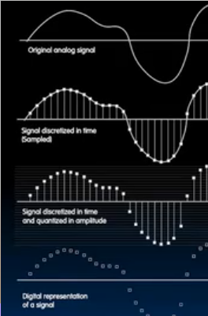
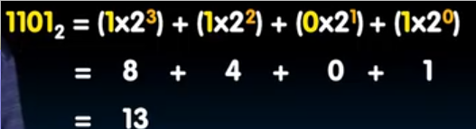
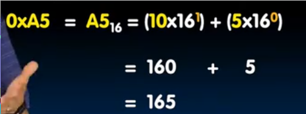

# 数字表示

数据通常开始于**模拟**区域，我们需要将其转换为**数字**形式, 这需要两个步骤：

1. 取样 *在定期间隔的每个时间点上，询问数据的值是多少*
2. 将其转化在**特定标尺上的某个振幅** *对于一些标尺上没有的数据，取最接近的*

但是并不是所有的数字数据都是通过模拟数据转化而来, 也可以来自纯数字世界，比如音频，视频

## Bits可以表示任何事物！

ASCII 使用**7位**来表示所有字符

Unicode 使用**8位 16位 32位**来表示世界上所有字符（包括表情）

逻辑值 使用 0 表示

RGB 使用数字表示

**任何可枚举的事物都能用bit表示**

**如何判断需要多少bits?**

假如事物有n种结果，表示事物需要的位数为`logn(取上整）`

## 二进制、十六进制、十进制

* 二进制

 

我们在二进制前加上`0b`以区分 如`0b1101`

* 十六进制

在十六禁止前加上`0x`以区分 如`0xA5`
