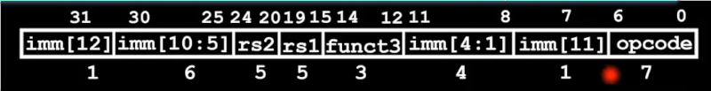
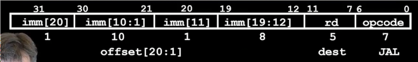

# RISC的指令表示
 
* [汇编指令集到二进制](#汇编指令集到二进制)
* [字段和类型](#字段和类型)
  * [r类型格式](#r类型格式)
  * [i类型指令格式](#i类型指令格式)
    * [加载指令](#加载指令)
  * [s类型指令格式](#s类型指令格式)
  * [b类型指令格式](#b类型指令格式)
  * [u类型指令](#u类型指令)
  * [j类型指令格式](#j类型指令格式)
* [总结](#总结)

这是我们当前位于的抽象层级！我们结束了RISC-V的学习

处理器能够理解的只有二进制树序列0 1 我们要把汇编映射到其上

计算机的发展过程

* 可插线的计算机
* 控制开关的编程计算机
* 35位作为数据的计算机
* 所有东西（数据和指令）都存在内存并具有内存地址
  * C指针也仅仅是内存地址
  * 一个重要的寄存器**PC** 存储了接下来执行指令的地址

## 汇编指令集到二进制

* 二进制程序绑定到对应指令集 不同架构的二进制程序不同
* 机器语言要向下兼任：其更新后，先前版本的程序也能运行 （新版本的手机更新了架构，我们不想重新开发其程序）

我们处理大部分数据都是32位，寄存器是32位，lw和sw都是对32位进行操作

而最基本的指令集大约40条指令，但是可扩展到几百个额外可选扩展

* 如何编号呢？我们通常不会顺序编号，比如add为1，sub2...
* 而是为其分配32位值（方便将其同样放置在内存）
  * 并且这些32位指令在所有RISCV的变体中使用 RV32 RV64 RV128

那么理论上我们可以表示2^32条指令 但是不会将其任意表示，而是**设计指令集使得其便于微处理器解释**

* **分为字段** 字段告知处理器 这条指令是什么
* 每个字段告诉处理器一些关于指令的信息：**什么类型** **对哪些寄存器操作**

## 字段和类型

* 我们有32个寄存器，因此每次使用**32位中的5位表示操作数寄存器**
* 类型 共有六种类型的操作 **每一种类型具有一种字段格式**
  * R 寄存器到寄存器的算术和逻辑运算
  * I 寄存器和立即数的算术和运算操作 以及 加载 **加载和立即数指令对于字段有相同的格式**
  * S 存储操作
  * B 分支操作
  * U 长立即数 
  * J 跳转指令

 ### r类型格式

算术逻辑运算 寄存器到寄存器的指令

每条指令覆盖0到31位 分为各个字段

* 最低的部分是**操作码** 占有7位 0 - 6 *opcode*
* 目标寄存器的二进制代码 占有5位 7 - 11 *rd*
* *funct3* 占有3位 12 - 14 
* 源寄存器1 占有5位 15 - 19 *rs1*
* 源寄存器2 占有5位 20 - 24 *rs2*
* *funct7* 占有7位 25 - 32 

其中操作码 funct3 funct7表示我们要执行什么指令 add 还是 sub 还是 sll

* 所有r指令的操作码相同`0b0110011`
* 剩下的funct3和funct7来区分指令（我们可以区分2^10=1024条指令，因此存在很多冗余，利用这一点选择合适的区分方法使得处理器容易确定其将执行哪条指令）
* 他们分散在各处的原因同样是让处理器工作更容易

所有R类型指令的摘要

* `slt` `sltu`指令当源寄存器1值小于源寄存器2，设置目标寄存器为1，否则为0 `set on less than`

可以观察出一些特别之处

* `add`和`sub`仅仅用1位区分，我们用这一位是否为1决定加法器是否变为减法器（符号扩展） （相同的硬件）
* 算术右移`sra`和逻辑右移`srl`也用同样的位置区分，除了这两条指令，其他指令的这个位置都为0，因此这个位（30）表示是否**符号扩展** 
* 其他的相似之处也有巧妙的设计

### i类型指令格式

立即数和寄存器的算术逻辑运算以及加载指令

我们尽量让不同类型的指令格式大部分相同，因此其和R指令布局类似

立即数编码为指令的一部分，但是其只能占用32位中的一部分 

我们可以利用R指令中rs2的位置，但是5位是不够的，需要更大的立即数范围

**将R指令中与rs1字段相邻的funct7也利用起来** 12位表示立即数 功能表示2^12 = 4000多个

但是我们实际有9条I指令，而funct3只能区分8条

立即数范围为-2048-2047 不过我们需要其和rs1中的值匹配，因此处理器自动将其**符号扩展为32位**

* I类型的操作码为`0010011`
* 这里addi的funct3和add的相同

所有I指令的摘要

* `slti` `sltiu` 将源寄存器数和立即数比较，小于则设置目标寄存器为1，否则为0
* 由于funct3不够区分两种指令 
  * 缩减立即数范围，用第30位区分`srli`和`srai` 和R指令中相同，也表示是否符号扩展
  * 对于移位指令，过大的立即数范围没有意义，因为最多只有32位数，当移位大于32后毫无意义，因此只要保留5位立即数即可

#### 加载指令

加载指令实际上和I指令结构相同 一个目标寄存器存放值 一个源寄存器存放内存的指针 一个立即数表示偏移量

加载指令仅仅区分了操作码 

funct3来区分加载类型 **字** **字节** **无符号**

* `lh`用于加载**半字**
* 带`u`的版本采用0扩展 其余采用符号扩展 **w没有空间扩展，因此不需要**

### s类型指令格式

存储

store不得不采用新的格式 其使用不同的方式使用寄存器

* 两个源寄存器 一个存放数据 一个存放指向内存的指针
* 一个立即数 表示偏移量

我们希望寄存器在指令中的位置尽可能相同，避免处理器在指令中到处寻找寄存器

因此将立即数分开 占据R指令中目标寄存器的五位和funct7的7位，共12位 -2048-2047

### b类型指令格式

分支

* 两个源寄存器 用于评估条件
* 一个**标签** 表示地址

如何编码标签？

下面一些特征

分支通常表示`if-else` `while` `for`

* 循环结构通常非常短
* 如果我们要跳转到更远的地方 将使用J类型指令

而另一方便，代码存在于内存中`text`，并与数据存在不同的位置 *一些历史原因 其不会超过4GB* 

而**程序计数器存储我们正在执行代码的地址** 因此我们可以利用PC来进行相对寻址 **立即数表示偏移量**

如果采用S类型指令的格式（12位的立即数 2个源寄存器）那么偏移量最多表示4096字节

同时，我们不会寻址到某指令的中间（一条指令是4字节）

一种做法是

那么我们就不应该以字节作为单位 而是应该以4字节（32位）作为单位 现在我们拥有了十几KB **因此这个立即数表示距离当前指令有多少条指令**

PC的执行状态如下

* 当我们不分支时，PC会自增4以指向下一条指令
* 如果我们进行分支，那么PC会增加 **立即数*4**

但是！在RISCV中，我们支持压缩指令集：一些16位的指令 *原因在与一些应用需要非常简介的空间表示代码 闪存等*

这样就会同时存在32位指令和16位指令 **因此以2个字节为单位**

那么这就是RISCV中PC的执行过程

* 当不分支时，PC自增4
* 如果分支，那么PC自增2*立即数

由于在本课程中我们不使用压缩指令，立即数总是偶数

和S指令相比，仅仅立即数的位置发生变化 两个源寄存器 操作数 funct3位置都不变

立即数为什么这么乱？其表示有点奇怪，没有0的原因是将其把imm[0]视作始终为0，以满足PC=PC+imm（13位数）

在我们始终用32位指令的情况下，imm[1]始终为0

可以跳转指令的范围是（假如全是32位）2^11 = 2048 也就是前后的1024条指令

对于全是16位指令则是前后的2048条

在这里我们需要分支到4条指令之后 其立即数为4 * 4 = 16（PC加多少立即数就是多少，注意在存储中不存立即数的最低位）存储0b1000

* 全新的操作码`1100011`
* funct用于区分不同的分支命令

立即数为什么存储如此混乱？

这是之前指令中立即数存储的位置，我们将其组合后，可以发现指令中最高位永远是立即数的最高位，我们据此对本不足32位的立即数进行符号扩展

而B指令较S仅仅将imm[11]存储在7位，但是大多数不变，这也帮助处理器更方便处理

这是我们刚刚的局部指令的实际存储

摘要

注意目前所有类型的指令操作类型地位都是0011,实际上我们只用操作码的前三位来区分不同指令

最低四位用于编码指令集架构ISA的其余部分，并添加扩展

### u类型指令

* upper 上位表示 32位的高位 以结合普通立即数表示更大的数

在之前的b指令中，立即数（13位）为汇编器计算得到，表示跳转指令距离当前指令的字节数

当我们的代码存储在内存的不同位置时，这个立即数不需要改变，这是PC相对寻址的优势 **位置无关代码**

但是当我们需要分支到1024条32位指令以外怎么办？？

此时需要借助另一条指令

可以表示20位立即数 允许的立即数2^20大概一百万

结合我们的12位短立即数 表示全部32位数

少一个寄存器字段和funct3字段

供两个指令使用

* lui *load upper immediate* 将上位立即数加载到目标寄存器
* auipc *add upper immediate to pc* 将上位立即数加给PC并存储结果在dest目标寄存器

区分两条指令不得不使用两个操作码

但是有时候并不能直接配合表示全部的32位数

`DEADBEEF` 其中`DEADB`大约90万，我们最多能有`lui`加载这么多，但是剩下的`EEF`仍然超出`addi`的立即数范围大概3k多，而我们只能表示+-2048，超出后，最高位被符号扩展使得lui的结果减小1

解决方案是故意增大lui的操作数1

这就是ADDI溢出时的方案

而伪指令li，可以自动让汇编器为我们处理这些情况，接受32位16进制！

auipc对于PC相对寻址很有用！可以将偏移量加给PC，如果我们只加0，那么就是存储了当前指令的地址

### j类型指令格式

jal

和U类型类似

* 需要一个目标寄存器 存储下一条指令PC+4的值
* 一个立即数用于把标签代表的偏移量加给PC 事实上是21位（最后一位不保存）

排序是希望其和分支类型差不多

可以表示2^19个32位指令 也就是当前指令的+-2^18 二十余万 1MB的代码

而对于`jalr`，其不是j类型！而是I类型 因为额外需要一个源寄存器 用于存储PC+4给目标并将PC设置为源寄存器和立即数的和

是**绝对跳转的方法** 并且要注意这个立即数的最低位没有省略，可能是1！而我们通常要自行设置0

## 总结

RV32中六种类型的指令

我们牺牲一些格式的可理解性，以便硬件设计和高效
