# 编译C_汇编A_连接L_加载L_
 
* [解释语言和编译语言](#解释语言和编译语言)
  * [解释过程](#解释过程)
* [编译器](#编译器)
* [汇编器](#汇编器)
* [链接器](#链接器)
  * [绝对函数寻址](#绝对函数寻址)
  * [解决引用](#解决引用)
  * [加载器](#加载器)
* [例子](#例子)

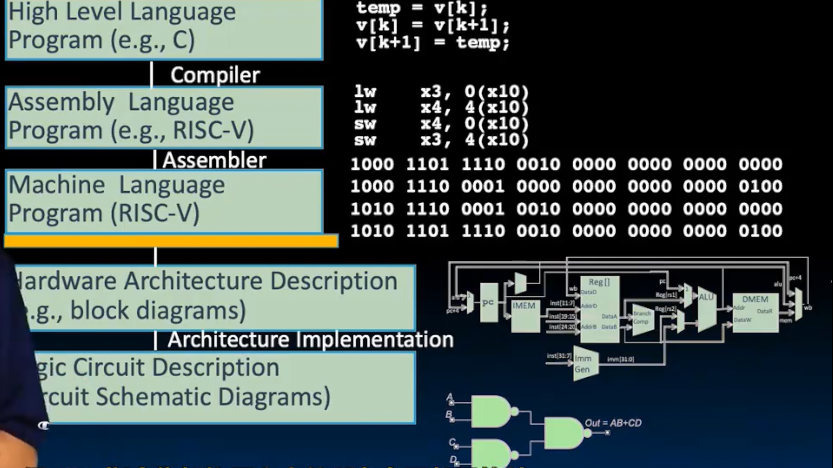

软件和硬件由ISA指令集架构层分界

我们今天研究软件部分

## 解释语言和编译语言

一种运行其他程序的方式是**解释器** 其是一个用来**执行其他程序的程序**

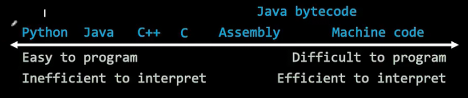

* 越左侧相对容易编写，而右侧较难编写
* 越右侧解释起来效率很高，速度很快

其中Java字节码解释效率很高 因此Java自身是**非完全解释型的语言** 先编译为字节码，然后解释字节码（python类似，这样做兼容性好）

而另一种执行程序的方式是编译 

* 其将语言翻译为更低级的形式：在上图中更靠右，（通常翻译为最右，然后直接执行它）

比如C语言直接翻译为机器码（但是C语言也可以解释执行，人们写过C解释器，上面的任何语言都可以解释执行，同样也可以翻译）

* 当不需要性能时，通常解释高级语言
* 而需要性能时，往往翻译为低级语言

### 解释过程

解释器读取程序并产生输出

我们有时想**解释机器码**，比如我们在Venus解释RISC-V

* 这样也可以获取更多调试信息
* 将一个指令集架构ISA转换为另一个（速度慢很多，但是这是一种向下兼容的方式）*程序不在意其在软件中还是裸硅上运行* 
* 编写解释器也更容易 其代码更少 考虑的事情也没有编写编译器那么多 *CS164*
* 指令集独立性 比如python编写的解释器，我们不需要指定指令集在什么硬件上运行，而是只需要python环境 而翻译要考虑硬件以翻译为其目标语言

## 编译器

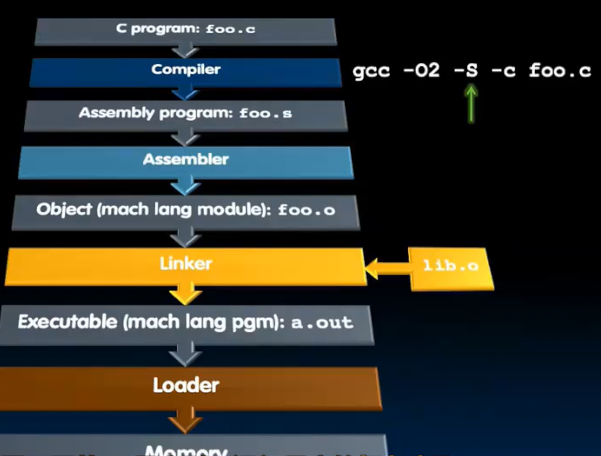

这是C语言到可执行程序的过程

对于编译器，输入C程序，输出.s程序

`-s`参数获取.s输出

.s可以通过两种方式生成 

* 编译器生成 可以打开一些选项来优化生成的.s汇编代码
* 也可以像我们之前手动编写 尝试对比一些小代码手动翻译和编译器翻译的差异
  * 伪指令使得汇编级程序更易思考 **由汇编器翻译成真实指令**

## 汇编器

汇编器读取`.s`文件输出`.o`目标代码

为什么不直接生产可执行文件？由连接层执行（一个项目可能有很多.c，一次编译汇编出多个.o)

1. 替换伪指令
2. 生成处理object代码还有**信息表**

读取指令

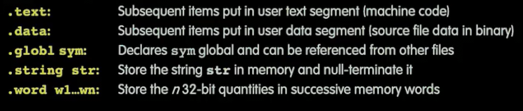

这些指令不是代码，告诉系统每个阶段要做什么

* `.text` 从此处直到下一个`.`指令，内容是**文本段** 也就是代码
* `.data` **数据段** 比如很大的数组
* `.global` 告诉符号能被其他文件访问
* `.string` 接下来是字符串
* `.word` 存储一些值（也可以标记）

一些伪指令的替换

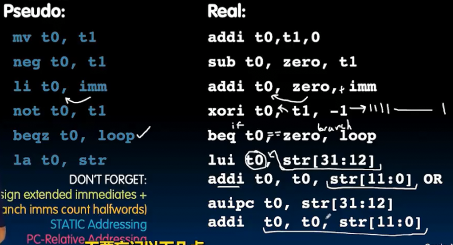

生成目标代码

* 简单的情况是逻辑算术运算等，只需要根据规则简单翻译即可
* 而对于分支和跳转语句，`beq` `bne`  由于采用相对寻址，不需要获取PC的值，需要得知标签表示此处距离目标有多少字节，以确定存储的立即数
  * 对于向前跳转呢？我们应当先再扫描一遍文件（之前的一遍是替换伪指令），记录下所有标签的位置

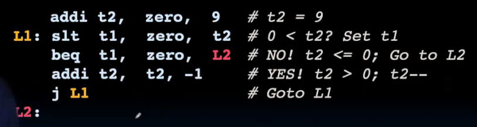

对于`auipc` 这些位置无关指令都很好办

但是对于`la` `lui`指令，其要编码真实地址，也就是在最后`a.out`中的位置 我们在此处不能确定其编码

之后，我们还产生一个**符号表**，作用是给出哪些符号可以被其他文件使用

* `labels` 一些可以被调用的函数
* `data` 一些`.data`数据段中的数据

**重定位表** 用于存储我们暂时还不能处理的指令（需要其实际绝对地址）以及静态部分的数据

**.o文件的格式**

* object文件头部 *告知内容的大小和信息 接下来的文件包含 几个部分... 一遍快速获取文件部分内容*
* `text`部分 
* `data`部分 硬编码的若干数据
* 重定位表
* 符号表
* 调试信息
* 一种标准的格式是ELF

## 链接器

输入若干`.o`文件 生成`.out`可执行文件

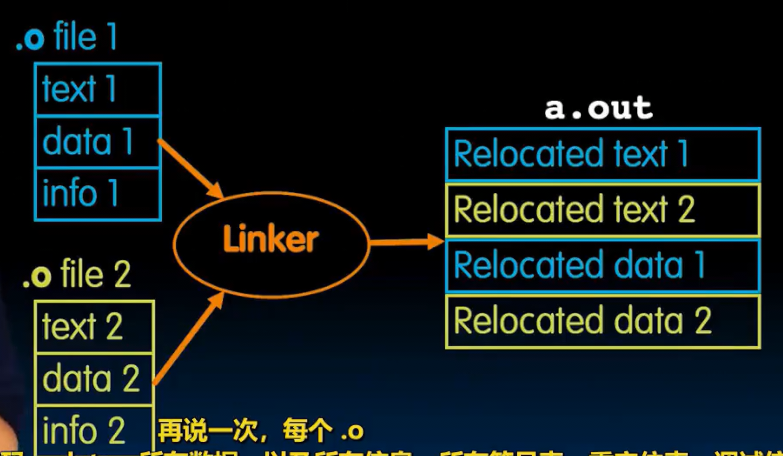

1. 获取所有文本 顺序排列
2. 放置所有数据 连接在一起
3. 浏览重定位表，将符号替换为地址

**四种地址** 后三种都通过重定位表修复

* PC相对寻址 `beq` `bne` `auipc` 
* 绝对函数地址 
* 外部函数引用
* 静态数据引用

### 绝对函数寻址

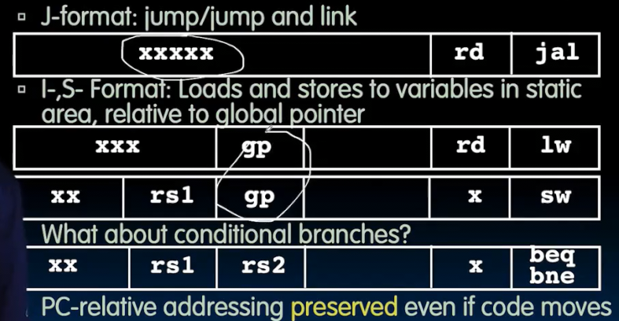

* j指令可能引用其它文件中函数
* i指令和s指令使用静态区时（源寄存器是gp 指向静态区开头）因为静态区要在文本后，我们连接前不确定静态区在哪
* 条件分支不需要！其是位置无关代码

### 解决引用

代码段实际上从0x10000开始 之前的被保留 之后是数据 然后是堆 底部是栈 相对增长

连接器通过.o文件中的信息`info`得知其中文本段和数据段的长度

并且将其排列放置，得到所有绝对地址，修复链接

在解析引用时，从符号表中搜索，找到后替换为绝对地址

* 如果函数缺少或重复 在连接阶段被找到错误

这是**静态链接**的过程 但是当库更新后，我们不得不重新编译其 并链接 其优势是自己就是可执行的

另一种模式是**动态连接** 我们不把库静态链接到可执行文件 只是声明包含这个库 在运行时会动态链接库`dll` *dynamically linked libraries*
  * 优势在于我们只需要更新其中一个库，而不链接全部 执行两个包含同一库的文件占用更少的空间
  * 缺点在于 运行时间略长，因为要去找到这个库，而且会出现运行时错误  并且可执行文件本身变得自己不能工作

其在最低级别，也就是机器语言级别上链接 而不是更高的汇编 （在运行时，才会进行填充工作）这变成加载器的任务

### 加载器

作用把.out从磁盘上加载入内存 假如我们使用静态链接

* 加载入内存
* 设置所有需要设置的东西
* 启动运行

实际上就是操作系统 *cs162*

1. 阅读可执行文件的头部，得知各种东西的大小：文本，数据
2. 给程序创建足够大的地址来容纳文本和程序 以及给栈分配空间
3. 复制指令和数据 到创建的空间
4. 传递程序的参数到堆栈 （由于不知道有多少，因此不放在寄存器）
5. 初始化寄存器
6. 跳转到一个启动例程，并将程序参数从堆栈复制到寄存器 设置PC 开始执行 结束后通过系统调用终止程序并传递返回值

## 例子

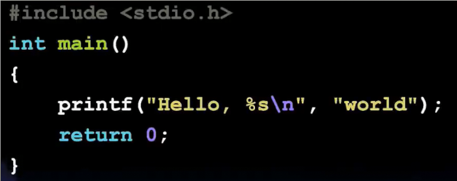

编译！

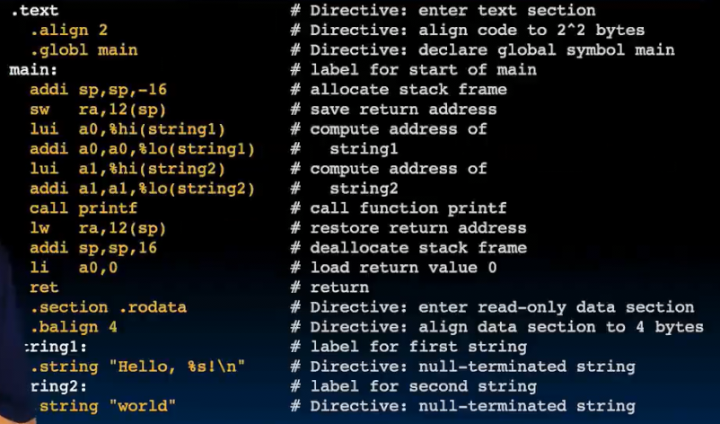

1. `.text`段 接下来是代码
    * `.align 2` 需要将这段代码对齐到2^2次方字节（按字对其）
    * `.glogl main` 其他人可以得知这个main的存在
2. `main`函数
    * 因为之后有函数调用，存储返回地址
    * 加载两个字符串到参数寄存器，准备调用函数
    * 恢复ra，加载返回值，恢复堆栈 返回
3. `.section .rodata` 表示当前为只读数据
    * `.balign 4`对其到4个字节

汇编！

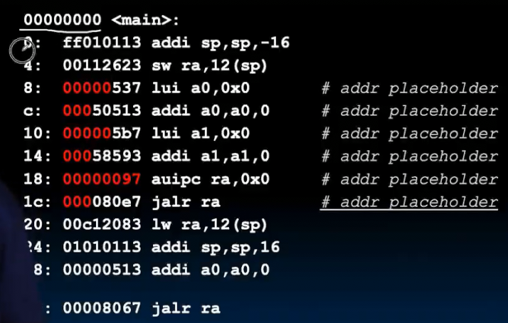

一些不确定的指令用0占位

链接！

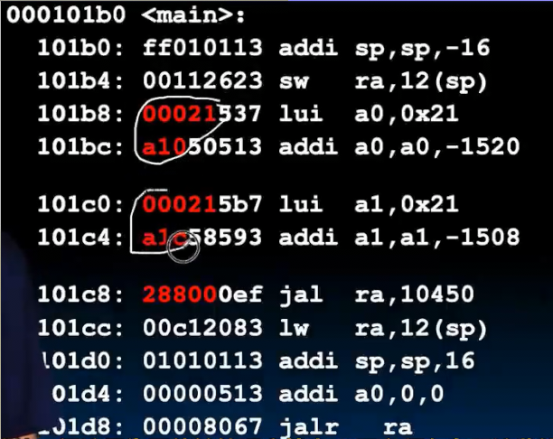

通过查表得知各符号，找到链接后其地址，填入
