# 同步数字系统概述
 
* [晶体管](#晶体管)
  * [mos晶体管](#mos晶体管)
  * [非门](#非门)
  * [与非门](#与非门)
* [信号和波形](#信号和波形)
* [寄存器](#寄存器)

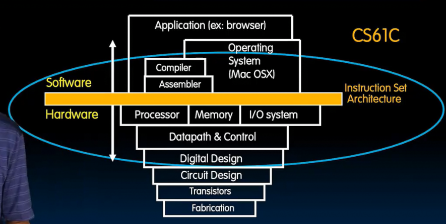

我们来到最底层

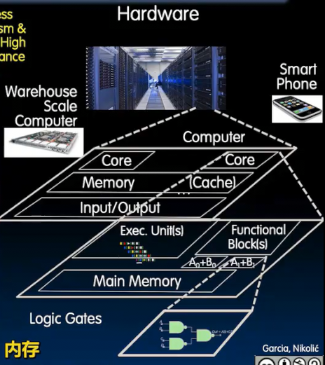

**同步**表示系统具有“心跳” **时钟** 当前大概3-4GHz *每秒40亿次* 

时钟如同方波 1 0 1 0

**数字**表示当我们进行到数模转换时，将模拟量量化为0 1

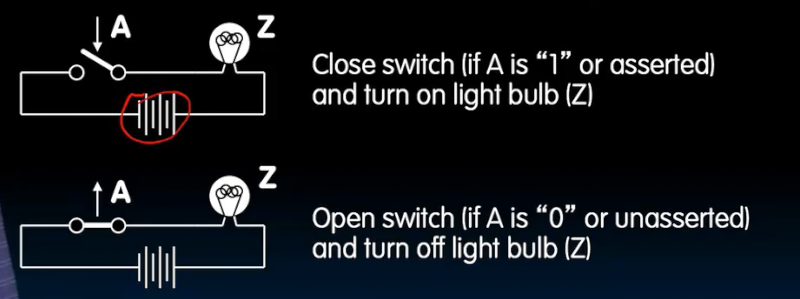

断言A或者A置为1，意味着打开开关使得其为通路 因此灯泡亮度和A是相同的关系

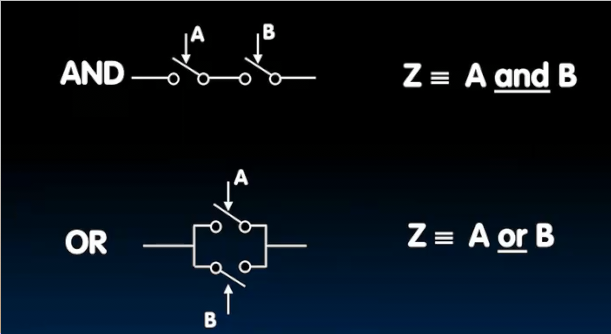

## 晶体管

可以通过另一个源控制是否两个引线之间导电（放大 导通 断开） **半导体**

之前使用真空管 *尺寸更大* *寿命更短*

之后出现集成电路 缩小了尺寸

现代数字短路使用CMOS

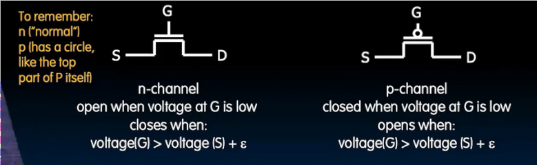

### mos晶体管

* Drain 漏极
* Gate 栅极
* Source 源极

对于N型晶体管 **negative** *normal*

S和D之间存在电位差，因此电流希望流向D，但是G极可以控制阻止

* 当G极电位大于等于S极，*开关合上* 通路

对于P型晶体管 G极大于等于S极 开关断开 开路

### 非门

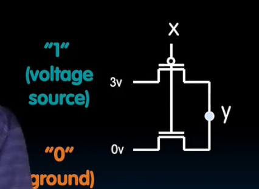

注意连接时3和0之间永远**不要直接相连**

并且**不要使得输出为不确定值**

X0V 时 对于上面 P型晶体管 G极低电位通路 Y3V 而下方N型晶体管 G低电位断开 因此不短

X3V时，上方P型断开，下方N型导通0V

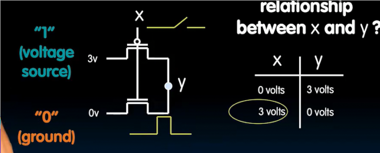

NOT!

### 与非门

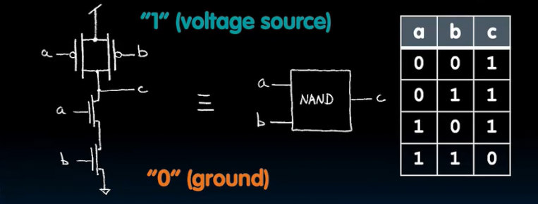

* a和b高点位时，N开关导通 C接地 0 而上方P开关断开
* a和b低电位时，N开关断开 上方P断开全部导通 接高电平 1
* a和b有一个高电平一个低点评时，N型会断开一个，因此不接地，而P型由于串联，总会有一个通路，C1

与非门可以构建所有数字世界的东西！

## 信号和波形

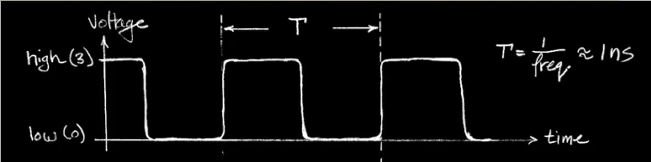

* 周期T是上升沿到下一个上升沿之间的距离
* T时频率f的倒数 约为1ns
* 电线上一次只能有一个信号 1/0

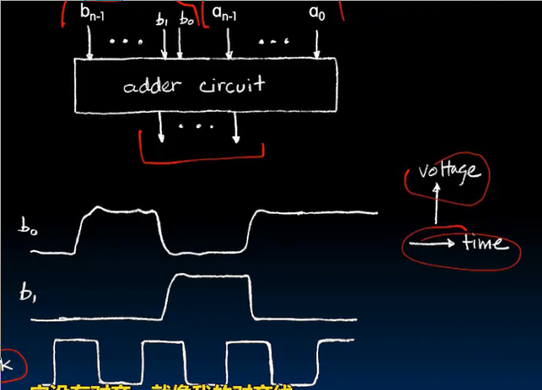

这里的信号没有随着时钟到来而立即发生 *延迟* 也没有对齐 *噪声*

这是4个并行的信号 一同表示一个二进制数

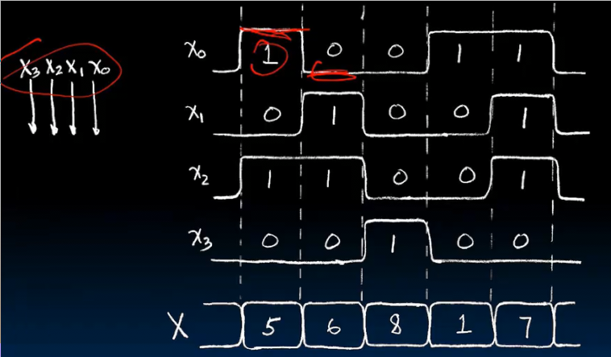

可以只是绘制为向量X的信号

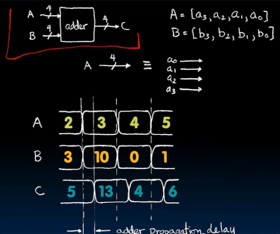

这里绘制出输入和输出向量之间的延时 下一次输出之前会额外由于传播延时停留在上一段输出一段时间

* **组合逻辑电路CL** 纯函数 只有输入对应输出 同样输入下，输出相同
* **状态元素** 存在状态、记忆 （用来存储数据）

## 寄存器

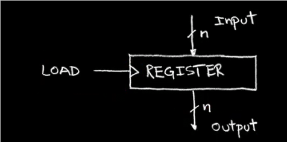

* 输出始终为存储的值 
* 当加载位置高，获取输入，并保持
* 当加载位低，忽略输入

更常见的是时钟到来时加载一次

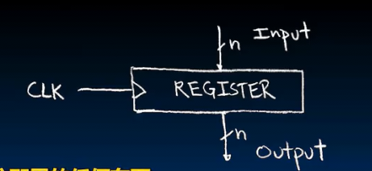

当时钟上升沿，抓住输入并保持

在现实中，存在信号模糊的现象，而我们每个模块都会清理处理：对于接近0的信号，拉到0，对于接近3的信号，拉到3
