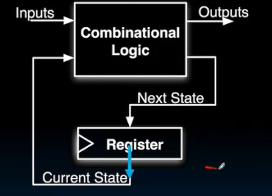
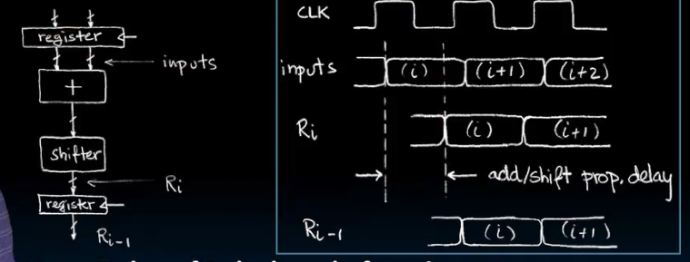

# 状态元素
 
* [构建一个累加器](#构建一个累加器)
* [寄存器内部](#寄存器内部)
* [累加器细节](#累加器细节)
* [流水线](#流水线)
* [有限状态机](#有限状态机)

## 构建一个累加器

状态元素用于构建需要保存状态的东西：寄存器 内存...

没有状态元素可以吗

这里使用一个加法器 将输入接到输出称为**反馈**，这是被允许的

但是在这里，我们无法初始化，也无法控制迭代循环的时间

取而代之，我们引入一个寄存器来控制

* 这个寄存器中有一个`reset`，置1时寄存器存储0 （最初时使用，S起初为0）

每当时钟到来时，寄存器加载，此时累加器载入加法器的新的结果，输出到加法器的另一端，并且Xi迭代，加法器计算出新结果输入到寄存器和S，等待下次时钟到来更新

## 寄存器内部

内部存在**触发器**

n位寄存器内部首先由n个并行触发器组成 也叫D触发器

对于触发器

其由上升沿触发 当时钟上升沿时，输入D被获取，载入，并且输出始终为载入值

红线是时间的上升沿

* 在时钟上升沿时，D改变怎么办？会导致获取一半的情况，因此我们需要D**在时钟上升沿到来前后一段时间保持稳定**，其余时间可以任意改变
* **建立时间** 时钟沿到来前的一段时间，D在建立时间要保持稳定
* **保持时间**  时钟沿到来后的一段时间，D在保持时间要保持稳定
* **clk-to-q延时** 时钟到来，获取到的值显示在q上的延时
* 这三个值通常越低越好

## 累加器细节

* 重置优先于D，当reset置1同时时钟到来，寄存器会清0

时序角度 Si变为si-1，在时钟到来时，被采用，经过`clk-to-q`延时反应在si-1，立即输入加法器，经过加法器延时，反应在si

1. 考虑重置，在重置置为1时，时钟到来，寄存器存储0，si-1忽略si的值，经过`clk-to-q`后，被置0
2. 被置0的si-1立即输入加法器，xi此时还不是正确的x0，因此经过加法器延时，算得并非正确结果，但是当xi为x0时，经过加法器延时，得到正确结果（此时下一次时钟还未到来，处于**建立时间**之外）

由于xi和si-1的不同步，si经常会有暂时的错误值

**时钟超频**会导致周期缩短，可能si的错误值会被保存在建立时间，甚至被寄存器保存！

建立期间和保持期间始终要稳定，不要有不确定的值

## 流水线

1. 当时钟到来时（上升沿），经过`clk-to-q`获取新状态，保持并输出
2. 输出立即输入到组合逻辑电路，经过`T组合`，输出给寄存器
3. 寄存器存在**建立时间和保持时间**，期间要保持输入稳定

这是最大延时，需要在一个周期内串联完成（保持时间和CL延时同时发生）

在这里，加法和移位器串联完成，因此CL延时很大，导致最大延时也很大，允许的最小周期很大

但是我们插入一个寄存器

1. 上升沿到来，寄存器1，通过`clk-to-q`延时输出给加法器，加法器通过`T-add`延时，输出给寄存器2，这个延时小很多，但是需要在下一个时钟到来前寄存器2的建立时间前完成
2. 上升沿到来，寄存器2和移位器完成上述工作 保证在下一个上升沿到来reg3建立时间前完成...

这就是流水线的思想 这样最大误差就是比较小的T-CL加上clk-to-q和建立时间，允许的最小时钟周期更小

## 有限状态机

拥有一系列状态和转换

在当前状态下，输入为转换，输出为下一个状态

**使用有限状态机检测3个连续1**

当检测到3个连续1时输出1

* **有限状态机的每个状态都要有全部输入数据范围内的任意个值作为退出条件** 比如在这里，3个状态中每个都有1或0转换为其他
* 每个有限状态机都要有一个箭头表示初始状态

这里每个状态表示当前看到1的数量

* s0开始，当看到1，输出0，转换到s1
* 输入1，输出0，转换到s2
* 输入1，输出1，转换到s0
* ...

这是实现的方法

这是我们之前有限状态机的真值表

可以有更复杂的反馈

这就是同步数字系统的一般结构
