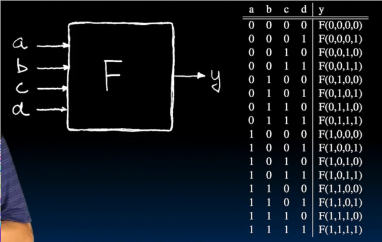
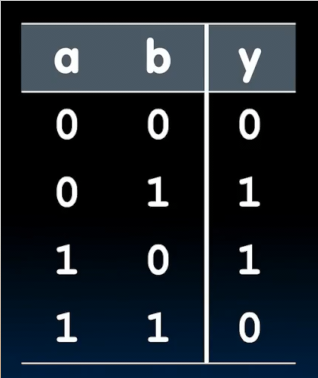

# 组合逻辑
 
* [真值表](#真值表)
* [逻辑门](#逻辑门)
* [布尔代数](#布尔代数)
  * [定律](#定律)
* [规范形式](#规范形式)

## 真值表

这是一个组合逻辑电路 没有状态 四个输入和一个输出

输入从全0递增到全1 输出指示特定输入对应的输出

对于4输入1输出，有2^(2^4)种真值表

做两者之一为1，但是不都做 

另一种思考方式

两位加法器

32位加法器

其有2^64行！因此此时真值表不是最好的表示方式

这是一个3输入多数器

## 逻辑门

记忆方法

* AN"D"

多输入 

* 对于AND OR多输入很好理解
* 对于XOR 多输入在计算1的数量 奇数则1 偶数则0

多数器电路

**从真值表到逻辑电路** 取交相并法

对于这种一个符号对应多位数，可以用下标表示某一位

## 布尔代数

基本函数 

* AND * 
* OR + 
* NOT -(上面)

这就是y的布尔函数

* 加法 可交换
* 乘法 可交换 可以省略 *

之前的状态机真值表

可以通过从电路中读出布尔函数，化简来简化电路！

也可以化简查看两个电路是否完全一致

### 定律

* x和其补集交集为0 并为1
* x和0交集为0 和1并集1
* x和1交集为1 和0并集为x
* x和x交集并集都为x
* x和y的交和并具有交换律
* x和y和z的单纯交和并具有结合律
* x和y和z的组合交并具有分配率
* 合并定律
* 对偶率

## 规范形式

1. 找到真值表中的输出1部分
2. 对于每一个输出1，将其每个输入0的部分取反，输入1不变，取交集
3. 对所有的交集结果取并集 
4. 化至最简

