# 组合逻辑块
 
* [数据多路复用器](#数据多路复用器)
  * [4to1_mux](#4to1_mux)
* [alu_算术逻辑单元](#alu_算术逻辑单元)
* [加法器细节](#加法器细节)
    * [有符号的溢出](#有符号的溢出)
* [减法器设计](#减法器设计)

更强大的组合逻辑电路

## 数据多路复用器

MUX

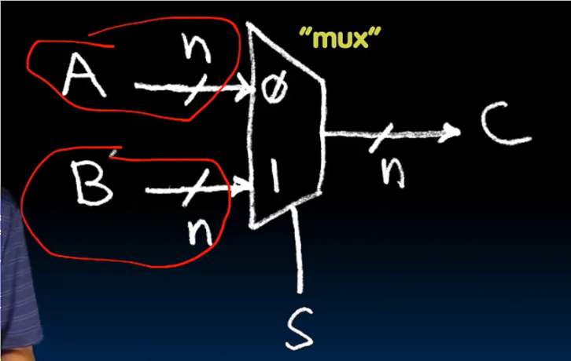

S控制C输出A还是B

其是一位的多路复用器的并行

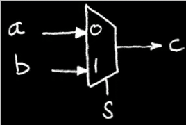

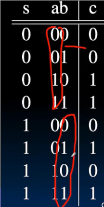

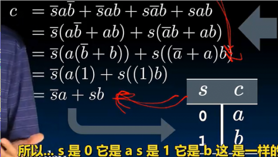

### 4to1_mux

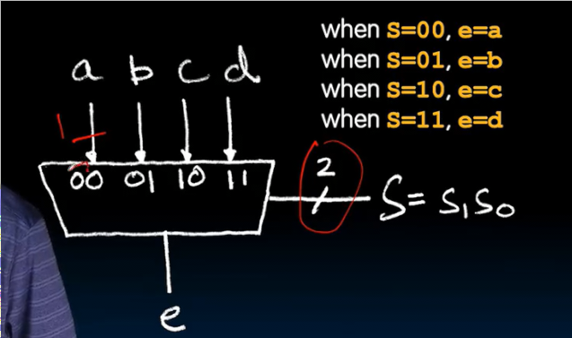

s要控制四条路的选择，因此需要有两位

其真值表会有2^6 = 64行 我们不妨从其语义出发 直接得到答案

一种巧妙的连接方式 可以利用已有的模块 从语义出发 而不拘泥于真值表

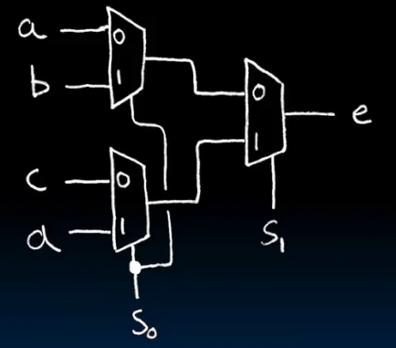

## alu_算术逻辑单元

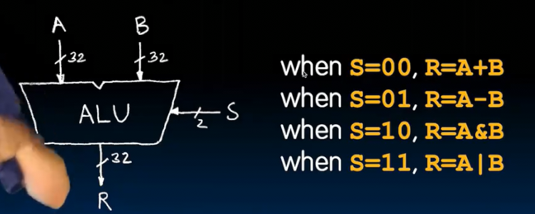

ALU是一个组合逻辑模块

如此庞大的数据，我们依旧需要从语义出发

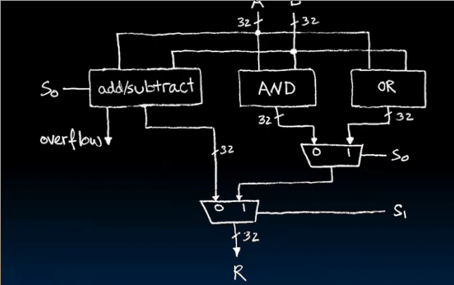

* 使用多路复用器对结果选择
* 加法和减法用同一套元件，只不过减法受到s0控制使得B有符号
  * 对于无符号数和有符号数溢出不太相同

## 加法器细节

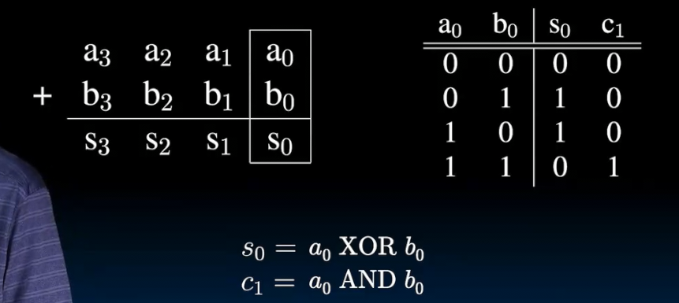

我们考虑这个四位加法，这是最低位相加的真值表和实现

在下一位中，有三位相加

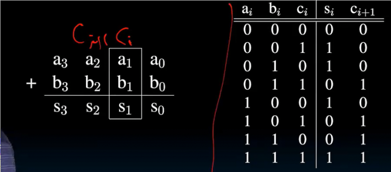

* `si` 在统一1的奇偶，因此其是XOR
* `ci+1`  为多数电路！1过半时为1

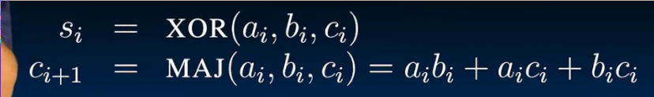

这就是1位加法器

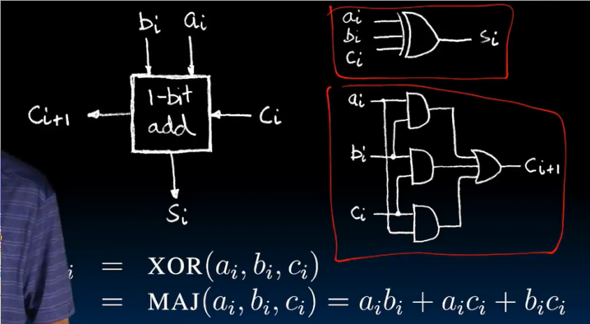

那么多位呢？串联他们！

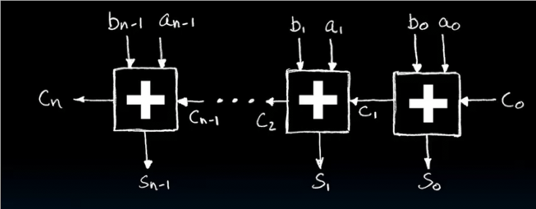

* `c0`会设置为0
* 溢出呢？
  * 如果是无符号时，cn为1时，则溢出了（第33位）

#### 有符号的溢出

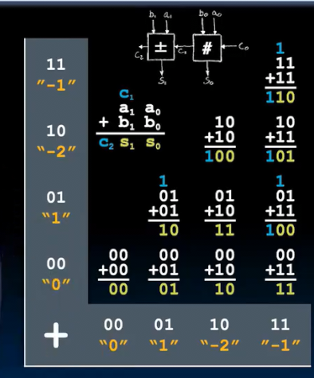

我们考虑这些有符号数的加法

对于无符号的溢出即是最高位发生进位的四个

而对于有符号计算，出现问题的是

* 01 + 01
* 10 + 10  10 + 11
* 其余忽略掉进位都表示正确的值

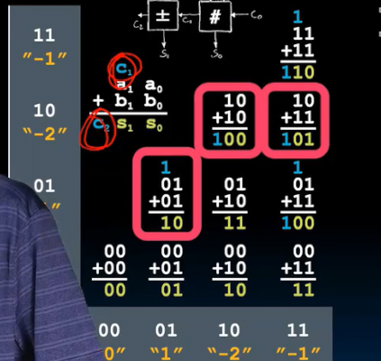

规律在于 这三个计算某个一位加法器 只有C_in或c_out其中一个为1，对于C_in 和 C_in 都为1，则不溢出

这个规律适用于更多位运算，并且C_in 表示最高位加法器的输入C C_out 表示最高位加法器的输出C

## 减法器设计

我们希望复用加法器

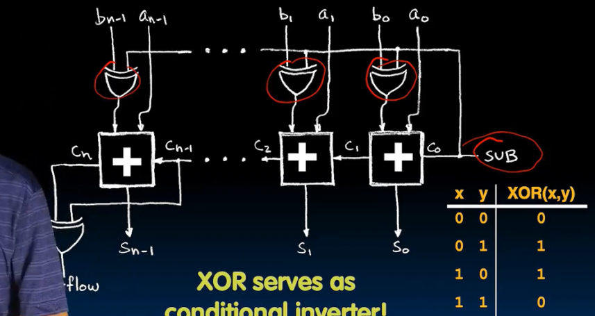

* SUB线用于控制是加法还是减法器，当SUB变高，输出到每个异或门，所有B会被反转！（根据右侧的真值表，当X为1，输出为y反），并且！SUB会输出到C0，做为初始值，完成B的取负（取反加1）
* 另一个异或门控制有符号溢出（Cn表示无符号的溢出）
