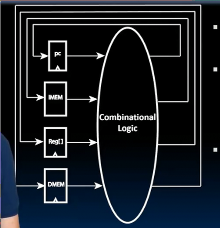
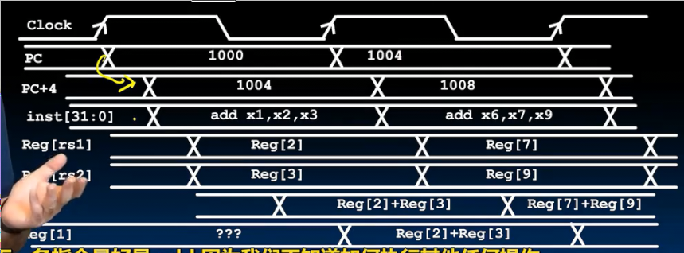

# RISC-V_处理器设计
 
* [cpu设计](#cpu设计)
* [rv32i_中的_状态元素](#rv32i_中的_状态元素)
  * [寄存器](#寄存器)
  * [寄存器文件](#寄存器文件)
  * [内存](#内存)
* [加法指令数据通路](#加法指令数据通路)
* [减法数据通路](#减法数据通路)
* [i指令的数据通路](#i指令的数据通路)

我们将研究**数据通路和控制的设计**

这张图片更能描述硬件的并行性 多个功能单元并行执行多条指令

* 可以有多种指令集架构，但应能编译出相同的机器语言
* 而硬件上可以有多种实现，但是都可以运行这些机器语言

* 我们研究一个单核微处理器 CPU
   * 计算机中主要动作发生的地方
* 处理器内部有**控制部分** 和 **数据通路**部分
* 数据通路中存在特殊寄存器**PC** 以及若干寄存器 和最常用的功能单元ALU
  * 数据通路如同处理器的肌肉 **是处理器中包含执行ISA所有指令所需硬件的部分**
  * 可以为每条指令构建一个数据通路（但是通常不会这样做，而是一个数据通路执行多条指令）

我们的目标是构建这些不同类型指令的数据通路和控制

## cpu设计

状态机是数字系统的常用方式 或许我们可以使用状态机

CPU的状态存储在PC 寄存器 内存 中

对于寄存器加法，我们主要关心寄存器的状态 从其中读取输入，经过组合逻辑电路，之后写回状态元素

与其给每个指令分配一个组合逻辑块，由于一些指令可以共享相同的数据通路，不妨将数据通路构建为一个可以执行所有指令的逻辑云

指令在每个周期被执行，通过组合逻辑在下一周期时写回状态元素

然而整个的逻辑云并不好设计，发生的事情很多，更好的方案是将指令分为多个阶段，每个阶段设置一个逻辑块

一般的五个步骤

1. 指令获取 从内存中获取指令 存在处理器中
2. 指令解码 查看指令并确定其是什么
3. 执行 实现实际操作 （ALU等）
4. 内存访问 （对于需要处理内存的程序而言 lw sw）
5. 写回寄存器 (对于需要写回寄存器的指令)

这个结构 有PC 指令内存 寄存器 ALU 数据内存

尽管指令内存和数据内存在是同一物理内存的不同区域，但是我们区分他们

* **PC**在顺序执行时，会自增4个字节的地址 
* **多路复用器**来抉择是否是顺序执行还是分支跳转 
* 从**指令内存**中获取执行的指令，这些指令指示要使用的寄存器
* **ALU**和**数据内存** 数据内存中存在写回寄存器的路径

1. 指令的获取阶段 PC始终指向指令内存当前指令所在 因此获取到指令
2. 解码阶段 解码阶段 通常和寄存器有关 指令的某些区段来指示用到的寄存器 
3. 执行阶段 加法、减法、分支计算
4. 内存访问 并将结果写回寄存器

所有这些操作可以在**一个周期内完成** 上升沿开始指令获取 在下一个上升沿写回寄存器（寄存器存储新值） 称为**单周期数据通路** 五个阶段发生在同一时钟周期

内部由加法器 多路复用器 ALU 配合状态元素组合

## rv32i_中的_状态元素

### 寄存器

N通常是32 仅在时钟的上升沿更新 

* 写入位指示时钟到来时是否读取新值，当时钟到来时，写入位为1，则读取存取输入，否则忽略

### 寄存器文件

在RISC-V中 是32个寄存器的组合

一次可以访问的寄存器数量有限 RISC-V要求我们同时读取其中的两个，并且能写入其中的一个 **两读单写** 通过地址和总线来访问

* 输入总线 busW 32位宽 包含输入的新值 （给目标寄存器的值）
* 两个输出总线 busA busB 32位宽 源寄存器的值
* 通过地址来选择 RW RA RB
* 写入使能位控制是否要写入

时钟只控制写入，而输出不需要等待时钟到来 

延时称为**访问时间**

### 内存

* 数据输入总线 数据输出总线 地址
* 写入使能位 
* 时钟只控制写入内存 读取不必等待时钟到来

延时同样称为**读写访问时间**

## 加法指令数据通路

r类型指令大致形式相同

指令对机器状态进行两个更改：rd的值 PC的值

* PC指向指令内存地址，输出指令（读取无需时钟）
* 加法器使得PC加4（但是仅仅在上升沿，PC才会被更新）

* 读出指令的相应位输入到寄存器文件的地址控制（读取无需时钟）
* 读出值经过ALU计算后输出到寄存器文件的busW（但是仅仅在上升沿，才会被写入）

每一次上升沿 写入目标寄存器 完成上一条指令 同时PC改变 开始下一条指令

此外，控制逻辑很简单，仅仅是控制寄存器文件写入位的开启

1. 上升沿开始 首先PC被写入 
2. 经过加法器延时和内存读访问延时得到PC新地址和指令
3. 经过内存其文件的访问延时 得到源寄存器的值
4. 经过ALU延时 得到计算结果
5. 下一次时钟到来，写入目标寄存器，PC被写入

## 减法数据通路

和加法指令相比仅仅funct7中的第二高位不同

我们需要使用这一位控制ALU的功能

所有R指令的区别就是funct3以及funct7 只要是否这些位控制ALU的功能即可

## i指令的数据通路

和R指令相比，funct3字段相同 但是rs2字段和funct7合并成12位的立即数字段

ALU的输入值之一不是寄存器，而是指令中的字段

我们不要直接将指令的输出从寄存器文件直接改到ALU,而是使用多路复用器来同时支持R和I指令

通过控制，在i指令的操作码时，将多路复用器的控制位置1,完成输入立即数和输入寄存器的转换

但是不要忘记拓展立即数的宽度

