# CPU设计_其余指令的数据通路
 
* [加载的数据通路](#加载的数据通路)
* [存储指令的数据通路](#存储指令的数据通路)
* [分支指令的数据通路](#分支指令的数据通路)
* [jarl的数据通路](#jarl的数据通路)
* [jal的数据通路](#jal的数据通路)
* [u类型的数据通路](#u类型的数据通路)

## 加载的数据通路

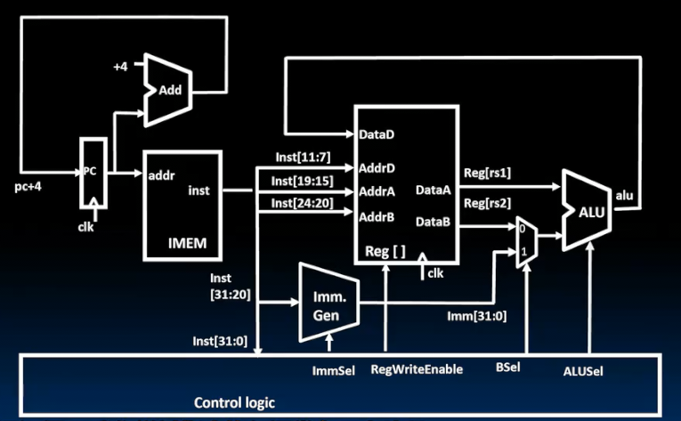    

我们目前实现R和I指令的数据通路，指令执行步骤中的四步，但是缺少访问内存的步骤

在RISCV中和内存的所有交互使用加载存储指令完成

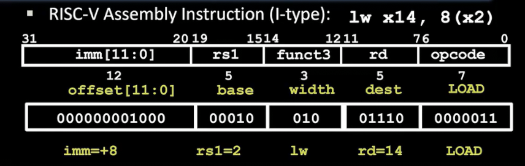

这是l指令的形式 同样是I指令

而立即数和源寄存器加法运算和一般I指令不同，不写回寄存器文件，**而是用来指向要访问的内存地址，从内存中读取数据再写回寄存器**

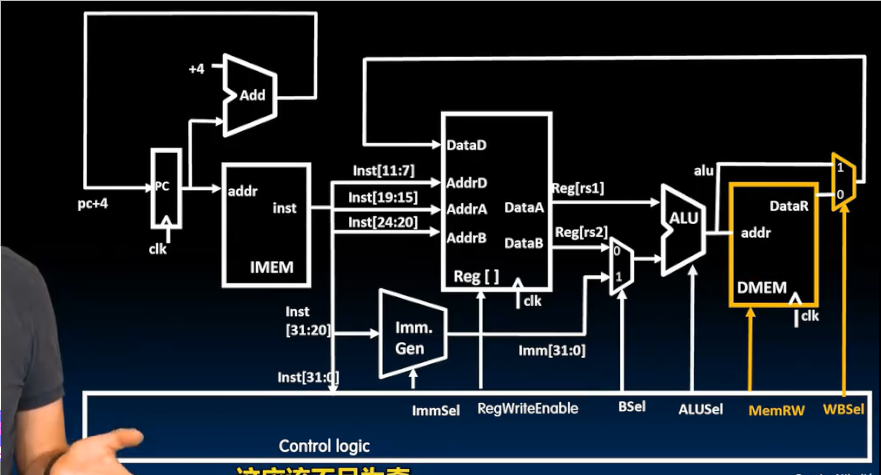

引入一个多路复用器 决定是否是直接写回寄存器还是作为内存地址，将内存值写回寄存器（无需时钟上升沿）

## 存储指令的数据通路

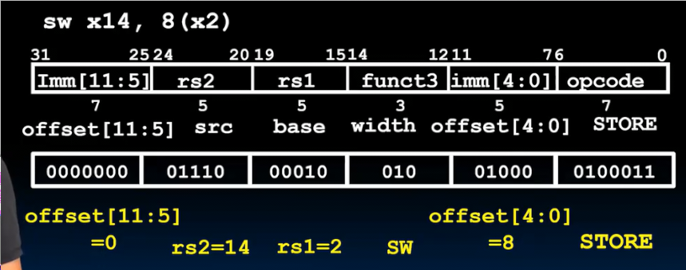

同样相加扩展后的立即数和RS1，将值作为内存的地址，而将RS2的值写入内存

但是此外，指令中立即数的位置发生了改变，需要额外予以支持

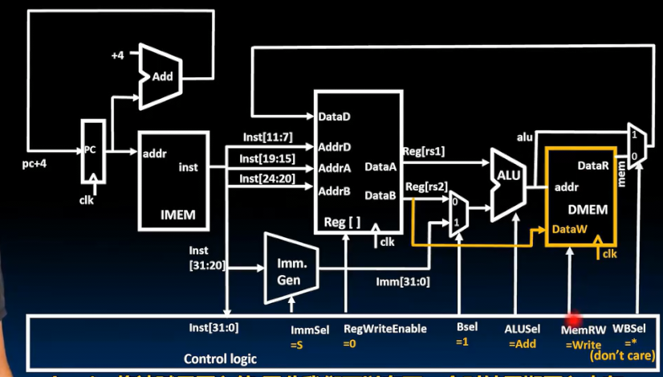

将寄存器文件的输出2连接到内存，并对内存写入加以控制（同时控制从立即数而不是RS2获取ALU的输入，控制寄存器文件不被写入）

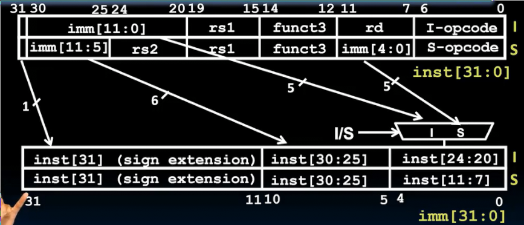

对于立即数 I和S立即数的最高7位都在指令高处，我们将其符号扩展 而最低5位来源不同，可以采用一个多路复用器进行控制

## 分支指令的数据通路

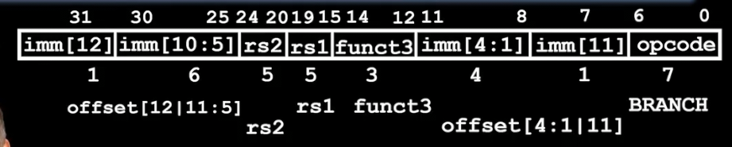

比较两个源寄存器的内容 并根据分支条件更新PC

如果满足，PC则加上立即数 否则PC加4

立即数实际上为13位，最后一位始终为0

寄存器和内存的状态不会改变，而是PC的状态改变

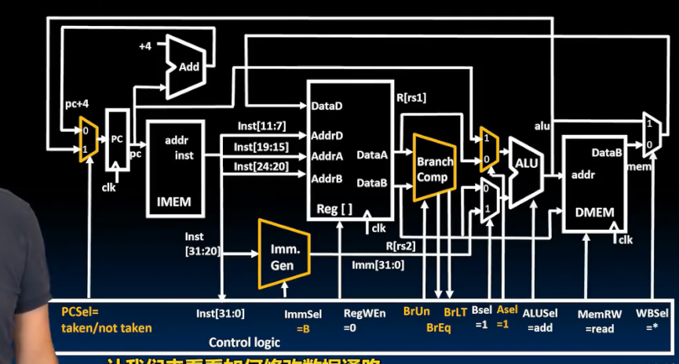

* 寄存器文件的两个输出新连接一个硬件，这个硬件来进行分支比较
* 这个硬件同时接受指示是否有符号的输入 
* 产生两个bit输出 指示值是否相等或小于另一个值 
* ALU除了立即数和寄存器的输入外，还接受PC和立即数的输入（受到控制）以计算跳转后地址

B指令的立即数也有所不同 通过多路复用器实现

## jarl的数据通路

JARL 跳转并链接寄存器

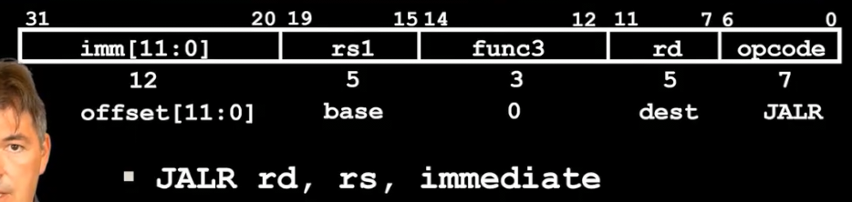

I格式指令

将PC+4写入目标寄存器，原寄存器加立即数作为目标地址更改PC（同样实际为13位立即数）

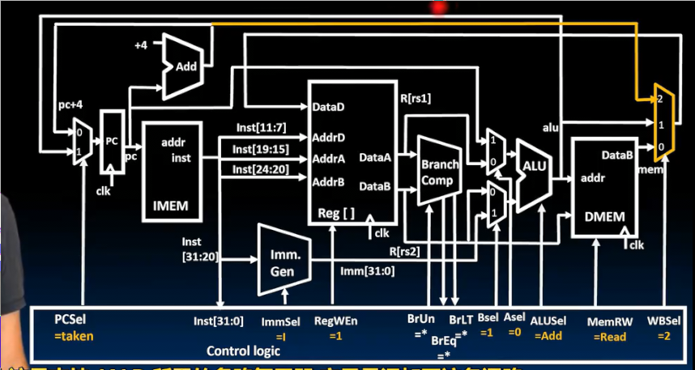

仅仅添加PC+4到寄存器文件的通路 而ALU到PC的通路已经有了

## jal的数据通路

j格式 

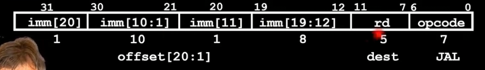

 20位宽的立即数 PC+4 保存在目标寄存器 PC加上立即数表示的偏移量

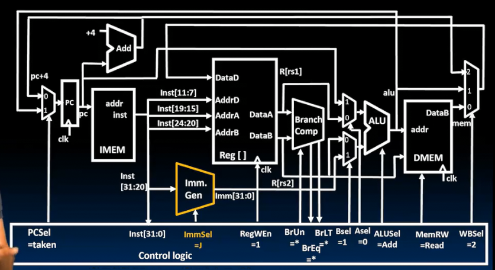

唯一的更改就是添加对J类型立即数的支持

## u类型的数据通路

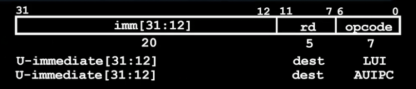

用于支持高位立即数 指令包含20位立即数

LUI加载20位立即数到rd，低位清零

AUIPC 高位和PC相加 存在目标寄存器

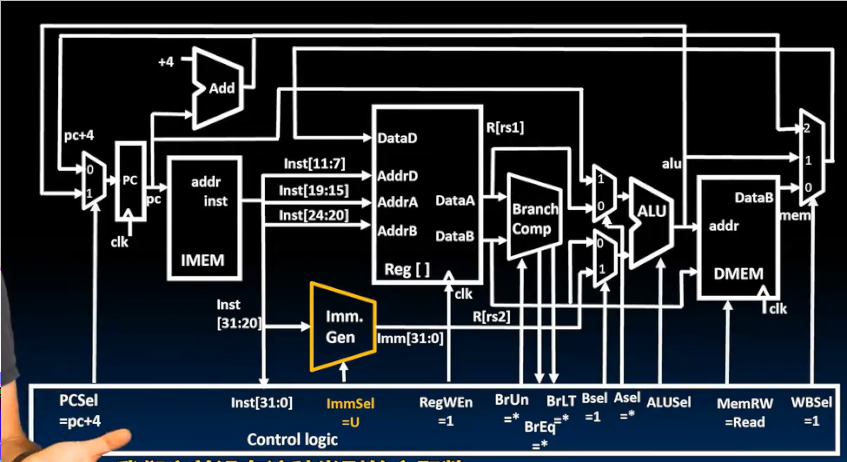

同样只需要添加对U类型立即数的支持
